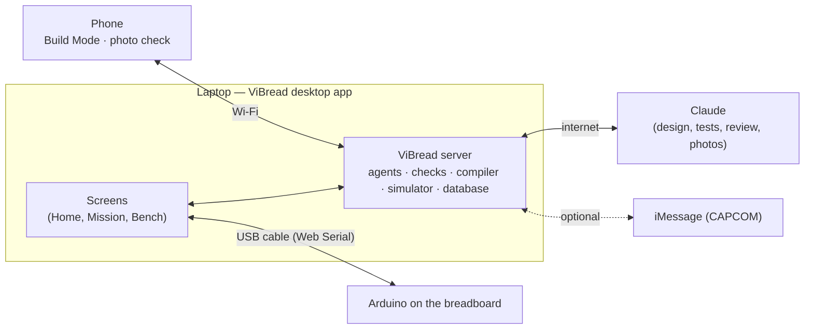

# How ViBread works

**In one sentence:** you describe a circuit in plain words; ViBread designs it from the parts you own, tests it in a
simulator, shows you step by step how to build it on a breadboard, then flashes your Arduino over USB and tests your
real wiring — and if something is wrong, it tells you which hole to fix.

## What you need

| Thing | Why | Notes |
|---|---|---|
| **The ViBread desktop app** | Everything runs inside it: the screens, the server, the Arduino compiler, the simulator and the USB connection | Linux x64 now ([download](https://github.com/BarryTheShen/ViBread/releases/tag/desktop-v0.1.0-linux)); Windows x64 next. Developers can run it from source instead ([README](README.md)) |
| **Arduino Uno R3 or Nano** (ATmega328P, 5 V) + a USB **data** cable | The board ViBread programs and tests | Charge-only cables don't work. Linux: `sudo usermod -aG dialout $USER`, then log out and in once |
| **A breadboard + parts** | LEDs, resistors, push buttons, light sensor (photoresistor), knob (potentiometer), buzzers | Anything else can be added as a "generic part" (not checked as deeply) |
| **A Claude key** (optional) | Designing *new* circuits, writing the independent tests, the reviewer's vote, the photo check | Desktop app: menu **ViBread → Set Anthropic API key…**, or **Settings → Connect your Claude account** |
| **A phone** (optional) | Build steps one at a time next to the breadboard, photo check | Same Wi-Fi as the laptop; menu **ViBread → Show phone link / QR** |
| **iMessage** (optional) | Text CAPCOM: brief, status, GO/NO-GO polls, alerts, answer test prompts | Needs the team's Photon project |

## What runs where

Everything except Claude and iMessage works offline, on the laptop.

## A mission, step by step

1. **Describe it (Home).** Type what the circuit should do ("a lamp that fills like the moon when I press a button,
   only in the dark") and tap the parts you have. Pick how much the AI may do on its own (**Plan / Ask every time /
   Review** (default) **/ Autopilot**).
2. **ViBread designs it.** Claude picks parts *only from your list*, wires them to Arduino pins and writes the Arduino
   sketch. You see its work in the chat; changes wait for your OK as the permission mode says.
3. **Go/No-Go checks — five "consoles" (Apollo Mission Control names):**
   - **EECOM, electrical:** no short circuits, every LED has a resistor, no pin gives more current than it's rated for
     (checked at the worst-case USB voltage and resistor tolerance, and cross-checked with the ngspice circuit simulator).
   - **GUIDO, firmware:** the sketch really compiles for your board (the real Arduino compiler, inside the app), and the
     pins the code uses match the wiring.
   - **FIDO, simulation:** a *second* AI, which never sees the sketch, writes tests from your description ("after 4
     presses in the dark, all 4 LEDs are on"). ViBread runs them on a simulated Arduino (see below).
   - **FAO, assembly:** ViBread lays the circuit out on a breadboard and proves the layout connects exactly what the
     design says.
   - **RETRO, review:** a third AI compares your description, the design and all the results, and votes GO or NO-GO.
4. **GO for build.** You (the "Flight Director") press it. Only then does the design become the build target.
5. **Build it.** Numbered LEGO-style steps, one per part or wire: a picture, the exact holes ("from e12 to e16"),
   and whether the USB cable must be plugged in. On the laptop (Steps tab) or the phone (scan the QR code). The phone's
   **Check with camera** asks Claude whether the photo matches the step — advice only, it never blocks you.
6. **Bench: test the real board.** Plug in the Arduino and open **Bench** → **Use USB board**. The seven steps on
   screen:
   1. **Connect your board:** pick the Arduino in the port chooser.
   2. **Make it safe:** ViBread flashes its own *safe self-test* program first, so a wiring mistake can't damage anything.
   3. **Check power:** the 5 V and ground rails are right.
   4. **Test each part:** the board checks each pin *before* driving it, then asks you to help: "press the button",
      "cover the light sensor", "which light is blinking?", "did you hear a beep?".
   5. **Find the problem:** if something is wrong: "Houston, we have a problem: D2 reads LOW even with the button
      released — its leg shares row 31 with the GND jumper", with the holes highlighted and the fix. Fix it and run
      the test again.
   6. **Run your project:** when everything passes, ViBread flashes *your* sketch (with the light sensor tuned to your
      room from the test's readings).
   7. **Celebrate** — then tell ViBread whether it does what you wanted → **mission complete**.

## Yes, the simulator is built in

ViBread emulates the Arduino's chip (ATmega328P, via the avr8js library) and runs **the exact program file that will
be flashed**, with models of the LEDs, buttons, knobs, light sensors and buzzers. No board or internet needed. It's used
four ways:

| Where | What you see |
|---|---|
| **FIDO console** | The independent tests run on the simulated board before you build anything |
| **Try it tab** (mission page) | Press the virtual button, drag the light level, turn the knob — the LEDs on the breadboard picture react live |
| **Bench → Try without a board** | The whole bench test on a simulated board; you can even inject a wiring mistake to see the diagnosis |
| **Diagnosis** | ViBread simulates common mistakes ahead of time, so a real test result can be matched to its most likely cause |

What the simulator proves: the logic, timing and pin setup of the program. What it can't: real currents, electrical
noise or a flaky wire — that's what the electrical checks and the real bench test are for. (The ngspice current
cross-check needs ngspice installed on the laptop; without it EECOM says "SPICE unavailable" and uses the calculation.)

## Pushing code onto the Arduino

- ViBread compiles with the real Arduino compiler (`arduino-cli`; the desktop app downloads it on first launch) and
  flashes over the USB cable from inside the app — no Arduino IDE needed.
- Two programs go onto the board, in order: the **safe self-test** first, then **your sketch** once the test passes.
- **Nothing touches the board without your click on the Bench page.** Claude, Claude Code or an iMessage "GO" can
  *ask* for a flash; it still waits for the click.
- If flashing from the app fails, the Bench shows a ready-to-paste `arduino-cli upload …` command and the program files.

## Without a board, without Claude

| | Works | Doesn't |
|---|---|---|
| **No Arduino** | Everything up to the bench; the bench's **Try without a board** | Flashing, the real test, mission complete |
| **No Claude key** | The 3 example missions and 1 recorded real Claude run (labeled "Recorded run"), all checks, simulation, build steps, the bench | Designing new circuits, writing new tests, the reviewer's live vote, live photo checks |

## Status (Sat Sep 26)

Built and tested in our container: all of the above, with the simulated board. **Not yet tried:** a real Arduino over USB
(first test with the team), ViBread's own agents with a real Claude key (the prompts were tested on real Claude through
another tool), cloud iMessage, the Windows app (in progress), Google/GitHub sign-in. Details: [PLAN.md](PLAN.md) "Build
status".

## Where things live in the code

| Folder | What it is |
|---|---|
| `apps/desktop` | The desktop app (Electron): starts the server, opens the window, USB port chooser, first-launch setup (on branch `desktop` until it's merged) |
| `apps/server` | The server: API, AI agents, iMessage, sign-in, Claude Code connection (MCP) |
| `apps/web` | The screens (Material UI): Home, Mission, Bench, Build Mode (phone), Settings |
| `packages/checks` | EECOM electrical rules + ngspice |
| `packages/firmware` | Compiling with arduino-cli; the safe self-test program |
| `packages/sim` | The simulated Arduino and part models |
| `packages/assembly` | Breadboard layout, build steps, schematic, pictures |
| `packages/bench` | The self-test plan, reading test results, the diagnosis |
| `fixtures` | The example missions and the recorded Claude run |
