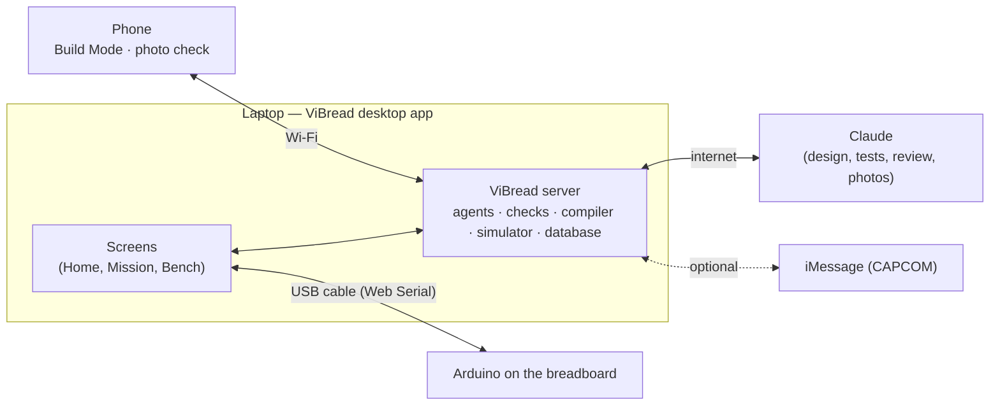

# How ViBread works

**In one sentence:** you describe a circuit in plain words; ViBread designs it from the parts you own, tests it in a
simulator, shows you step by step how to build it on a breadboard, then flashes your Arduino over USB and tests your
real wiring — and if something is wrong, it tells you which hole to fix.

## What you need

| Thing | Why | Notes |
|---|---|---|
| **The ViBread desktop app** | Everything runs inside it: the screens, the server, the Arduino compiler, the simulator and the USB connection | [Download](https://github.com/BarryTheShen/ViBread/releases/latest): Linux x64 (AppImage or .deb), Windows 10/11 x64 (.exe), macOS Apple silicon or Intel (.dmg). First launch takes 3–6 minutes (it downloads the Arduino compiler and prepares the examples). Developers can run it from source instead ([README](README.md)). Every successful CI build publishes a numbered `desktop-v0.1.N`; the newest build is at [Releases → Latest](https://github.com/BarryTheShen/ViBread/releases/latest) |
| **Arduino Uno R3 or Nano** (ATmega328P, 5 V) + a USB **data** cable | The board ViBread programs and tests | Charge-only cables don't work. Linux: `sudo usermod -aG dialout $USER`, then log out and in once |
| **A breadboard + parts** | LEDs, resistors, push buttons, light sensor (photoresistor), knob (potentiometer), buzzers | Anything else can be added as a "generic part" (not checked as deeply) |
| **A Claude connection** (optional) | Designing *new* circuits, writing the independent tests, the reviewer's vote, the photo check and inventory scans | In **Settings → Claude**, connect with pi-ai's Anthropic OAuth, or save your own Anthropic API key; ViBread checks the key with Anthropic |
| **A phone** (optional) | Build steps one at a time next to the breadboard, photo check | Same Wi-Fi as the laptop; menu **ViBread → Show phone link / QR** |
| **iMessage** (optional) | Text CAPCOM: brief, status, GO/NO-GO polls, alerts, answer test prompts | Needs the team's Photon project |

## What runs where

Everything except Claude and iMessage works offline, on the laptop. The interface has a light and dark theme that follows the
system setting, using a space-cadet, cool-gray, anti-flash-white and red palette.

## A mission, step by step

1. **Describe it (Home).** Type what the circuit should do ("a lamp that fills like the moon when I press a button,
   only in the dark") and tap the parts you have.
2. **ViBread designs it.** Claude picks parts *only from your list*, wires them to Arduino pins and writes the Arduino
   sketch. Claude can edit designs directly. You see grouped tool rows in the chat; if something is ambiguous, an
   answerable question card appears. You can stop a run and resume it later.
3. **Go/No-Go checks — five "consoles" (Apollo Mission Control names):**
   - **EECOM, electrical:** no short circuits, every LED has a resistor, no pin gives more current than it's rated for
     (checked at the worst-case USB voltage and resistor tolerance, and cross-checked with the ngspice circuit simulator).
   - **GUIDO, firmware:** the sketch really compiles for your board (the real Arduino compiler, inside the app), and the
     pins the code uses match the wiring.
   - **FIDO, simulation:** a *second* AI, which never sees the sketch, writes tests from your description ("after 4
     presses in the dark, all 4 LEDs are on"). ViBread runs them on a simulated Arduino (see below).
   - **FAO, assembly:** ViBread lays the circuit out on a breadboard and proves the layout connects exactly what the
     design says.
   - **RETRO, review:** a third AI compares your description, the design and all the results, and votes GO or NO-GO.
4. **GO for build.** You (the "Flight Director") press it in the web app, or send `GO` from iMessage as the human operator.
   Only then does the design become the build target.
5. **Build it.** Numbered LEGO-style steps, one per part or wire: a picture, the exact holes ("from e12 to e16"),
   and whether the USB cable must be plugged in. On the laptop (Steps tab) or the phone (scan the QR code). The phone's
   **Check with camera** asks Claude whether the photo matches the step — advice only, it never blocks you.

6. **Bench: test the real board.** Plug in the Arduino and open **Bench** → **Use USB board**. The seven steps on
   screen:
   1. **Connect your board:** pick the Arduino in the port chooser.
   2. **Make it safe:** ViBread flashes its own *safe self-test* program first. It keeps every pin switched off until
      that pin has been checked, so a misplaced wire is far less likely to damage anything. (No program can protect
      against a wire straight from + to −: the build steps have you keep USB unplugged while wiring.)
   3. **Check power:** the board starts up, answers, and reports its own supply voltage.
   4. **Test each part:** the board checks each pin *before* driving it, then asks you to help: "press the button",
      "cover the light sensor", "which light is blinking?", "did you hear a beep?".
   5. **Find the problem:** if something is wrong: "Houston, we have a problem: D2 reads LOW even with the button
      released — its leg shares row 31 with the GND jumper", with the holes highlighted and the fix. Fix it and run
      the test again.
   6. **Run your project:** when everything passes, ViBread flashes *your* sketch (with the light sensor tuned to your
      room from the test's readings).
   7. **Celebrate** — then tell ViBread whether it does what you wanted → **mission complete**.

### Your parts

The Inventory page accepts a typed list or photos from the laptop, a phone, or an upload. The typed parser understands
parentheses, “N each”, “A & B”, and units. A scan shows what was uploaded and whether analysis succeeded; if it fails, the
reason is shown and **Retry** runs the analysis again without asking you to upload the photos again. You can edit the catalog
with the part-types editor.

**Your hardware** (top of the Inventory page) is the breadboard, board and part variants you build with:
- **Breadboard:** 170-point mini (17 rows, no rails), 400-point, 830-point, or 830-point with split rails.
- **Board:** genuine Uno R3 (ATmega16U2), CH340 Uno clone, or Nano with the new or old bootloader.
- **Parts:** 5 mm or 3 mm LEDs; 6 mm, 12 mm or 2-leg push buttons; trimmer or panel pots.

New missions use these choices. The design agent is told which board and breadboard to build for, and the layout puts power
through the strips on a mini board and adds a bridge wire across split rails. The steps and pictures name your parts ("your
400-point board", "3 mm red LED"). **Identify from a photo** (laptop camera, phone QR, or upload) asks Claude which one you
have and shows the reasons, then you confirm it or pick another. Without Claude, you pick from the lists.

## Yes, the simulator is built in

ViBread emulates the Arduino's chip (ATmega328P, via the avr8js library) and runs **the exact program file that will
be flashed**, with models of the LEDs, buttons, knobs, light sensors and buzzers. No board or internet needed. It's used
four ways:

| Where | What you see |
|---|---|
| **FIDO console** | The independent tests run on the simulated board before you build anything |
| **Try it tab** (mission page) | Press the virtual button, drag the light level, turn the knob — the LEDs on the breadboard picture react live |
| **Bench → Try without a board** | The whole bench test on a simulated board; you can even inject a wiring mistake to see the diagnosis |
| **Diagnosis** | ViBread simulates common mistakes ahead of time, so a real test result can be matched to its most likely cause |

What the simulator proves: the logic, timing and pin setup of the program. What it can't: real currents, electrical
noise or a flaky wire — that's what the electrical checks and the real bench test are for. (The ngspice current
cross-check needs ngspice installed on the laptop; without it EECOM says "SPICE unavailable" and uses the calculation.)

## Pushing code onto the Arduino

- ViBread compiles with the real Arduino compiler (`arduino-cli`; the desktop app downloads it on first launch) and
  flashes over the USB cable from inside the app — no Arduino IDE needed.
- Two programs go onto the board, in order: the **safe self-test** first, then **your sketch** once the test passes.
- **Nothing touches the board without your click on the Bench page.** Claude, Claude Code or iMessage can request a bench
  action, but a person must click to run it. The human operator's iMessage `GO` releases a design for building; it does
  not flash or test the board.
- If flashing from the app fails, the Bench shows a ready-to-paste `arduino-cli upload …` command and the program files.
  Run the command on the computer that runs ViBread (with the desktop app, that's this computer).

### Connect Claude

In **Settings → Claude**, choose **Connect your Claude account** to use pi-ai's Anthropic OAuth. Open the Claude link,
approve it, then paste the code, `code#state`, or the whole `localhost:53692/callback…` address. This works even when the
browser is on another computer. On the server computer the localhost callback may finish automatically; if port 53692 is
already held, paste the address instead. The other option is **Use an API key instead**. ViBread checks that key with
Anthropic before saving it. OAuth credentials and per-user API keys live in the server database; there is no external helper or
credential file. If a user's credential is unavailable, the server can fall back to `ANTHROPIC_API_KEY`.

## Debug logs

ViBread writes redacted JSONL logs for the server and for each mission. **Settings → Diagnostics** shows either log with
area and level filters, and browser errors are sent to the server. From the repository root, follow the server log with
`node scripts/debug-log.mjs --follow`, or follow one mission with `node scripts/debug-log.mjs <missionId> --follow`.

## Without a board, without Claude

| | Works | Doesn't |
|---|---|---|
| **No Arduino** | Everything up to the bench; the bench's **Try without a board** | Flashing, the real test, mission complete |
| **No Claude credential** | The 3 example missions and 1 recorded real Claude run (labeled "Recorded run"), all deterministic checks, simulation, build steps, and the bench | Designing new circuits, writing new tests, the reviewer's live vote, live photo checks and inventory scans |

## Status (Sat Sep 26)

Built and tested in our container, including the pi agent harness, assistant-ui chat, inventory flows, elkjs schematic checks,
and the simulated board. The desktop releases are numbered and the Windows CI smoke starts the server and Claude sign-in.
**Not yet tried:** a real Arduino over USB, a real Claude account sign-in/model run with the team's credential, cloud iMessage,
and Google/GitHub sign-in. Details: [PLAN.md](PLAN.md) "Build status".

## Where things live in the code

| Folder | What it is |
|---|---|
| `apps/desktop` | The desktop app (Electron): starts the server, opens the window, USB port chooser, first-launch setup |
| `apps/server` | The server: pi design agent, pi-ai structured calls, UI-message stream, iMessage, sign-in, Claude Code connection (MCP), debug logs |
| `apps/web` | The screens (Material UI + assistant-ui chat): Home, Mission, Bench, Build Mode (phone), Inventory, Settings |
| `packages/checks` | EECOM electrical rules + ngspice |
| `packages/firmware` | Compiling with arduino-cli; the safe self-test program |
| `packages/sim` | The simulated Arduino and part models |
| `packages/assembly` | Breadboard layout, build steps, elkjs schematic, geometry check, pictures |
| `packages/bench` | The self-test plan, reading test results, the diagnosis |
| `fixtures` | The example missions and the recorded Claude run |
