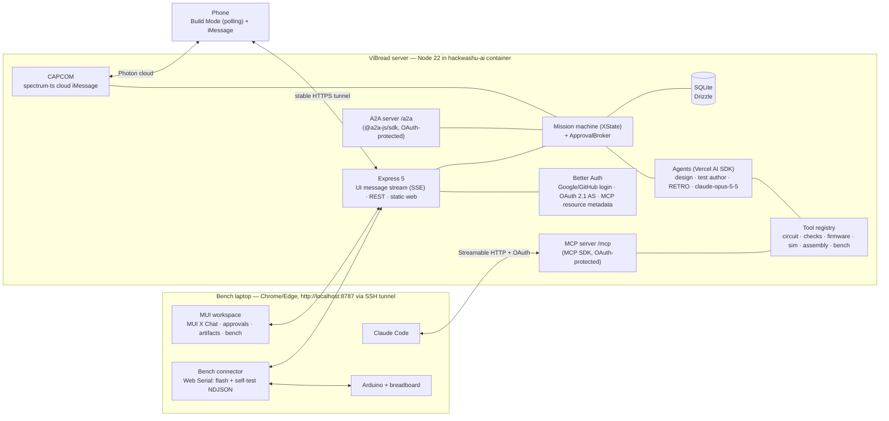

# ViBread — Build Plan (for review)

> HackWashU Fall Build Challenge, Sep 25–27 2026 · Main track + Photon bonus track.
> Hard deadline: **Sun Sep 27, 12:00 PM CT** (Devpost). Plan written Sat Sep 26, ≈00:30 CT → ~35 h of wall clock.
> Evidence: [`research/`](research/) (technology research, sources inline) and [`research/audit/`](research/audit/)
> (hands-on verification of every package and claim used below: installs, type checks, offline smokes).

## 0. TL;DR

ViBread is **Mission Control for your breadboard**. A beginner describes what a circuit should do; ViBread's agent designs it
(schematic + netlist + Arduino sketch) from parts the user already owns, runs a **Go/No-Go poll** of independent checkers,
turns the design into **LEGO-style numbered assembly steps** on laptop and phone, then verifies the **real build**: safe firmware
first, staged power-up, then a generated self-test that streams "telemetry" back over USB. When something is wrong it says
*where* ("Houston, we have a problem: D2 reads LOW even with the button released — its leg shares row 17 with the GND jumper"),
proposes the fix, and re-runs the checks. The same mission is reachable from iMessage (Photon Spectrum, "CAPCOM") and from other
agents (Claude Code over MCP with OAuth, A2A), under Claude-Code-style permission modes where physical actions always need an
authenticated human.

**Build philosophy: libraries first, our code is glue.** Every subsystem uses a maintained library where one exists
(Vercel AI SDK, Material UI + MUI X Chat, Better Auth, tscircuit, avr8js, arduino-cli, XState, Drizzle, Spectrum, A2A/MCP SDKs).
We write custom code only where no library fits — each such piece is listed with the reason in §6.2.

**Delivery strategy:** a fixture-driven **Golden Path v0** (no LLM in the loop) runs end-to-end on the real board by
**Sat 13:00**; the agent, channels, and richer analyses plug into that pipeline afterwards in strict priority order (§4).

## 1. Problem, users, definition of success

- **Problem.** Going from "a lamp that turns on when it's dark" to a working breadboard needs four skills at once: circuit
  design, embedded code, reading wiring diagrams, and debugging hardware. In a CHI 2016 study of novices building an Arduino
  project, only 6 of 20 finished within the 45-minute session and circuit construction was the most common fatal failure
  (Booth et al., *Crossed Wires*; research/06 §2.7).
- **What exists.** Commercial AI tools (Cirkit Designer, Schematik, Tinkered, Flux, Arduino AI Assistant) stop at design,
  simulation, or upload. Research systems proved pieces we build on: Trigger-Action-Circuits (UIST 2017) generated circuits,
  firmware, and assembly instructions from behavior descriptions (6/6 novices finished vs 0/6 with the Arduino IDE);
  ElectroTutor (UIST 2018) attached tests to tutorial steps and cut backtracking from 18.8 to 0.2 instances; SchemaBoard
  (UIST 2020) linked schematic and breadboard views. They relied on fixed component databases, hand-authored tutorials, or
  custom instrumented hardware.
- **What ViBread adds:** LLM design from the user's own parts with ask-back · the same binary simulated and flashed ·
  auto-generated self-test firmware with fault attribution on an unmodified Uno · a permissioned agent that lives in iMessage and
  answers other agents.
- **Users.** Non-technical and intermediate makers who already own an Arduino kit (brief p.3). Controller family: Arduino only.
- **Supported-circuit envelope (brief p.5 "how complicated"):** Uno R3 or Nano (ATmega328P) · 5 V logic, USB power · one
  breadboard (30- or 63-row) · ≤ 12 parts and ≤ 10 signal nets · planned external load ≤ 400 mA (per pin ≤ 20 mA, MCU total
  ≤ 200 mA) · parts from the module library · no motors/relays/mains in the MVP.
- **Successful build (brief p.5, sharpened):**
  - **GO for build** = no ERC errors · electrical limits within spec · sketch compiles · the independent test suite passes with
    full coverage · reviewer agent votes GO (the brief's "overall agent saying yes") · human GO.
  - **Mission success** = staged power-up clean · self-test telemetry matches expectation · user confirms the behavior.

## 2. Theme fit — "Fly Me to the Moon"

The rubric asks whether we address the prompt and whether the design supports the theme. The interpretation is structural:
**Apollo reached the moon because every step was simulated, every wire was checked against a checklist, a Go/No-Go poll gated
each phase, and when Apollo 13 failed, Mission Control debugged it from telemetry.** ViBread gives a first-time maker the same
discipline for their own moonshot.

| Apollo practice | ViBread feature |
|---|---|
| Mission brief | User describes the goal (web or iMessage) |
| Flight plan | Schematic + sketch + bill of materials drawn from the user's own parts |
| Simulators | The compiled binary runs in an AVR emulator before anything is wired |
| Go/No-Go poll | Consoles report GO / NO-GO: **EECOM** electrical · **GUIDO** firmware · **FIDO** simulation · **FAO** assembly · **RETRO** independent reviewer agent. Human = Flight Director |
| Launch checklist | Numbered LEGO-style assembly steps ("T-minus 6 steps") with staged power-up |
| Telemetry | Self-test firmware streams pin/ADC/VCC readings, diffed against expectation |
| "Houston, we have a problem" | Closed-loop debugger localizes the fault and proposes the fix |
| CAPCOM (the one voice talking to the crew) | iMessage agent (Photon Spectrum) talking to the builder at the bench |

UI labels stay plain ("Electrical checks · EECOM"); console names are flavor. The MUI dark "mission control" theme is built in
P1/P2, not left for the end, because two of three rubric criteria (Impact-vs-prompt, UX-supports-theme) reward it.

**Hero demo circuit: the Moon-Phase Lamp** (pending the kit inventory, §7 gate). Four LEDs show the lit fraction of the moon
(8 phases), a button advances the day, and a photoresistor divider turns the lamp on only when the room is dark — with the dark
threshold **calibrated on the user's bench** by the self-test (§5.9). Fallbacks if the kit differs: *Launch Control* (buttons +
countdown LEDs + buzzer) or *Knob Night-Light* (potentiometer + PWM LED).

## 3. Demo, pitch, and judging logistics

**Latency budget** (measured at Checkpoint A, P50/P95): design run ≤ 60 s / 120 s · revision run ≤ 45 s / 90 s · flash
≤ 15 s · self-test ≤ 60 s including prompts. Anything slower is pre-computed for live demos.

| Format | Live | Recorded / pre-warmed |
|---|---|---|
| **Pitch (5 min, non-EE judges)** | (1) Brief on the phone loads a pre-warmed mission; GO poll voted on iMessage. (2) Real board with a deliberate fault: self-test → "Houston…" with rows highlighted → fix → GO → celebration effect → lamp works. | Full agent design run in the MUI workspace, simulation replay, Claude Code connecting over MCP — in a 40-second video cut inside the pitch |
| **Table demo (2 min, Sun 12:00–16:00)** | Pre-flashed, powered kit with a deliberate fault: self-test → diagnosis → fix → GO; phone shows the steps; iMessage alert | Devpost video for everything else |
| **Photon clip (60 s)** | — | CAPCOM flow on the phone: brief → poll → step image → fault alert → photo → celebration |

**Pitch skeleton (5:00), story-first:** 0:00 hook — the *Crossed Wires* result (6/20) and Apollo's discipline · 0:40 one user's
journey · 1:10–3:30 live beats · 3:30 40-second video · 4:10 why it's new (§1) · 4:40 impact + close. One technical slide.

**Judging logistics:** one person stays at the table 12:00–16:00 with the kit powered and pre-flashed; spare board + cable on the
table; ask Photon on Discord (Saturday office hours) how and when they judge; rough backup video at Checkpoint B, refreshed at C.

## 4. Scope: Golden Path v0, tiers, and cut order

**Golden Path v0 — due Sat 13:00, fixture-driven, no LLM in the loop:** hand-written Moon-Phase-Lamp fixture (IR + sketch +
intent tests) → schematic SVG → ERC + analytic limits + compile → headless tests + simulation replay on the breadboard view →
layout + LVS → phone steps with staged power-up → safe firmware + self-test on the real board → one deliberate fault diagnosed →
one CAPCOM DM with a GO/NO-GO poll. Every later feature plugs into this pipeline; if later work fails, this still demos.

| Tier | Item | Track |
|---|---|---|
| MUST | **M0** Golden Path v0 (above) | Main + Photon |
| MUST | **M1** Agent design: natural language → IR + sketch (module library ∩ user inventory, ask-back); independent test author; RETRO reviewer vote | Main |
| MUST | **M2** Checks: ERC + Uno rules, analytic electrical limits at worst-case corners, compile, code↔circuit pin-mode check, test coverage rules | Main |
| MUST | **M3** Schematic SVG + simulation replay on the breadboard view (the user "checks the simulation") | Main |
| MUST | **M4** Deterministic layout + LVS + phone LEGO steps with staged power-up | Main |
| MUST | **M5** Physical verification: safe firmware before wiring, rail-short detection at power-up, self-test telemetry diff, light-sensor calibration | Main |
| MUST | **M6** Debug loop: rule-table diagnosis → attribution (design / code / wiring / component / unknown) → fix → re-test | Main |
| MUST | **M7** MUI agent workspace (chat + tool cards + approvals + mode switcher + artifact tabs); Google sign-in; permission modes with human-only physical approvals | Main |
| MUST | **M8** Thin CAPCOM: brief by DM, status replies, GO/NO-GO poll, iMessage-number linking (Photon requires Spectrum integration) | Photon |
| SHOULD 1 | **S1** Full CAPCOM: step images, self-test prompts as polls, iMessage approvals, inbound photo check, fault alerts, celebration | Photon |
| SHOULD 2 | **S2** Live interactive simulation (avr8js in a browser worker) | Main |
| SHOULD 3 | **S3** Agent interop: remote MCP for Claude Code with OAuth 2.1 (CIMD) + A2A server with OAuth security scheme; GitHub sign-in | Main + Photon |
| SHOULD 4 | **S4** SPICE cross-check (ngspice) of the analytic limits | Main |
| SHOULD 5 | **S5** Mutant-based fault ranking (fault dictionary) on top of the rule table | Main |
| SHOULD 6 | **S6** Photo verification in the web app (same pipeline as S1's photo intake) | Main |
| COULD | Claude Code Channel push bridge; skill-level exposition; inventory from a kit photo; Wokwi cross-check; ArUco rectification; KiCad export (tscircuit) | Main |
| WON'T | Uno R4/ESP32/Pico, PCB layout, arbitrary-part simulation, AR overlay, mains/high voltage, "sign in with Claude" | — |

**Degradation rules.** Behind at Checkpoint A → demo runs on the golden fixture while M1 continues. Behind at Checkpoint B → M1
demos from pre-warmed (cached) agent runs; M6 stays rule-table. **Cut order** after that: COULD → S5 → S4 → S3's A2A (keep remote
MCP; if needed keep only the header-token path) → S6 → S1's photo intake → S2 (replay remains). The brief marks instruction
adaptation to variants/skill levels "out of scope for MVP" (p.5), hence COULD.

## 5. Architecture

### 5.1 Components and network topology



- **Server** runs in the container on golf: one Express 5 process on `0.0.0.0:8787` serving the API, the UI message stream,
  `/mcp`, `/a2a`, Better Auth routes, and the built web app.
- **Laptop (bench):** `ssh -L 8787:172.30.77.10:8787 <golf>` → `http://localhost:8787` — a secure context, which Web Serial
  requires (the raw `172.30.77.10` URL is not). Google/GitHub OAuth callbacks work on `http://localhost:8787`.
- **Stable public HTTPS hostname** for the phone, for Claude Code's OAuth (issuer, resource URI, and callbacks must not change
  between runs), and for judges: a named Cloudflare Tunnel if the team has a domain on Cloudflare; otherwise another stable
  tunnel (ngrok static domain or Tailscale Funnel) — chosen at the hardware gate and proven by spike 12. Cloudflare *quick*
  tunnels are only a fallback: they don't carry SSE (verified live, research/audit/A3), cap in-flight requests at 200, and change
  URL on every start. Phone views **poll** every 1–2 s regardless, so they work over any tunnel.
- In iMessage, CAPCOM sends a plain URL only after the user's first reply (Photon deliverability guidance).
- The browser owns the USB device; the server never touches the laptop's serial port.

### 5.2 Agent harness — Vercel AI SDK over the Claude API (research/audit/A9, A1)

- **Why not the Claude Agent SDK:** it runs the Claude Code binary, and Anthropic's terms for products that run Claude Code say
  the company "may not pay for, resell, or intermediate Claude usage on their end users' behalf" — each end user would need their
  own Anthropic credentials. That contradicts a product for non-technical users. Anthropic's Commercial Terms (§A.1) do allow
  using the Claude API "to power products and services Customer makes available to its own customers and end users", billed to
  our account. So ViBread calls the Messages API with its own server-side key; users never bring keys, and "sign in with your
  Claude account" is not offered (Anthropic prohibits it for third-party apps).
- **Library:** `ai` 7.0.116 + `@ai-sdk/anthropic` 4.0.65 (Apache-2.0), model `claude-opus-5-5`. `streamText`/`ToolLoopAgent`
  with `stopWhen: isStepCount(20)`; per-call **`toolApproval`** callbacks implement the permission modes (§5.10); approval IDs are
  bound server-side (`experimental_toolApprovalSecret` + ApprovalBroker). Output streams to the browser with
  `pipeUIMessageStreamToResponse` on Express.
- **Three agent roles, three separate calls/contexts:** *design agent* (IR + sketch), *test author* (sees brief + IR interface,
  never the sketch), *RETRO reviewer* (sees everything, can only vote and explain). Vision (photo checks) uses the same provider
  with image parts and a strict output schema.
- **Tools are defined once** in `packages/tools` (zod schema + handler) and registered twice by thin adapters: as AI SDK tools for
  our agents, and as MCP tools on `/mcp` for external clients. No internal MCP hop (avoids MCP protocol-version skew between the AI
  SDK's MCP client and the server, research/audit/A9); `@ai-sdk/mcp` stays available to consume external MCP servers (e.g. Wokwi).

| Tool group | Tools (abridged) | Libraries behind it |
|---|---|---|
| `circuit` | `list_modules`, `get_inventory`, `propose_design`, `validate_ir`, `render_schematic` | zod, tscircuit (`@tscircuit/core` → Circuit JSON → `circuit-to-svg`) |
| `checks` | `run_erc`, `electrical_limits`, `spice_crosscheck` (S4), `explain_finding` | json-rules-engine, ngspice CLI |
| `firmware` | `compile`, `pin_mode_check`, `generate_selftest` | arduino-cli, Eta + ArduinoJson, avr8js |
| `sim` | `run_scenarios`, `coverage_report`, `sim_trace` | avr8js, yaml, worker_threads |
| `assembly` | `layout_board`, `lvs_check`, `build_steps`, `render_step_png` | @wokwi/elements glyphs, @resvg/resvg-js |
| `bench` | `diagnose`, `inspect_photo`, `explain_telemetry` | json-rules-engine, sharp + heif2jpeg, Claude vision |

Flashing and self-tests are orchestrator actions executed by the browser after human approval — never agent tools.

### 5.3 Circuit IR and module library (research/02, audit/A8)

- A small versioned **zod schema** (`vibread.circuit/0.1`) is the contract the agent writes and every tool reads. It is a data
  definition, not an engine. It stays ours because tscircuit's Circuit JSON (checked hands-on) doesn't carry pin electrical types
  and its IDs are generated; instead, an adapter emits Circuit JSON from the IR for schematic rendering and KiCad export.
- Field groups: `board` (profile `uno-r3-atmega328p-5v` / `nano-atmega328p-5v`: pin capabilities, limits, reserved pins, on/off
  breadboard) · `parts` (id, ref, `moduleKey`, variant, value + tolerance) · `pins` with KiCad-style electrical types · `nets` ·
  `sketch` · `tests` · `provenance` (intent clauses, assumptions). Every artifact carries the revision hash.
- **Module library** = data files (facts + links, no copied art): pins, limits, sim model id, footprint, glyph id (`@wokwi/elements`
  names), self-test strategy, evidence URLs. MVP set (~10, frozen from the team's kit): LED by color, resistor, 4-pin tactile
  button, photoresistor, potentiometer, passive + active buzzer; stretch: SG90 servo, HC-SR04. Parts outside the library can be
  added as *generic modules* from a user-supplied pinout; they are flagged **unverified** and never receive a simulation GO.

### 5.4 Mission lifecycle and gates

`BRIEF → CLARIFY → DESIGN ⟲ → GO/NO-GO → ASSEMBLE (staged) → VERIFY → (DEBUG ⟲) → LAUNCH → DONE` — an **XState v5** machine
(persisted snapshots in SQLite, so human waits survive restarts).

- **DESIGN:** the design agent proposes IR + sketch; deterministic checkers return findings; it repairs until every checker is GO
  or 4 iterations elapse, then reports what blocks. The test author writes intent tests; RETRO reviews at the end.
- **Revisions:** any change creates revision *n+1* and re-runs every checker; approvals bind to a revision hash.
- **VERIFY is machine-driven**, not an LLM tool call: flashing, prompts that wait on a human, and telemetry collection are states
  with timeouts; the LLM receives the final telemetry + diagnosis to explain.

| Console | Evidence | Source |
|---|---|---|
| EECOM (electrical) | Typed ERC + Uno rules (json-rules-engine data) + analytic limits at worst-case corners (SPICE cross-check with S4) | research/03 |
| GUIDO (firmware) | arduino-cli compile (`--json --warnings all`), flash/RAM budget, pin modes observed in simulation vs IR roles | research/05, 04 |
| FIDO (simulation) | Independent intent tests pass **and** coverage rules hold | research/04 |
| FAO (assembly) | Layout fits the user's breadboard; LVS derived nets == IR nets | research/07 |
| RETRO (review agent) | Independent agent compares brief, IR, sketch, and results; votes GO/NO-GO with reasons | — |

### 5.5 Electrical checks (research/03, audit/A5, A8)

- **ERC:** the Uno rule table is **data** evaluated by `json-rules-engine` 7.3.1 (ISC) — `CUR-PIN-DESIGN` ≤ 20 mA,
  `CUR-PIN-ABS` 40 mA, `CUR-VCC-GND` ≤ 200 mA, `PWR-USB-FUSE` 500 mA path, `LED-RESISTOR`, `BTN-PULLUP` (internal 20–50 kΩ; no
  internal pull-down), `ADC-RANGE`, `PWM-PINS` {3,5,6,9,10,11}, `I2C-PINS` A4/A5, `SPI-PINS` 10–13, `SERIAL-USB` D0/D1,
  `SHORT-GRAPH`. A small pin-type conflict check follows KiCad's documented matrix (written from the docs, not KiCad's GPL source).
- **Analytic limits (MUST) at conservative corners:** maximum current uses near-zero driver resistance, minimum LED Vf, and the
  resistor's minimum value within tolerance; brightness/voltage-drop checks use the ~45 Ω effective driver bound and maximum Vf.
- **SPICE cross-check (S4):** ngspice 45.2 (Ubuntu apt) in batch mode (`-b -r`), temp dir, timeout; server-owned deck and
  `.control` block; source currents are sign-normalized (ngspice reports current out of the source as negative; verified in
  research/audit/A5: 5 V → 220 Ω → red LED = 13.39 mA). Results are labeled "nominal model check."
- **Light sensors are never judged on absolute values** (a GL5528-class photoresistor spans ~8–20 kΩ at 10 lux and ≥ 1 MΩ
  dark); checks use relative change, and thresholds come from on-bench calibration (§5.9).

### 5.6 Firmware, tests, and simulation (research/04, 05, audit/A3, A5, A8)

- **Compile — arduino-cli 1.5.1** (checksum-pinned binary) + **`arduino:avr@1.8.8`**: `compile --fqbn <arduino:avr:uno |
  arduino:avr:nano:cpu=atmega328 | …:cpu=atmega328old> --json --warnings all --output-dir <job>` → ELF + HEX + diagnostics.
  Job-local `ARDUINO_DIRECTORIES_*`, unique output dirs, serialized installs; JSON fields like `diagnostics` are optional and parsed
  defensively. Warm compile ≈ 0.4 s measured.
- **Simulation — avr8js 0.21.1** runs the ATmega328P; HEX parsing reuses `parseIntelHex` from `webserial-flasher` (avr8js has no
  HEX loader). **Custom glue:** a scenario runner and five device models (LED, button with deterministic bounce, potentiometer,
  photoresistor divider driven by relative light levels, passive/active buzzer); stretch: servo, HC-SR04. No maintained library
  provides portable functional part models for avr8js (audit/A8). Headless runs use a `worker_threads` pool; the same runner runs
  in a browser worker for the live view (S2).
- **Scenario files** use the `yaml` package in a Wokwi-shaped format we version as `vibread.sim/v1` (`set-digital`, `bounce`,
  `set-light`, `wait`, `expect-pin`, `expect-pwm`, `expect-serial`).
- **Independent intent tests:** the test author turns each intent clause into scenario steps plus a plain-language line ("In the
  dark, pressing the button 3 times lights 3 LEDs"). **Coverage rules:** every output asserted, every input exercised, every intent
  clause mapped to ≥ 1 test, edge-case categories present (bounce, threshold hysteresis, rapid input, power-on). The design agent
  can't edit this suite.
- **Code ↔ circuit check:** decode DDRx/PORTx per pin (OUTPUT / INPUT_PULLUP / INPUT) during simulation vs IR roles.
- **What the human sees at GO:** the plain-language test list with pass marks and a **simulation replay** (recorded trace
  animated on the breadboard view — MUST); the live interactive simulator arrives with S2.
- **Fidelity statement with every simulation:** "Instruction-level ATmega328P emulation of the exact binary that will be flashed,
  with protocol-level part models. Validates logic, timing, and pin configuration; does not prove current, noise, brown-out, or
  contact quality — the physical self-test does."

### 5.7 Schematic, breadboard layout, LVS, and LEGO-style steps (research/07, audit/A3, A8)

- **Schematic (MUST, P1) — library:** IR → adapter → `@tscircuit/core` (board modeled as a `chip` with Arduino pin labels) →
  Circuit JSON → `circuit-to-svg`. Verified hands-on for Uno-chip + LED + resistor (audit/A8). `@tscircuit/core` must run under
  `tsx`/Bun in a worker (a Node ESM directory-import issue was found); PNG via resvg for iMessage.
- **Breadboard — custom glue (no library exists):** audits found no MIT/Apache breadboard component or solderless placer (Wokwi
  Elements has part glyphs but no breadboard; Fritzing is GPL/CC-BY-SA; other repos are apps, not libraries). We draw the board
  grid in SVG and place `@wokwi/elements` part glyphs (MIT; wrapped with `React.createElement` because their JSX types fail under
  React 19). Board profiles: 0.1" grid, A–E / F–J groups split by the channel, rails as explicit segments; **Uno** off-board via
  flexible jumpers, **Nano** as an on-board anchor straddling the channel. The profile is frozen at the hardware gate.
- **Layout — deterministic net-to-row allocator:** 5 V/GND on the top rails; each branch placed left-to-right with a spacer row;
  each signal net gets a 5-hole strip; 2-lead parts span strips at footprint-legal distances; the tactile button straddles the
  channel; lexicographic tie-breaks make the same input produce the same holes.
- **LVS:** union-find over contact groups + occupied holes + jumpers → derived nets compared with IR nets; reports split nets,
  merged nets (critical if GND+5 V), floating pins, duplicate occupancy. Same engine powers diagnosis.
- **Steps** (Agrawala et al. SIGGRAPH 2003, LEGO conventions, CircuitStyle): inventory → orientation legend → **USB unplugged** →
  rails → **power-up checkpoint 1 (rails only)** → one part per step (polarity before insertion) → one jumper per step → a
  checkpoint test after each functional subsection (ElectroTutor-style) → final power-up. Each step shows a parts callout
  ("1× 220 Ω — red-red-brown"), highlighted new items, exact holes in text ("R1: E12 → E16"), never color alone (WCAG 1.4.1);
  PNG per step via `@resvg/resvg-js` 2.6.2 (≈19 ms for 1200×800, audit/A3).

### 5.8 User interface — Material UI (research/audit/A7)

A Claude-Code-like agent workspace, made friendly for non-technical users, composed from MUI components:

- **Libraries:** `@mui/material` 9.4.0 + Emotion, `@mui/icons-material` 9.4.0, **`@mui/x-chat` 9.0.0-alpha.18** (MIT; ChatBox
  with streaming, tool-call parts, approval states, stop, accessible message list), MUI X Community `x-charts`/`x-data-grid`
  9.14.0 (lazy-loaded; no Pro/Premium), `react-markdown` + `react-syntax-highlighter`, React 19.3 + Vite 8.3.1, React Router 8,
  TanStack Query 5 (polling). MUI v9 needs `sx` for spacing props.
- **Stream glue:** MUI X Chat ships `createAiSdkAdapter`, which parses the AI SDK UI message stream (verified with a mock model,
  including `tool-approval-request`). We wrap it to add `addToolApprovalResponse`, `stop`, and `reconnectToStream`, which the stock
  adapter doesn't provide — approvals POST to the ApprovalBroker, which re-validates them server-side.
- **Fallback:** if the X Chat alpha breaks, `@assistant-ui/react` ExternalStoreRuntime styled with MUI (type-checked in audit/A7).

| Screen | MUI composition |
|---|---|
| Home / new mission | `Card` + multiline `TextField` ("What should your circuit do?"), parts `Chip`s, recent missions `List` |
| Mission workspace (laptop) | `AppBar` with mode `Select` (Plan / Ask every time / Review / Autopilot), connection status, **Stop agent**; left `Drawer` of mission steps; center `ChatBox` with tool cards ("Checking the circuit… ✓", expandable details) and inline approval cards; right `Tabs` artifact canvas (Schematic · Steps · Code · Replay · Tests · Telemetry); bottom console lights (text + icon, never color alone) |
| Approval card | Plain-language action + consequence, revision + expiry `Chip`s, **Allow once / Always for this mission / Deny**; physical actions show "a person must approve each time" instead of "Always" |
| Bench / Verify | `Stepper`: Connect board → Safe firmware → Rails checkpoint → Self-test (live prompts: "Press the button now") → Diagnose; `Alert` for "likely rail short — unplug now" |
| Build Mode (phone) | `MobileStepper` + one step `Card` (image, parts callout, holes), "I did this", stale-connection badge; polls; never offers flashing |
| Settings / Connections | Sign-in, **Connect Claude Code** (shows the `claude mcp add` command), **Link iMessage** (one-time code), default mode |

Wireframes and copy guidelines: research/audit/A7 §"Screen set". Accessibility: visible focus, ≥ 24 px targets (44 px on phone),
reduced motion honored (including celebration and step animations), polite streaming announcements (built into X Chat).

### 5.9 Physical verification and debugging (research/06, audit/A3, A8)

**Safety sequence (answers the brief's "short circuit check" for the dangerous case):**
1. **Step 0 — before any wiring:** connect the bare board; flash ViBread's safe firmware (all pins inputs, banner with design
   hash). Whatever sketch was on the board before can no longer drive pins into the new circuit.
2. **Power-up checkpoint 1 (rails only):** plug USB; the board must enumerate, print its banner, and report normal VCC (internal
   bandgap). No banner, repeated resets, or USB dropping off → **"likely rail short — unplug now"** with the rail jumpers
   highlighted and a rail checklist.
3. **Subsection checkpoints** as parts are added; full self-test at the end.

- **Flashing — `webserial-flasher` 1.0.1** (MIT, STK500v1 over Web Serial; browser bundle verified without Node deps), wrapped in
  a buffered adapter (its `sendCommand` writes before attaching the response listener — a race found in audit/A3), with Uno/
  Nano-new 115200 and Nano-old 57600 profiles, DTR reset, signature check `1E 95 0F`. Chrome/Edge are the tested browsers
  (Firefox 151 added Web Serial behind a permission add-on). Fallback: STK500v1 uploader written from Atmel's AVR061 note (2 h).
- **Self-test firmware** comes from a fixed **Eta** template (never LLM-written), serializing NDJSON with **ArduinoJson** 7.4.2.
  Firmata was rejected: StandardFirmata and ConfigurableFirmata set digital pins to OUTPUT on reset, which is unsafe on an
  unverified circuit (audit/A8). Tests run only where the design's safety metadata allows: `rails.vcc` · `digital.stuck` ·
  `button.interactive` · `light.relative` (ambient, then "cover the sensor") · `pot.sweep` · `led.sequence` (human reports which
  LED lit — web buttons or a poll) · `net.continuity` only across resistor-guarded pairs. Unobservable cases report `unknown`.
- **Light-sensor calibration:** recorded ambient/covered readings set the app firmware's dark threshold (midpoint + hysteresis),
  compiled in before the final flash.
- **Expected signatures** come from the IR revision; readings in the logic-threshold gap and floating inputs (median + variance)
  are indeterminate and never gate a verdict.
- **Diagnosis (MUST = rule table in `json-rules-engine`):** failing signatures map to candidate causes with holes highlighted —
  button pin stuck LOW → {leg in a GND row, button rotated 90°, jumper to GND}; LED sequence mismatch → {jumpers swapped, LED
  reversed, LED missing}; light reading pinned at a rail → {divider resistor missing, sensor missing, wrong row}; no banner / USB
  drop → {rail short}. **S5** adds a fault dictionary of single-fault layout mutants (moved lead, missing part, misrouted jumper,
  rotated button, swapped jumpers, reversed polarity, wrong value) ranked against the telemetry.
- **Attribution:** fails in simulation → *code* · checks/LVS fail pre-build → *design* · telemetry ≠ expectation and a wiring cause
  explains it → *wiring* · nothing explains it → *component* · else *unknown*.
- **Photo check (secondary):** `heif2jpeg` (HEIC → JPEG, ≈8 ms) + `sharp` (orient/crop/resize); Claude vision gets the photo, the
  expected step image, and placements, answering per-part questions with `unknown` allowed. It never overrides telemetry.

| Fault | MCU self-test | Photo | Human prompt |
|---|---|---|---|
| Rail short (5 V–GND) | D (no banner / USB drop at checkpoint 1) | C | D (rail checklist) |
| Missing wire | D (on a tested path) | D/C | D |
| Wrong row | D/C (same-net row: undetectable and harmless) | D/C | D |
| Short to GND | D/C (stuck-low, VCC sag) | C | D |
| Short between pins | D/C (guarded pairs) | C/D | D |
| Reversed LED | C | C/D | D (LED doesn't light) |
| Missing resistor | C | D/C | D |
| Wrong resistor value | C | C (bands) | D (color code) |
| Dead component | C/D (behavior test) | N | D |

(D = detectable, C = conditional, N = not detectable; research/06 §6.7.)

### 5.10 Permission model (brief p.5 "claude code permission control")

Mapped onto AI SDK `toolApproval` callbacks (returning `approved`, `denied`, or `user-approval` per call; research/audit/A9):

| ViBread mode | Software tools (design/code edits, compile, sim, tests) | Releasing a revision as build target | Physical (flash, self-test, rewire step) | BOM change (new part) |
|---|---|---|---|---|
| Plan | `denied` — the proposal is rendered, nothing executes | ask | ask | ask |
| Ask every time | `user-approval` on every call | ask | ask | ask |
| **Review (default)** | `approved` | `user-approval` once per revision (plain-language tests + diff + console evidence) | ask — human only | ask — human only |
| Autopilot | `approved` | automatic when all consoles incl. RETRO are GO | ask — human only | ask — human only |

- **ApprovalBroker** (SQLite via Drizzle): request id, action class, exact action hash (revision + action + input), expiry,
  one-shot decision, decider identity and kind (human/agent). First valid decision wins; stale or mismatched approvals are rejected.
  UI decisions are requests; the broker is the authority.
- **Who may decide physical and BOM actions:** only an authenticated human — the signed-in bench laptop session or an iMessage
  handle linked to the account. OAuth scopes never include physical approval; MCP and A2A clients can request actions, never
  approve them.
- The narrowing of "bypass all permissions" is listed in §9 for sign-off.

### 5.11 Identity, OAuth, and API access (research/audit/A6)

- **Library: Better Auth 1.7.6** (MIT) with `@better-auth/mcp`, `@better-auth/oauth-provider`, `@better-auth/cimd` 1.7.6, on
  SQLite through its Drizzle adapter. Mounted with `toNodeHandler` **before** `express.json()`; schema generated/migrated before
  serving (a startup failure without it was observed).
- **User sign-in (MUST):** Google first; GitHub with S3. httpOnly + Secure + SameSite=Lax cookies, CSRF checks on, exact
  `trustedOrigins` (`http://localhost:8787` and the stable HTTPS host). Callback URLs registered for both hosts. Apple is out
  (needs TLS-only callbacks and developer credentials).
- **Claude Code / MCP clients (S3):** `/mcp` is an OAuth-protected MCP resource (MCP authorization spec): Protected Resource
  Metadata at `/.well-known/oauth-protected-resource` and `/…/mcp`, RFC 8414 metadata, PKCE S256, resource-bound tokens, **Client
  ID Metadata Documents** for client registration (DCR only behind a flag). The user runs
  `claude mcp add --transport http vibread https://<stable-host>/mcp`, signs in, consents — no key, no install. Scopes:
  `circuits:read`, `circuits:write`, `bench:request`. Private-demo fallback: `--header "Authorization: Bearer <short-lived token>"`
  minted on the Connections page. MCP server: `@modelcontextprotocol/sdk` 1.30.1 Streamable HTTP (a Claude Code 2.1.283 probe
  connected to it; imports use explicit `.js` subpaths because the package root export is broken). Ask-back: task tools return
  `input_required` with the question, and Claude continues with `vibread_continue_task`.
- **A2A agents (S3):** agent card `securitySchemes` declares an OAuth2 scheme on the same issuer with a separate `/a2a` audience;
  bearer-verification middleware runs before the A2A handlers (the SDK only advertises security, it doesn't enforce it).
- **iMessage linking (M8):** the Connections page shows a one-time code; the user texts it to CAPCOM; the server binds the
  verified sender handle to the account (after registering it as a Photon project user). Codes are hashed, expiring, single-use.
- **Anthropic:** one server-side API key (secrets only, never in the browser), per-user usage caps; data-retention disclosure in
  the README.

### 5.12 Photon CAPCOM (research/08, audit/A4)

- `spectrum-ts` 12.10.1 cloud iMessage provider inside the server; long-lived `app.messages` loop (poll votes aren't delivered via
  webhooks); `effect` and its constants come from `spectrum-ts/providers/imessage`; the terminal provider (pre-cache its `tuichat`
  binary) handles development and **all late-night testing** so the shared line isn't flagged for burst/off-hours sends.
- **M8 thin slice (P1):** brief by DM → status replies → GO/NO-GO poll → iMessage linking. **S1:** step PNGs, self-test prompts as
  polls ("Which LED is on? 1/2/3/4/none"), iMessage approvals from the linked handle, inbound photo check, fault alert with
  highlighted image, celebration screen effect on mission success.
- **Onboarding:** redeem `HACKWITHPHOTON` in the Dashboard and confirm Pro (100 users) → register each person → they text first →
  CAPCOM replies text-only → links only after their reply. Polls need iOS 26: every poll has a text fallback ("reply 1–4", "GO",
  "NO-GO"). Judges' numbers only with consent, registered with the Photon CLI (`photon spectrum users add --phone …`).
- **Teammates without group chats:** Free/Pro are shared-pool DMs (groups need the $250/line Business tier). Each teammate DMs
  CAPCOM; mission membership links them into one mission context.

### 5.13 Persistence and cross-channel context

Drizzle ORM 0.45.3 + drizzle-kit migrations on better-sqlite3 13.0.3: `missions` (+ XState snapshot), `members` (user, linked
iMessage handle, OAuth clients, human/agent kind), `revisions` (IR, sketch, tests, console results, layout, hashes), `messages`
(channel, sender, direction, revision), `approvals`, `runs` (sim, self-test, photo, calibration), `artifacts` (content-addressed),
plus Better Auth's tables. The workspace timeline shows every event with its channel icon; any channel can resume a mission.

## 6. Stack, what we write, repo layout

### 6.1 Pinned stack (each verified in research/audit)

| Layer | Library (version, license) |
|---|---|
| Runtime | Node 22.22.x (npm ≥ 10 — the image's npm 9.2 must be upgraded for avr8js), TypeScript, `tsx` |
| HTTP | Express 5.2.1, pino 10.3.1, express-rate-limit 8.7.0 |
| Agent | `ai` 7.0.116 + `@ai-sdk/anthropic` 4.0.65 (Apache-2.0); `@ai-sdk/mcp` 2.0.60 for external MCP servers; zod 4.6.5 |
| Auth | better-auth 1.7.6 + `@better-auth/mcp` / `oauth-provider` / `cimd` 1.7.6 (MIT) |
| Interop | `@modelcontextprotocol/sdk` 1.30.1 (MIT), `@a2a-js/sdk` 1.2.1 (Apache-2.0) |
| Messaging | `spectrum-ts` 12.10.1 (MIT), `heif2jpeg` 0.1.6 (MIT; statically bundles LGPL libheif/libde265 — notice in README) |
| Workflow + data | xstate 5.33.2 (MIT), drizzle-orm 0.45.3 (Apache-2.0) + drizzle-kit 0.31.11, better-sqlite3 13.0.3 (MIT) |
| Circuit/schematic | `@tscircuit/core` 0.0.1989 (MIT), `circuit-json` 0.0.506 (ISC), `circuit-to-svg` 0.0.433 (ISC) |
| Checks | json-rules-engine 7.3.1 (ISC); ngspice 45.2 (apt, external tool) |
| Firmware | arduino-cli 1.5.1 + `arduino:avr@1.8.8` (external tool, GPL-3); eta 4.6.0 (MIT); ArduinoJson 7.4.2 (MIT, in sketches) |
| Simulation | avr8js 0.21.1 (MIT), yaml 2.9.1 (ISC) |
| Bench | webserial-flasher 1.0.1 (MIT), `@types/w3c-web-serial` |
| Rendering | `@wokwi/elements` 1.9.2 (MIT), `@resvg/resvg-js` 2.6.2 (MPL-2.0), sharp 0.35.4 (Apache-2.0) |
| UI | `@mui/material` / `@mui/icons-material` 9.4.0, `@mui/x-chat` 9.0.0-alpha.18, `@mui/x-charts` / `x-data-grid` 9.14.0 (MIT, Community), React 19.3, Vite 8.3.1, react-router 8, `@tanstack/react-query` 5, react-markdown 10.1, react-syntax-highlighter 16.1 |
| Network | cloudflared 2026.9.3 (Cloudflare `any` apt repo or pinned binary) or the chosen stable tunnel |

Avoided on purpose: Claude Agent SDK (terms, §5.2) · MUI X Pro/Premium (commercial) · tscircuit packages without a license
(`circuit-json-to-spice`, `@tscircuit/checks`) · Firmata (unsafe reset) · Fritzing assets (CC-BY-SA) · GPL/AGPL code in the repo.

### 6.2 What we write ourselves (the glue) — and why no library covers it

| Custom piece | Why custom | Built on |
|---|---|---|
| IR zod schema, board profiles, module data | Contract + facts specific to Arduino kits; Circuit JSON lacks pin electrical types | zod |
| Adapters: IR → tscircuit, tools → AI SDK / MCP, AI SDK stream → MUI X Chat approvals, Spectrum messaging port, A2A executor | Connecting libraries | the libraries themselves |
| Mission machine definition + ApprovalBroker policy | Our workflow and safety rules | XState, Drizzle |
| Scenario runner + 5 device models | No portable avr8js part models exist | avr8js, yaml |
| Uno rule data + pin-type check + analytic limits | Board-specific electrical rules | json-rules-engine |
| Breadboard allocator, LVS, step list, board SVG | No solderless-breadboard placer or component exists (MIT/Apache) | Wokwi glyphs, resvg |
| Self-test template, expected signatures, diagnosis rules | Safety depends on knowing the netlist; Firmata is unsafe | Eta, ArduinoJson, json-rules-engine |
| MUI screens | Composition of MUI components | MUI, MUI X Chat |

### 6.3 Repo layout

```
vibread/
  apps/server        Express 5: auth, UI stream, REST, /mcp, /a2a, CAPCOM, mission machine, broker, static web
  apps/web           React + Vite + MUI: workspace, Build Mode, bench (Web Serial), sim replay/live worker
  packages/core      IR schema, board profiles, module library, hashing
  packages/tools     tool registry (zod + handlers) → AI SDK tools + MCP tools
  packages/checks    rule data + json-rules-engine, pin-type check, analytic limits, SPICE cross-check
  packages/firmware  arduino-cli service, Eta self-test template, calibration injection
  packages/sim       avr8js runner, device models, scenarios, coverage (Node workers + browser)
  packages/assembly  tscircuit schematic adapter, breadboard layout, LVS, steps, SVG/PNG
  packages/bench     expected signatures, diagnosis rules, fault dictionary, NDJSON protocol
  fixtures/          golden designs, faulted variants, sample photos
```

## 7. Execution plan and timeline (CT)

**Owners.** Headcount is open (§10 Q2); roles to fill:

| Role | Owns |
|---|---|
| Integrator (Barry + the lead coding agent) | Contracts, Golden Path, merges, checkpoints, pushes to `origin/main` |
| Hardware lead | Kit inventory, demo boards, deliberate faults, hardware spikes, table demo |
| Channels lead | Photon account/onboarding, Google/GitHub OAuth apps, stable tunnel, Claude Code demo laptop |
| Pitch/UX lead | MUI theme review, novice test, video, Devpost |
| AI subagents (one per package) | Each `packages/*` and `apps/*` — contract-first, shared golden tests |

AI subagents keep building overnight against the frozen contracts and fixtures; humans integrate and test hardware in the morning.

| When | Phase | Exit criterion |
|---|---|---|
| **Sat 00:30–01:30** | Plan sign-off; decisions (§10); register team on Devpost; Anthropic key; Photon signup + promo; Google OAuth client | Keys and accounts exist |
| Sat 01:30–08:30 | **P0 overnight (AI):** container spikes 1–5, 9, 13, 14; repo scaffold; contracts (IR schema, tool registry, UI stream + poll API, NDJSON protocol); golden fixture; module library; packages against golden tests | Contracts committed; container spikes green or fallback chosen |
| **Sat 08:30–09:30** | **Hardware gate (if not done at night):** kit photo/inventory (board, USB-serial chip, breadboard, parts), hardware spikes 6–8, 10–12 at the venue | Board profile, module list, hero circuit frozen; **not a 328P → re-scope within the hour**; spare 328P board sourced |
| Sat 08:30–13:00 | **P1 = Golden Path v0** + thin CAPCOM (M8) + schematic + MUI workspace shell/theme + Google sign-in; agent path in parallel | **Checkpoint A 13:00:** Golden Path v0 runs on the real board; agent P50/P95 measured |
| Sat 13:00–18:00 | **P2:** agent design (M1) with test author + RETRO in the MUI chat; permission modes + broker; 3 deliberate faults diagnosed; calibration; staged power-up | **Checkpoint B 18:00:** an agent-generated design gets GO and a deliberate fault is diagnosed + fixed through the UI; rough backup video |
| Sat 16:00–18:30 | Photon online office hours — S1 questions; ask how/when Photon judges | — |
| Sat 18:00–23:00 | **P3:** SHOULDs in order S1 → S2 → S3 → S4 → S5 → S6; **novice test** (non-EE person follows the phone steps 10 min; fix top 3 issues) | **Checkpoint C 23:00:** full demo script runs; video refreshed |
| Sat 23:00–01:00 | **P4:** polish, error states; iMessage testing via terminal provider only | Feature freeze 01:00 |
| Sun 08:00–10:30 | **P5:** bug bash; rehearse pitch (5 min) and table demo (2 min) ×3; final video + Photon clip; screenshots | Videos done |
| Sun 10:30–11:30 | Devpost write-up + README (dependency/license notices, data retention) → **submit by 11:30** | Submitted with 30-min buffer |
| Sun 12:00–16:00 | Table judging: staffed, kit powered and pre-flashed | — |
| Sun 16:30 | Finalist pitch (5 min) if selected | — |

## 8. Verification strategy

**Spikes (each ≤ 30 lines; pass criterion).** 1–5, 9, 13, 14 run in the container; 6–8, 10–12 need Barry's laptop, phone, board,
and the venue network.

1. arduino-cli compiles Blink for Uno/Nano → ELF + HEX; JSON parsed (done once in audit/A5; repeat in the repo).
2. avr8js runs that HEX (via `parseIntelHex`) in a worker thread; PB5 toggles at 1 Hz virtual time; virtual-s per wall-s recorded.
3. ngspice: 5 V → 220 Ω → red LED → 13.39 mA after sign normalization.
4. AI SDK + Anthropic: one live `streamText` call on `claude-opus-5-5` with one tool whose `toolApproval` returns `user-approval`;
   approval round-trip resumes the loop.
5. A2A: card served; bearer middleware rejects no-token; `sendMessage` → `TASK_STATE_INPUT_REQUIRED` → continuation →
   `TASK_STATE_COMPLETED` with an artifact.
6. Claude Code on the laptop: `claude mcp add --transport http …/mcp` → Better Auth login → tool list; header-token fallback works.
7. Spectrum: terminal echo; cloud iMessage DM round-trip with a registered phone; poll vote + text fallback; PNG delivered.
8. Chrome via `http://localhost:8787` flashes Blink through the wrapped `webserial-flasher`, then reads NDJSON from a test sketch.
9. resvg renders a 1200×800 step SVG with text to PNG.
10. Claude vision returns schema-valid JSON for one breadboard photo + expected layout.
11. `heif2jpeg` converts an iPhone HEIC photo.
12. Demo phone on venue Wi-Fi opens Build Mode on the stable HTTPS host; a step change appears within 2 s; OAuth metadata URLs
    resolve on that host.
13. tscircuit adapter renders the golden fixture's schematic SVG (Uno as labeled chip) under `tsx` in a worker.
14. MUI X Chat (wrapped `createAiSdkAdapter`) renders a streamed tool card and completes an approval round-trip in the browser.

**Acceptance per MUST item:**

| Item | Proof |
|---|---|
| M0 | Golden Path v0 end-to-end on the real board by 13:00, including one diagnosed fault and one CAPCOM poll |
| M1 | 3 golden prompts (moon lamp, launch control, knob night-light) → schema-valid IR + compiling sketch + schematic in ≤ 4 iterations; P50/P95 within budget; test suite written without sketch access; RETRO vote recorded |
| M2 | Rule tests: LED without resistor, floating button, output-output conflict, 5 V–GND short, PWM on non-PWM pin → exact rule IDs; worst-case LED current matches hand calculation; coverage rules reject a suite missing an output assertion |
| M3 | Schematic renders for all golden designs; replay LED states match the headless trace |
| M4 | LVS clean on golden layouts; injected mutants (moved lead, missing jumper, merged strip) → exact diagnostics; identical layout hash on rerun; steps include both power-up checkpoints |
| M5 | Safe firmware flashed before wiring; the rail-short path is exercised safely by pulling the USB cable during checkpoint 1 and reports "likely rail short" — rails are never shorted on purpose; correct build passes; faults detected: button leg in a GND row, photoresistor divider resistor missing, two LED jumpers swapped; calibration sets a working threshold in the demo room |
| M6 | Rule-table diagnosis lists the true cause in the top 2 for each fault; the fix is shown; re-test passes |
| M7 | Workspace shows streamed tool cards and approval cards; Review is the default; in Autopilot a flash still waits for a signed-in human; an approval POST with a stale revision or from an OAuth/A2A client is rejected; Google sign-in works on localhost and the stable host |
| M8 | Brief by DM → status → GO/NO-GO poll (and text fallback) on a registered phone; linking code binds the handle once and rejects replay |
| UX | Non-EE tester completes the golden circuit's phone steps; top 3 issues fixed |

## 9. Risks, pushback, mitigations

| Risk | Likelihood / impact | Mitigation |
|---|---|---|
| Board is not an ATmega328P (Uno R4/ESP32) | Unknown / **critical** | Hardware gate; source a 328P Uno/Nano clone; re-scope within the hour otherwise |
| Scope/time overrun | High / high | Golden Path v0 first; checkpoints A/B/C; degradation rules and cut order (§4); overnight AI build |
| MUI X Chat is alpha | Medium / medium | Pinned exact version; spike 14; assistant-ui fallback |
| tscircuit runtime quirks (Node ESM) | Medium / low | Run under `tsx`/Bun worker (verified); fallback: schematic tab shows the netlist table + breadboard view |
| Better Auth / OAuth setup time | Medium / medium | Google first; header-token fallback for Claude Code; WorkOS AuthKit as managed fallback |
| No stable HTTPS hostname | Medium / high | Decide at the gate (domain on Cloudflare, ngrok static domain, or Tailscale Funnel); quick tunnel + polling as last resort (no OAuth for Claude Code then) |
| Agent designs weak or tests self-serving | Medium / high | Curated library, schema-constrained tools, deterministic checkers, independent test author + coverage rules, RETRO vote, golden fixtures |
| `webserial-flasher` edge cases (new, 5 stars, listener race) | Medium / high | Buffered wrapper; spike 8; STK500v1 fallback (2 h) |
| Photon provisioning / onboarding friction | Medium / medium | Sign up tonight; onboarding script; text fallbacks; terminal fallback |
| Light-sensor behavior in the judging room | Medium / medium | Relative checks + on-bench calibration; rehearse in the room |
| Vision misreads breadboards | High / low | Secondary evidence; never gates |
| API spend | Low / low | Estimate ≈$0.40 per design run on Opus 5.5 (~50k input + 10k output tokens at $4/$20 per MTok); cap at $100; per-user caps |
| Licensing | Low / medium | No copied code/art; no GPL/AGPL code in the repo; notices for MPL-2.0 (resvg), the statically bundled LGPL codecs in heif2jpeg, external GPL tools (arduino-cli), and LGPL Arduino libraries used as libraries |

**Pushback on points in the brief (for team sign-off):**

1. *"Very accurate simulation; we fully rely on it; circuits as complicated as needed."* No tool simulates arbitrary circuits
   accurately; accuracy exists only for modeled parts (Wokwi itself documents limited analog support). We claim: the exact binary
   that gets flashed runs in an instruction-level emulator, and electrical limits are computed at worst-case corners, **for the
   supported module set and envelope (§1)**. Physical verification exists because simulation can't see a loose wire or a dead LED.
2. *"Supported parts: any hardware they have."* MVP = curated library (~10 modules from the team's kit) ∩ the user's inventory,
   plus generic modules flagged unverified.
3. *"Camera to Claude to see if we did anything wrong."* Vision is a second opinion; the MCU self-test is authoritative, matching the
   brief's own "main thing is tests ran through the microcontroller."
4. *"Bypass all permissions."* Autopilot bypasses software approvals only; flashing, self-tests, rewiring, and new parts always need
   a human at the bench.
5. *Claude accounts.* Users can't pay with their own Claude subscription (Anthropic forbids Claude login in third-party apps);
   ViBread's API key pays, which the Commercial Terms allow for our own product. The Claude Agent SDK is not used for this reason.

## 10. Decisions needed from the team

1. **Board and parts:** exact board(s) + USB-serial chip, breadboard size, a photo/list of the kit; is there a spare?
2. **Team:** members (≤ 4) and who takes each role in §7.
3. **Anthropic API key** for the app (budget cap).
4. **Google OAuth client** (and GitHub for S3): who creates them; callback URLs for localhost and the stable host.
5. **Stable HTTPS hostname:** do we have a domain on Cloudflare, an ngrok account (static domain), or Tailscale?
6. **Photon:** who signs up + redeems `HACKWITHPHOTON`; which iPhones (iOS 26 for polls) to register.
7. **Claude Code** laptop for the interop demo.
8. **Theme + hero circuit:** approve Mission Control and the Moon-Phase Lamp, or pick a fallback.
9. **Latency tolerance:** confirm the §3 budget and the live/recorded split.

## 11. Originality, licensing, submission

- **New this weekend:** all research in `research/` was produced Sep 25–26 after the prompt release (git timestamps); no code
  existed before this weekend. Libraries are used through their public APIs and listed with licenses in the README. Our glue code,
  prompts, module data, and art are written this weekend. Protocol-level pieces (KiCad-style pin matrix, STK500 fallback) are
  written from documentation, not from GPL sources.
- **Positioning for the Creativity rubric:** ViBread builds on Trigger-Action-Circuits and ElectroTutor (cited in the pitch) and goes
  beyond commercial tools that stop at design, simulation, or upload: LLM design from the user's own parts, one binary simulated and
  flashed, auto-generated self-test firmware with fault attribution on an unmodified Uno, and a permissioned agent that lives in
  iMessage and answers other agents.
- **Devpost package:** title, short description, team, problem/solution, tech list, 2–3 min video + 60 s Photon clip, screenshots,
  GitHub link, tracks: Main + Photon.
