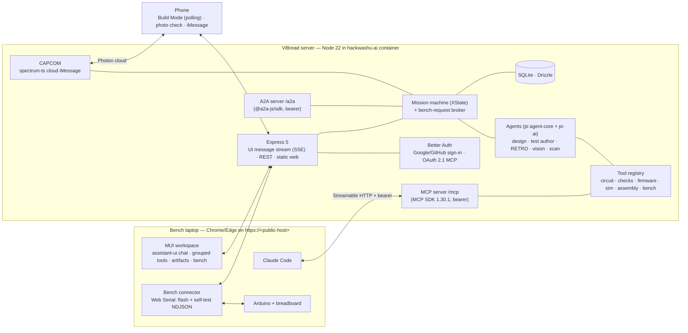

# ViBread — Build Plan

> HackWashU Fall Build Challenge, Sep 25–27 2026 · Main track + Photon bonus track.
> Hard deadline: **Sun Sep 27, 12:00 PM CT** (Devpost). Plan written Sat Sep 26, ≈01:00 CT → ~35 h of wall clock.
> Evidence: [`research/`](research/) (technology research, sources inline) and [`research/audit/`](research/audit/)
> (hands-on verification of every package and claim used below: installs, type checks, offline smokes).

## Build status — Sat Sep 26 (after integration)

Everything on the ranked list (§4, items 1–16) is built and tested in the container. What still needs something only the team
has—real hardware, a Claude credential, and Google/GitHub/Photon accounts—is called out below. Plain-language overview:
[HOW-IT-WORKS.md](HOW-IT-WORKS.md).

| # | Item | State | Proof (live unless noted) |
|---|---|---|---|
| 1 | Core v0 | Built | Virtual board: bench firmware (Eta template) in the simulator, safe idle → rails → read-before-drive self-test → diagnosis. LED pulses measured ≤ 4.02 ms, 1.1 % duty. An output jumper in a rail row is reported stuck from passive reads and never driven (simulated fault). **Real board untested** |
| 2 | Workspace + agents + test author + RETRO | Built | assistant-ui/MUI workspace with grouped tool rows, answerable question cards, and stop/resume. The design agent runs on pi; test author, RETRO, photo check and scan use pi-ai structured calls. The web still receives the AI SDK UI-message stream format. The historical real-model benchmark ([docs/e2e-benchmark.md](docs/e2e-benchmark.md)) reached five GO consoles on 3/3 golden briefs, with 18/18 independent scenarios passing |
| 3, 10 | CAPCOM (iMessage) | Built | Terminal provider: link code → brief → status → poll fallback; links and mission attachments survive restarts; `mission N`; poll votes map to the requested poll; self-test prompts answerable from iMessage; agent and iMessage bench requests show at the bench and still need the click (end-to-end test). **Cloud iMessage untested** (no Photon project) |
| 4 | Photo check | Built | Upload → HEIC/JPEG → per-part advisory answers. Real Claude vision run once on a rendered step image (shown as a labeled example when no key exists); a real phone photo untested |
| 5 | Checks (EECOM/GUIDO) | Built | Rule tests for every broken variant; 220 Ω/red worst case 16.5 mA; core warnings filtered |
| 6, 12 | Schematic, replay, live "Try it" | Built | elkjs (EPL-2.0) layered SVG/PNG with a geometry/connectivity check on every drawing; failures become titled connection tables. Replay; real-time sim in a worker: button presses step the moon phases exactly as the tests say |
| 7 | Layout + LVS + steps | Built | Moon lamp: 15 jumpers, 33 steps, plug state on every step, phone focus crops; bb-400 fits |
| 8, 14 | Verification + fault dictionary | Built | Golden → "Houston, we are GO" with no fix suggested. Simulated fault table on all three goldens (25 cases, `npm run fault-table` → [docs/fault-table.md](docs/fault-table.md)): the self-test catches 22 (a wrong resistor value is electrically invisible to it on all three); the true cause ranks first in 14, second in 7, third in 1; highlighted holes. Mission complete requires a real-board pass |
| 9, 15 | Sign-in, OAuth 2.1, A2A | Built | Single-operator mode live. OAuth 2.1 (DCR + PKCE + consent + token → MCP tools) end to end in a regression test; real Claude Code 2.1.283 connects with the bearer command. Google/GitHub are config-gated (redirects tested, no real client yet) |
| 11 | Claude Code MCP + A2A | Built | `claude mcp list` → Connected; A2A ask-back → completed artifact |
| 13 | SPICE cross-check | Built | Part of EECOM's evidence: fixed per-color diode models at three corners; red LED 13.99 mA SPICE vs 13.41 mA analytic; goldens show no deviation, a wrong Vf assumption is flagged |
| 16 | Connect your Claude account | Built | pi-ai's Anthropic OAuth (paste-back of the code, `code#state`, redirect address, or its local callback) or an API key checked with Anthropic; credential stored per user in the server database; every production agent call runs through pi-ai. Tested with a stand-in token endpoint (paste, state mismatch, rejected code, local callback, one sign-in at a time, API key, refresh failure → server key). **Real sign-in needs you** |
| — | Desktop app (Electron) | Built | Numbered releases (`desktop-v0.1.N`, newest = [Latest](https://github.com/BarryTheShen/ViBread/releases/latest)) published by CI after every green build: Linux x64 AppImage + .deb, Windows x64 installer, macOS arm64/x64 dmg. Each packaged app smoke-tested on its own OS on GitHub Actions (Arduino compiler download + seed + compile + screenshots; first run 161 s Linux, 177 s Windows, 232–386 s macOS); .deb install-tested with apt. Real Arduino over USB untested |
| — | Phone as a home-screen web app | Built | Manifest + icons; iPhone "Add to Home Screen" tip in Build Mode |

Also added while integrating: human **GO for build** (Flight Director) when the agent isn't the one releasing; mission
completion (LAUNCH → "Does it work?" → DONE); independent tests are written when a credential exists. Tester GitHub issues
#1–#14 drove an issue-by-issue QA loop through the final fixes.

**Needs you (in order):**
1. **A Claude credential:** Settings → *Connect your Claude account* for pi-ai's Anthropic OAuth, or Settings → **Claude →
   Use an API key instead** (checked with Anthropic). The server's optional `ANTHROPIC_API_KEY` remains the fallback. Then
   run one design from Home and watch: design agent → test author → RETRO → GO for build.
2. **The board:** the Linux desktop app (or Chrome/Edge on `localhost`) → Bench → *Use USB board*: safe firmware flash
   (webserial-flasher), rails, self-test, calibration, app flash. Fallback: the `arduino-cli upload` command the bench shows.
   Tell the build which board/USB chip you have (see §10, "Remaining verification and demo decisions").

## 0. TL;DR

ViBread is **Mission Control for your breadboard**. A beginner describes what a circuit should do; ViBread's agent designs it
(schematic + netlist + Arduino sketch) from parts the user already owns, runs a **Go/No-Go poll** of independent checkers,
turns the design into **LEGO-style numbered assembly steps** on laptop and phone, then verifies the **real build**: safe firmware
first, staged power-up, a read-before-drive self-test that streams "telemetry" back over USB, and a Claude photo check. When
something is wrong it says *where* ("Houston, we have a problem: D2 reads LOW even with the button released — its leg shares row
17 with the GND jumper"), proposes the fix, and re-runs the checks. The same mission is reachable from iMessage (Photon Spectrum,
"CAPCOM") and from Claude Code over MCP. Claude can edit designs directly; **GO for build** is human-only (the web button or
iMessage `GO`), and physical actions still wait for a click at the bench.

**Build philosophy: libraries first, our code is glue.** Every subsystem uses a maintained library where one exists (pi-agent-core
and pi-ai, the AI SDK UI-message stream, assistant-ui, Material UI, Better Auth, elkjs, avr8js, arduino-cli, XState, Drizzle,
Spectrum, MCP/A2A SDKs). Custom code exists only where no library fits; each piece is listed with the reason in §6.2.

**Delivery strategy (historical):** the hardware + hostname gate set the board, parts, and public URL before hardware-dependent
code was written. Core v0 then grew into the complete ranked list (§4). The remaining team checks are real hardware and live
credentials, listed above.


## 1. Problem, users, definition of success

- **Problem.** Going from "a lamp that turns on when it's dark" to a working breadboard needs four skills at once: circuit
  design, embedded code, reading wiring diagrams, and debugging hardware. In a CHI 2016 study of novices building an Arduino
  project, only 6 of 20 finished within the 45-minute session and circuit construction was the most common fatal failure
  (Booth et al., *Crossed Wires*; research/06 §2.7).
- **What exists.** Schematik (built on Claude) already turns plain English into code, wiring diagrams, a parts list, pin tables,
  and step-by-step assembly instructions; Cirkit Designer, Tinkered, Flux, and Arduino's AI Assistant cover design, simulation, or
  upload. Research systems proved pieces we build on: Trigger-Action-Circuits (UIST 2017) generated circuits, firmware, and
  assembly instructions from behavior descriptions (6/6 novices finished vs 0/6 with the Arduino IDE); ElectroTutor (UIST 2018)
  attached tests to tutorial steps and cut backtracking from 18.8 to 0.2 instances; SchemaBoard (UIST 2020) linked schematic and
  breadboard views.
- **What ViBread adds — "Schematik tells you how to build it; ViBread checks that you actually built it right, and tells you
  where you didn't":** a closed loop on the *physical* build (self-test telemetry → locate the fault → fix → re-test) on an
  unmodified Uno · the same binary simulated and flashed · design from the user's own parts with ask-back · an agent that works
  from iMessage and Claude Code.
- **Users.** Non-technical and intermediate makers who already own an Arduino kit (brief p.3). Controller family: Arduino only.
- **Supported-circuit envelope (brief p.5 "how complicated"):** Uno R3 or Nano (ATmega328P) · 5 V logic, USB power · one
  breadboard (30- or 63-row) · ≤ 20 parts and ≤ 20 signal nets · planned external load ≤ 400 mA (per pin ≤ 20 mA, MCU total
  ≤ 200 mA) · parts from the module library, plus *generic* digital/analog parts that get basic logic simulation labeled
  unverified · no motors/relays/mains in the MVP.
- **Successful build (brief p.5, sharpened):**
  - **GO for build** = no ERC errors · electrical limits within spec · sketch compiles · the independent test suite passes with
    full coverage · reviewer agent votes GO (the brief's "overall agent saying yes") · human GO. The human (Flight Director)
    presses **GO for build**; if no Claude credential exists, the independent tests can't be written (FIDO stays PENDING and GO
    is blocked), and the reviewer vote can be waived only through an explicit confirmation that is recorded on the timeline.
  - **Mission success** = staged power-up clean · self-test telemetry matches expectation · user confirms the behavior.

## 2. Theme fit — "Fly Me to the Moon"

The rubric asks whether we address the prompt and whether the design supports the theme. The interpretation is structural:
**Apollo reached the moon because every step was simulated, every wire was checked against a checklist, a Go/No-Go poll gated
each phase, and when Apollo 13 failed, Mission Control debugged it from telemetry.** ViBread gives a first-time maker the same
discipline for their own moonshot.

| Apollo practice | ViBread feature |
|---|---|
| Mission brief | User describes the goal (web or iMessage) |
| Flight plan | Schematic + sketch + bill of materials drawn from the user's own parts |
| Simulators | The compiled binary runs in an AVR emulator before anything is wired |
| Go/No-Go poll | Consoles report GO / NO-GO: **EECOM** electrical · **GUIDO** firmware · **FIDO** simulation · **FAO** assembly · **RETRO** independent reviewer agent. Human = Flight Director |
| Launch checklist | Numbered LEGO-style assembly steps ("T-minus 6 steps") with staged power-up |
| Telemetry | Self-test firmware streams pin/ADC/VCC readings, diffed against expectation |
| "Houston, we have a problem" | Closed-loop debugger localizes the fault and proposes the fix |
| CAPCOM (the one voice talking to the crew) | iMessage agent (Photon Spectrum) talking to the builder at the bench |

UI labels stay plain ("Electrical checks · EECOM"); console names are flavor. The assistant-ui chat uses the MUI theme, with
light and dark palettes following the system setting (space cadet, cool gray, anti-flash white and red).

**Hero demo circuit: the Moon-Phase Lamp** (final choice at the gate, from parts in hand). Four LEDs **in a row** show the moon's
lit side the way the sky does: while waxing, light fills in from the right; while waning, the right side goes dark first (an
astrophysicist is on the judging panel). A button advances the day; a photoresistor divider turns the lamp on only when the room
is dark, with the threshold **calibrated on the user's bench** by the self-test (§5.9). Fallbacks if the kit differs: *Launch
Control* (buttons + countdown LEDs + buzzer) or *Knob Night-Light* (potentiometer + PWM LED).

## 3. Demo, pitch, and judging logistics

**Latency budget** (measured at Checkpoint B, P50/P95): design run ≤ 60 s / 120 s · revision run ≤ 45 s / 90 s · flash ≤ 15 s ·
self-test ≤ 60 s including prompts. Anything slower is pre-computed for live demos.

| Format | Live | Recorded / pre-warmed |
|---|---|---|
| **Pitch (5 min, non-EE judges)** | (1) Brief on the phone loads a pre-warmed mission; GO poll voted on iMessage. (2) Real board with a deliberate fault: self-test → "Houston…" with rows highlighted → fix → GO → celebration effect → lamp works. | Full agent design run in the MUI workspace, simulation replay, photo check, Claude Code over MCP — a 40-second video cut inside the pitch |
| **Table judging (format confirmed at office hours)** | Pre-flashed, powered kit with a deliberate fault: self-test → diagnosis → fix → GO; phone shows the steps; iMessage alert; photo check | Devpost video for everything else |
| **Photon clip (60 s)** | — | CAPCOM flow on the phone: brief → poll → step image → fault alert → photo → celebration |

- **Make it visible to a room:** an overhead camera (a phone on a stand or a webcam into the laptop) on the breadboard and the
  demo phone mirrored, shown side by side with the workspace. Rehearse with the real camera feed.
- **Laptop-only fallback:** server, SQLite snapshot, arduino-cli, pre-warmed missions and cached agent runs on the demo laptop;
  phone on the laptop's hotspot/LAN; sign-in disabled (single operator). One judging rehearsal runs on the hotspot only.
- **Pitch skeleton (5:00), story-first:** 0:00 hook — the *Crossed Wires* result (6/20) and Apollo's discipline · 0:40 one user's
  journey · 1:10–3:30 live beats · 3:30 40-second video · 4:10 why it's new, naming Schematik (§1) · 4:40 impact + close.
- **Logistics:** ask organizers and Photon (Discord; Saturday 16:00–18:30 office hours) about the judging formats, timing, and
  projector; one person stays with the kit Sun 12:00–16:00; spare board + cable on the table; Devpost entry created at
  Checkpoint B and kept current; rough backup video at Checkpoint B, refreshed at C.

## 4. Scope: one ranked build list

All ranked items are built top to bottom; this table records the original priority and cut order. Items 1–9 were the MUST line;
items 10–14 were SHOULD; item 15 was stretch; item 16 was built last.

| # | Item | Track | Tier |
|---|---|---|---|
| 1 | **Core v0** (hardware-verified): hand-written Moon-Phase fixture → compile → flash (fallback `arduino-cli upload`) → safe firmware → read-before-drive self-test → one diagnosis rule, shown in the MUI shell. Stand-ins: a hand-written layout/steps file and a pre-rendered schematic | Main | MUST |
| 2 | assistant-ui/MUI workspace (grouped tool rows, answerable question cards, artifact tabs, mission theme, stop/resume) + agent design from natural language (module library ∩ inventory, ask-back) + independent test author + RETRO vote | Main | MUST |
| 3 | Thin CAPCOM: brief by DM, status replies, GO/NO-GO poll (text fallback) | Photon | MUST |
| 4 | Thin web photo check: phone camera/upload → Claude vision vs the expected step image, per-part answers with `unknown`; advisory, never blocks (brief p.5) | Main | MUST |
| 5 | Checks: ERC + Uno rules, analytic limits at worst-case corners, compile warnings, code↔circuit pin-mode check, test coverage rules | Main | MUST |
| 6 | Schematic via elkjs layered layout + geometry/connectivity check (fall back to a titled connection table) and simulation replay on the breadboard view | Main | MUST |
| 7 | Auto-layout + LVS + LEGO steps (insert/highlight animation, reduced-motion aware) with staged power-up | Main | MUST |
| 8 | Full verification: rail-power checkpoint, all self-tests, light-sensor calibration, 3 deliberate faults diagnosed and fixed | Main | MUST |
| 9 | Google sign-in on the single public origin + iMessage linking | Main + Photon | MUST |
| 10 | Full CAPCOM: step images, self-test prompts as polls, fault alerts, iMessage pre-approvals, photo intake, celebration; 15-min group-chat test | Photon | SHOULD |
| 11 | Claude Code over MCP with a short-lived bearer token (`--header`); A2A endpoint (bearer) if cheap | Main + Photon | SHOULD |
| 12 | Live interactive simulation (avr8js in a browser worker) | Main | SHOULD |
| 13 | SPICE cross-check (ngspice) of the analytic limits | Main | SHOULD |
| 14 | Fault dictionary (single-fault layout mutants) ranking on top of the rule table | Main | SHOULD |
| 15 | OAuth 2.1 for Claude Code (Better Auth MCP + CIMD) and A2A OAuth scheme; GitHub sign-in | Main | STRETCH |
| 16 | **Connect your Claude account**: the user connects via pi-ai's Anthropic OAuth (paste the code, `code#state`, redirect address, or local callback) or a per-user API key checked with Anthropic; credentials live in the server database and model calls use pi-ai. The server key remains the fallback | Main | LAST |
| — | Claude Code Channel push; skill-level exposition; inventory from a kit photo; Wokwi cross-check; ArUco rectification; KiCad export | Main | COULD |
| — | Uno R4/ESP32/Pico, PCB layout, arbitrary-part simulation, AR overlay, mains/high voltage | — | WON'T |

**Team-size cuts:** these were planning tiers, not runtime permission modes. The shipped product has no design permission modes:
Claude edits designs directly, the person presses GO for build, and physical actions still wait for a bench click. The brief marks
instruction adaptation to variants/skill levels "out of scope for MVP" (p.5).

**Named fallbacks (each component degrades, not the whole demo):**

| Component | Primary | Fallback 1 | Fallback 2 |
|---|---|---|---|
| Flashing | `webserial-flasher` in the bench browser | `arduino-cli upload --input-file <hex>` on the laptop (browser releases the port first); browser keeps reading telemetry | Arduino IDE on the laptop with the same sketch |
| Agent | Live Opus 5.5 run | Cached runs of the golden prompts (pre-warmed missions) | Hand-written fixture |
| Chat UI | assistant-ui with MUI styling | Plain MUI list + form | Recorded run |
| Simulation tests | Custom avr8js runner | Wokwi CI scenarios (cloud, quota) | Test list without replay |
| Schematic | elkjs layered renderer + geometry check | Titled connection table fallback | Netlist table |
| Layout/steps | Auto-allocator | Hand-written layout files for golden designs | — |
| CAPCOM | Cloud iMessage | Terminal provider on screen | Video |
| Photo check | Live Claude vision | Recorded example | — |
| Hosting | golf container behind the stable tunnel | Laptop-only setup + hotspot | Video |
| Claude Code | MCP with bearer token | Video | — |
| Claude account (item 16) | The user's own Claude account | ViBread's server key | — |

## 5. Architecture

### 5.1 Components and network topology



- **One public HTTPS origin for all signed-in use**, bench included (Web Serial works on HTTPS): a named Cloudflare Tunnel if the
  team has a domain on Cloudflare, otherwise an ngrok static domain or Tailscale Funnel — **chosen tonight** so Google sign-in
  callbacks and the auth issuer are fixed to one address. Cloudflare *quick* tunnels are not used for signed-in traffic: they don't
  carry SSE (verified live, research/audit/A3), cap in-flight requests at 200, and change URL on every start.
- **Server:** one Express 5 process in the container on golf (`0.0.0.0:8787`) serving the API, the UI message stream (SSE),
  `/mcp`, `/a2a`, Better Auth, and the built web app. Phone views poll every 1–2 s, so they work on any network.
- **Developer access / laptop-only mode:** `ssh -L 8787:172.30.77.10:8787 <golf>` → `http://localhost:8787` (a secure context) —
  used for development and the laptop-only fallback, not for signed-in demo traffic.
- In iMessage, CAPCOM sends a plain URL only after the user's first reply (Photon deliverability guidance).
- The browser owns the USB device; the server never touches the laptop's serial port.

### 5.2 Agent harness — pi (`@earendil-works/pi-agent-core`) over the Claude API

- ViBread does not use the Claude Agent SDK. The server runs the design agent in-process on pi and uses the server key by
  default, or the mission owner's per-user Claude credential when one is connected. The same model code works with either
  credential; an unavailable owner credential falls back to the server key.
- **Library:** the design agent runs on **pi** in-process: `@earendil-works/pi-agent-core` 0.87.1 (`Agent`, sequential tool
  execution, `beforeToolCall` caps design attempts at 4 per turn, `finishTurn` ends the turn after `ask_user` or 20 model turns)
  + `@earendil-works/pi-ai` 0.87.1. Each run rebuilds the pi transcript from server-held UI history (`agents/pi-ui.ts`) and
  translates pi events into AI SDK UI-message chunks (`createUIMessageStream` from `ai` 7.0.116), streamed with
  `pipeUIMessageStreamToResponse` on Express, so the web chat contract stays unchanged. The single-shot calls (test author,
  RETRO, photo check, scan) also use pi-ai structured calls: one request whose only tool is the answer schema, required via
  `toolChoice` and validated by zod (`agents/pi-object.ts`).
- **No design permission system:** Claude's design and parts tools run directly when pi calls them. The browser stores the
  server-held conversation and can stop or resume a run; `ask_user` ends a turn until the person answers. A physical tool never
  touches the board: it files a bench request bound to the released revision, and the bench browser runs it only after a click.
- **Three agent roles, separate calls/contexts:** *design agent* (IR + sketch; `claude-opus-5-5`), *test author* (sees brief + IR
  interface, never the sketch), *RETRO reviewer* (sees everything, can only vote and explain). Test author, RETRO, photo
  checks and scans use the configured fast Claude model.
- **Tools are defined once** in `packages/tools` (zod schema + handler, tagged for read/state-changing/physical classification)
  and registered by thin adapters as pi `AgentTool`s for the design agent (`agents/pi-tools.ts`: zod → JSON Schema, arguments
  validated by pi, refusals returned to the model as tool errors) and as MCP tools on `/mcp`. No internal MCP hop.

| Tool group | Tools (abridged) | Libraries behind it |
|---|---|---|
| `circuit` | `list_modules` (ro), `get_inventory` (ro), `propose_design`, `validate_ir` (ro), `render_schematic` (ro) | zod, elkjs schematic renderer |
| `checks` | `run_erc` (ro), `electrical_limits` (ro), `spice_crosscheck` (ro, item 13), `explain_finding` (ro) | json-rules-engine, ngspice CLI |
| `firmware` | `compile` (ro), `pin_mode_check` (ro), `generate_selftest` | arduino-cli, Eta + ArduinoJson, avr8js |
| `sim` | `run_scenarios` (ro), `coverage_report` (ro), `sim_trace` (ro) | avr8js, yaml, worker_threads |
| `assembly` | `layout_board`, `lvs_check` (ro), `build_steps`, `render_step_png` (ro) | our SVG glyphs, @resvg/resvg-js |
| `bench` | `diagnose` (ro), `inspect_photo` (ro), `explain_telemetry` (ro) | json-rules-engine, sharp + heif2jpeg, Claude vision |

Flashing and self-tests are machine-driven bench actions executed by the browser after a human click — never agent tools.


### 5.3 Circuit IR and module library (research/02, audit/A8)

- A small versioned **zod schema** (`vibread.circuit/0.1`) is the contract the agent writes and every tool reads — a data
  definition, not an engine. It stays ours because the IR carries the electrical pin types, board limits and provenance that
  the schematic renderer and deterministic checks need. The isolated schematic runtime consumes the IR directly. **A human
  reviews and freezes the IR schema, the NDJSON telemetry format, and the golden fixture before the overnight build starts.**
- Field groups: `board` (profile `uno-r3-atmega328p-5v` / `nano-atmega328p-5v`: pin capabilities, limits, reserved pins, on/off
  breadboard, USB power-path protection) · `parts` (id, ref, `moduleKey`, variant, value + tolerance) · `pins` with KiCad-style
  electrical types · `nets` · `sketch` · `tests` · `provenance` (intent clauses, assumptions). Every artifact carries the revision
  hash.
- **Module library** = data files (facts + links, no copied art): pins, limits, sim model id, footprint, self-test strategy,
  evidence URLs. MVP set (~10, frozen from parts in hand at the gate): LED by color, resistor, 4-pin
  tactile button, photoresistor, potentiometer, passive + active buzzer; stretch: SG90 servo, HC-SR04. Parts outside the library
  enter as *generic digital/analog modules* from a user-supplied pinout: basic logic simulation, always labeled unverified.

### 5.4 Mission lifecycle and gates

`BRIEF → CLARIFY → DESIGN ⟲ → GO/NO-GO → ASSEMBLE (staged) → VERIFY → (DEBUG ⟲) → LAUNCH → DONE` — an **XState v5** machine with
persisted snapshots in SQLite, so human waits survive restarts.

- **DESIGN:** the design agent proposes IR + sketch; deterministic checkers return findings; it repairs until every checker is GO
  or 4 iterations elapse, then reports what blocks. The test author writes intent tests; RETRO reviews at the end.
- **Revisions:** any change creates revision *n+1* and re-runs every checker. **GO for build** releases one revision as the
  build target; physical bench requests bind to that released revision's hash.
  the LLM receives the final telemetry + diagnosis to explain.

| Console | Evidence | Source |
|---|---|---|
| EECOM (electrical) | Typed ERC + Uno rules (json-rules-engine data) + analytic limits at worst-case corners (SPICE cross-check with item 13) | research/03 |
| GUIDO (firmware) | arduino-cli compile (`--json --warnings all`), flash/RAM budget, pin modes observed in simulation vs IR roles | research/05, 04 |
| FIDO (simulation) | Independent intent tests pass **and** coverage rules hold | research/04 |
| FAO (assembly) | Layout fits the user's breadboard; LVS derived nets == IR nets | research/07 |
| RETRO (review agent) | Independent agent compares brief, IR, sketch, and results; votes GO/NO-GO with reasons | — |

### 5.5 Electrical checks (research/03, audit/A5, A8)

- **ERC:** the Uno rule table is **data** evaluated by `json-rules-engine` 7.3.1 (ISC) — `CUR-PIN-DESIGN` ≤ 20 mA,
  `CUR-PIN-ABS` 40 mA, `CUR-VCC-GND` ≤ 200 mA, `PWR-USB-FUSE` 500 mA path, `LED-RESISTOR`, `BTN-PULLUP` (internal 20–50 kΩ; no
  internal pull-down), `ADC-RANGE`, `PWM-PINS` {3,5,6,9,10,11}, `I2C-PINS` A4/A5, `SPI-PINS` 10–13, `SERIAL-USB` D0/D1,
  `SHORT-GRAPH`. A small pin-type conflict check follows KiCad's documented matrix (written from the docs, not KiCad's GPL source).
- **Analytic limits at conservative corners:** maximum current uses near-zero driver resistance, minimum LED Vf, and the
  resistor's minimum value within tolerance; brightness/voltage-drop checks use the ~45 Ω effective driver bound and maximum Vf.
- **SPICE cross-check (item 13):** ngspice 45.2 (Ubuntu apt) in batch mode (`-b -r`), temp dir, timeout; server-owned deck and
  `.control` block; source currents sign-normalized (verified in research/audit/A5: 5 V → 220 Ω → red LED = 13.39 mA).
- **Light sensors are never judged on absolute values** (a GL5528-class photoresistor spans ~8–20 kΩ at 10 lux and ≥ 1 MΩ dark);
  checks use relative change, and thresholds come from on-bench calibration (§5.9).

### 5.6 Firmware, tests, and simulation (research/04, 05, audit/A3, A5, A8)

- **Compile — arduino-cli 1.5.1** (checksum-pinned binary) + **`arduino:avr@1.8.8`**: `compile --fqbn <arduino:avr:uno |
  arduino:avr:nano:cpu=atmega328 | …:cpu=atmega328old> --json --warnings all --output-dir <job>` → ELF + HEX + diagnostics.
  Job-local `ARDUINO_DIRECTORIES_*`, unique output dirs, serialized installs; optional JSON fields parsed defensively. Warm compile
  ≈ 0.4 s measured.
- **Simulation — avr8js 0.21.1** runs the ATmega328P; HEX parsing reuses `parseIntelHex` from `webserial-flasher` (avr8js has no
  HEX loader). **Custom glue:** a scenario runner and five device models (LED, button with deterministic bounce, potentiometer,
  photoresistor divider driven by relative light levels, passive/active buzzer) plus the generic digital/analog part. No maintained
  library provides portable part models for avr8js (audit/A8); Wokwi CI is the fallback test engine if the runner slips.
  Headless runs use a `worker_threads` pool; the same runner runs in a browser worker for the live view (item 12).
- **Scenario files** use `yaml` in a Wokwi-shaped format we version as `vibread.sim/v1` (`set-digital`, `bounce`, `set-light`,
  `wait`, `expect-pin`, `expect-pwm`, `expect-serial`).
- **Independent intent tests:** the test author turns each intent clause into scenario steps plus a plain-language line ("In the
  dark, pressing the button 3 times lights 3 LEDs from the right"). **Coverage rules:** every output asserted, every input
  exercised, every intent clause mapped to ≥ 1 test, edge-case categories present (bounce, threshold hysteresis, rapid input,
  power-on). The design agent can't edit this suite.
- **Code ↔ circuit check:** decode DDRx/PORTx per pin (OUTPUT / INPUT_PULLUP / INPUT) during simulation vs IR roles.
- **What the human sees at GO:** the plain-language test list with pass marks and a **simulation replay** (recorded trace animated
  on the breadboard view); the live simulator arrives with item 12.
- **Fidelity statement with every simulation:** "Instruction-level ATmega328P emulation of the exact binary that will be flashed,
  with protocol-level part models. Validates logic, timing, and pin configuration; does not prove current, noise, brown-out, or
  contact quality — the physical self-test does."

### 5.7 Schematic, breadboard layout, LVS, and LEGO-style steps (research/07, audit/A3, A8)

- **Schematic — isolated runtime:** the circuit IR is sent to `packages/assembly/schematic-runtime`, a child process with
  `elkjs` 0.12.0 (EPL-2.0). ELK supplies layered layout and orthogonal routing; our renderer draws the Arduino, parts, power
  symbols, labels, junctions and wires. `checkSchematicSvg` checks connectivity and geometry on every drawing. A failure is
  replaced by a titled connection table, never a misleading drawing. PNGs use resvg for iMessage and step artifacts.
- **Breadboard — custom glue (no library exists):** audits found no MIT/Apache breadboard component or solderless placer (Wokwi
  Elements has part glyphs but no breadboard; Fritzing is GPL/CC-BY-SA; other repos are apps, not libraries). We draw the board
  grid **and** the part glyphs as plain SVG: the same drawing must render in the browser and in resvg (step PNGs for the phone and
  iMessage), and Wokwi's web components can't render server-side, so `@wokwi/elements` was dropped.
  Board profiles: 0.1" grid, A–E / F–J groups split by the channel, rails as explicit segments; **Uno** off-board via flexible
  jumpers, **Nano** as an on-board anchor straddling the channel.
- **Layout — deterministic net-to-row allocator:** 5 V/GND on the top rails; each branch placed left-to-right with a spacer row;
  each signal net gets a 5-hole strip; 2-lead parts span strips at footprint-legal distances; the tactile button straddles the
  channel; lexicographic tie-breaks make the same input produce the same holes.
- **LVS:** union-find over contact groups + occupied holes + jumpers → derived nets compared with IR nets; reports split nets,
  merged nets (critical if GND+5 V), floating pins, duplicate occupancy. Same engine powers diagnosis.
- **Steps** (Agrawala et al. SIGGRAPH 2003, LEGO conventions, CircuitStyle), with an explicit plug state on every step:
  inventory → orientation legend → **USB unplugged** → rails → **plug in: rail checkpoint** → **unplug** → one part per step
  (polarity before insertion) → one jumper per step → **plug in: subsection checkpoint → unplug** (ElectroTutor-style) → final
  power-up. Each step shows a parts callout ("1× 220 Ω — red-red-brown"), highlighted new items with a short insert/highlight
  animation (off under reduced motion), exact holes in text ("R1: E12 → E16"), never color alone (WCAG 1.4.1). PNG per step via
  `@resvg/resvg-js` 2.6.2 (≈19 ms for 1200×800, audit/A3).

### 5.8 User interface — Material UI + assistant-ui

A plain-language agent workspace made from MUI components and assistant-ui:

- **Libraries:** `@mui/material` 9.4.0 + Emotion, `@mui/icons-material` 9.4.0, `@assistant-ui/react` 0.15.22,
  `@assistant-ui/react-ai-sdk` 1.4.13, `react-markdown` + `react-syntax-highlighter`, `qrcode.react`, React 19.3 + Vite
  8.3.1, React Router 8, TanStack Query 5 (polling). MUI v9 needs `sx` for spacing props.
- **Stream glue:** the server translates pi events to the AI SDK UI-message stream. assistant-ui's AI SDK runtime handles
  streaming, stop/resume and reconnect; ViBread supplies MUI-styled tool rows, answerable `ask_user` cards, mission timeline
  rows and artifact panels.

| Screen | MUI composition |
|---|---|
| Home / new mission | `Card` + multiline `TextField` ("What should your circuit do?"), parts `Chip`s, recent missions `List` |
| Mission workspace (laptop) | MUI shell with assistant-ui thread, grouped tool rows, answerable question cards, **Stop** while a run is active, and artifact tabs (Schematic · Steps · Code · Replay · Tests · Telemetry · Photo) |
| Bench / Verify | `Stepper`: Connect board (filtered Uno/Nano port chooser) → Safe firmware → Rail checkpoint → Self-test (live prompts) → Diagnose; physical actions stay behind an explicit click |
| Build Mode (phone) | `MobileStepper` + one step `Card` (image, parts callout, holes, plug state), "I did this", **Check with camera**, stale-connection badge; polls; never offers flashing |
| Settings / Connections | Claude account or API key, **Connect Claude Code** (copyable `claude mcp add` command with a short-lived token), **Link iMessage**, phones and **Diagnostics** |

Wireframes and copy guidelines: research/audit/A7 §"Screen set". Accessibility: visible focus, ≥ 24 px targets (44 px on phone),
reduced motion honored (steps, replay, celebration), and polite streaming announcements.

### 5.9 Physical verification and debugging (research/06, audit/A3, A8)

**Safety sequence (answers the brief's "short circuit check" for the dangerous cases):**
1. **Step 0 — before any wiring:** connect the bare board; flash ViBread's safe firmware (all pins inputs, banner with design hash).
   Whatever sketch was on the board before can no longer drive pins into the new circuit.
2. **Rail checkpoint (rails only, then unplug):** the board must enumerate, print its banner, and report normal VCC (internal
   bandgap). No banner, repeated resets, or USB dropping off → **"Board lost power — unplug, then check the rails and the cable"**
   with the rail jumpers highlighted (the same symptom can be a charge-only cable or a missing driver; the board profile records
   its USB power-path protection).
3. **Subsection checkpoints** as parts are added; full self-test at the end.

- **Read before drive (enforced by the firmware template):** every self-test starts with a read-only phase — each planned output
  pin is read as an input with and without the internal pull-up. A pin that reads stuck at a rail is **never driven**; the test
  reports the stuck pin and stops. LEDs are then driven with short, low-duty pulses (≤ 5 ms on, ≤ 10 % duty) until the person
  confirms what they see.
- **Flashing — `webserial-flasher` 1.0.1** (MIT, STK500v1 over Web Serial; browser bundle verified without Node deps), wrapped in a
  buffered adapter (its `sendCommand` writes before attaching the response listener — a race found in audit/A3), with Uno/Nano-new
  115200 and Nano-old 57600 profiles, DTR reset, signature check `1E 95 0F`. Chrome/Edge are the tested browsers (Firefox 151 added
  Web Serial behind a permission add-on). **Fallback:** `arduino-cli upload --input-file <hex>` on the laptop with the server-built
  HEX, after the browser releases the port.
- **Self-test firmware** comes from a fixed **Eta** template (never LLM-written), serializing NDJSON with **ArduinoJson** 7.4.2.
  Firmata was rejected: StandardFirmata and ConfigurableFirmata set digital pins to OUTPUT on reset, unsafe on an unverified
  circuit (audit/A8). Tests: `rails.vcc` · `pins.readonly` · `digital.stuck` · `button.interactive` · `light.relative` (ambient,
  then "cover the sensor") · `pot.sweep` · `led.sequence` (human reports which LED lit — web buttons or a poll) · `net.continuity`
  only across resistor-guarded pairs. Unobservable cases report `unknown`.
- **Light-sensor calibration:** recorded ambient/covered readings set the app firmware's dark threshold (midpoint + hysteresis),
  compiled in before the final flash.
- **Expected signatures** come from the IR revision; readings in the logic-threshold gap and floating inputs (median + variance)
  are indeterminate and never gate a verdict.
- **Diagnosis (rule table in `json-rules-engine`):** failing signatures map to candidate causes with holes highlighted — button
  pin stuck LOW → {leg in a GND row, button rotated 90°, jumper to GND}; LED sequence mismatch → {jumpers swapped, LED reversed, LED
  missing}; light reading pinned at a rail → {divider resistor missing, sensor missing, wrong row}; output pin stuck at a rail →
  {jumper in a rail row, missing resistor}; no banner / USB drop → {rail short, cable}. Item 14 adds a fault dictionary of
  single-fault layout mutants (moved lead, missing part, misrouted jumper, rotated button, swapped jumpers, reversed polarity, wrong
  value) ranked against the telemetry.
- **Attribution:** fails in simulation → *code* · checks/LVS fail pre-build → *design* · telemetry ≠ expectation and a wiring cause
  explains it → *wiring* · nothing explains it → *component* · else *unknown*.
- **Photo check (item 4, advisory):** phone camera/upload → `heif2jpeg` (HEIC → JPEG, ≈8 ms) + `sharp` (orient/resize) → Claude
  vision with the photo, the expected step image, and expected placements; it answers per part with `unknown` allowed. It never
  blocks progress and never overrides telemetry; it catches what the MCU can't see (e.g. a reversed LED before power-up).

| Fault | MCU self-test | Photo | Human prompt |
|---|---|---|---|
| Rail short (5 V–GND) | D (no banner / USB drop at the rail checkpoint) | C | D (rail checklist) |
| Missing wire | D (on a tested path) | D/C | D |
| Wrong row | D/C (same-net row: undetectable and harmless) | D/C | D |
| Short to GND / rail on an output | D (read-only phase: stuck pin) | C | D |
| Short between pins | D/C (guarded pairs) | C/D | D |
| Reversed LED | C | C/D | D (LED doesn't light) |
| Missing resistor | C | D/C | D |
| Wrong resistor value | C | C (bands) | D (color code) |
| Dead component | C/D (behavior test) | N | D |

(D = detectable, C = conditional, N = not detectable; research/06 §6.7.)

### 5.10 Design authority and physical-action gate

The earlier permission-mode design was removed. There are no Plan / Ask every time / Review / Autopilot modes and no approval
prompt before Claude edits a design. The design agent's tools run directly when called. The person remains the Flight Director:

| Action | Authority |
|---|---|
| Design, revision and parts tools | Claude can run them directly; the server records the revision and findings |
| Release a revision as the build target | Human-only **GO for build** from the web button or an operator's iMessage `GO` |
| Flash, rail check, self-test and other physical bench actions | A remote agent or iMessage can request them; the bench browser runs them only after a person clicks |

The bench-request broker stores the request, released-revision hash, expiry and human decision. An iMessage operator can
pre-approve a request, but the physical action still waits for the bench click. Claude Code and A2A can request physical
actions but cannot approve or run them.

### 5.11 Identity, API access, and OAuth (research/audit/A6, A2)

- **Library: Better Auth 1.7.6** (MIT) on SQLite through its Drizzle adapter; mounted with `toNodeHandler` **before**
  `express.json()`; schema generated/migrated before serving (startup fails without it, audit/A6). `baseURL` = the single public
  origin; `trustedOrigins` = that origin (plus `http://localhost:8787` only in laptop-only mode).
- **User sign-in (item 9):** Google, with callbacks registered tonight for the public host. httpOnly + Secure + SameSite=Lax
  cookies, CSRF checks on. GitHub comes with item 15; Apple is out (needs TLS-only callbacks and developer credentials).
- **Claude Code (item 11):** `/mcp` is an MCP server on `@modelcontextprotocol/sdk` 1.30.1 (Streamable HTTP; imports use explicit
  `.js` subpaths because the package root export is broken; a Claude Code 2.1.283 probe completed the unauthenticated handshake).
  The **demo default is a short-lived bearer token** minted on the Connections page:
  `claude mcp add --transport http vibread https://<public-host>/mcp --header "Authorization: Bearer <token>"`. The server checks it
  with v1's `requireBearerAuth` against a token table (hashed, scoped, expiring). Scopes: `circuits:read`, `circuits:write`,
  `bench:request`. Ask-back: task tools return `input_required` with the question; Claude continues with `vibread_continue_task`.
- **OAuth 2.1 for MCP (item 15, built):** Better Auth `@better-auth/mcp` + `@better-auth/oauth-provider` (≥ 1.7.3, which
  fixed loopback callbacks) + `@better-auth/cimd` provide Protected Resource Metadata, PKCE S256, resource-bound JWTs and
  dynamic client registration; `/mcp` verifies them through `requireBearerAuth`. The short-lived bearer command remains the
  simplest demo path.
- **A2A (item 11):** `@a2a-js/sdk` 1.2.1 on Express with bearer-verification middleware before the handlers (the SDK only
  advertises security, it doesn't enforce it); the agent card advertises the OAuth scheme.
- **iMessage linking (item 9):** the Connections page shows the user's assigned CAPCOM number (shared-pool plans assign each user
  their own) as a tap-to-text link / QR with a one-time code pre-filled; the server binds the verified sender handle to the account
  (after registering it as a Photon project user). Codes are hashed, expiring, single-use; CAPCOM shares its contact card after
  the first reply.
- **Anthropic:** the optional server-side `ANTHROPIC_API_KEY` is kept out of the browser; per-user Claude credentials are
  checked and stored by the server, with data-retention disclosure in the README.
- **Connect your Claude account:** the user connects through pi-ai's own Anthropic OAuth (`@earendil-works/pi-ai` 0.87.1,
  MIT; no auth code or helper process of ours). `Models.login("anthropic", "oauth")` produces the claude.ai sign-in URL; the
  user pastes the code, `code#state`, or the final redirect address (`localhost:53692/callback?code=…&state=…`) so a browser
  on another machine works. pi-ai's local callback completes it on the server machine; each sign-in runs in its own worker
  thread and falls back to a free port when 53692 is occupied. An Anthropic API key is the other route
  (`POST /api/connections/claude/key`). The credential is stored per user in the `claude_accounts` table behind pi-ai's
  `CredentialStore` contract (serialized writes; pi-ai refreshes OAuth tokens). Every production model call—design agent, test
  author, RETRO, photo check and scan—uses pi-ai. No `HOME` or `USERPROFILE` credential files are involved. Per mission:
  owner's credential first, then the server key (also when refresh fails), then "Claude is not connected". This authorizes
  ViBread to use the account; it is not a ViBread sign-in.

### 5.12 Photon CAPCOM (research/08, audit/A4)

- `spectrum-ts` 12.10.1 cloud iMessage provider inside the server; long-lived `app.messages` loop (poll votes aren't delivered via
  webhooks); `effect` and its constants come from `spectrum-ts/providers/imessage`; the terminal provider (pre-cache its `tuichat`
  binary) handles development and **all late-night testing** so the shared line isn't flagged for burst/off-hours sends.
- **Item 3 (thin):** brief by DM → status replies → GO/NO-GO poll with text fallback. **Item 10 (full):** step PNGs, self-test
  prompts as polls ("Which LED is on? 1/2/3/4/none"), fault alert with highlighted image, iMessage pre-approvals, inbound photo
  check, celebration screen effect on mission success.
- **Onboarding:** redeem `HACKWITHPHOTON` in the Dashboard and confirm Pro (100 users) → register each person (Dashboard, or the
  Photon CLI — exact syntax checked tonight) → they text first → CAPCOM replies text-only → links only after their reply. Polls
  need iOS 26: every poll has a text fallback ("reply 1–4", "GO", "NO-GO"). Judges' numbers only with consent.
- **Group chats (15-minute test in item 10):** Free/Pro can't *create* groups, but the cloud provider handles existing groups; a
  person creates a group with a teammate and CAPCOM's assigned number and we check that messages arrive and replies land. If it
  works, the demo shows builder + helper + CAPCOM in one thread (Photon's first example category is agents in human-to-human
  conversations); if not, ask Photon about hackathon Business access at office hours, and keep per-person DMs linked to one mission.

### 5.13 Persistence and cross-channel context

Drizzle ORM 0.45.3 + drizzle-kit migrations on better-sqlite3 13.0.3: `missions` (+ XState snapshot), `members` (user, linked
iMessage handle, API tokens, human/agent kind), `revisions` (IR, sketch, tests, console results, layout, hashes), `messages` (full
agent history incl. approval parts, channel, sender, revision), `approvals`, `runs` (sim, self-test, photo, calibration),
`artifacts` (content-addressed), plus Better Auth's tables. The workspace timeline shows every event with its channel icon; any
channel can resume a mission.

## 6. Stack, what we write, repo layout

### 6.1 Pinned stack (each verified in research/audit)

| Layer | Library (version, license) |
|---|---|
| Runtime | Node 22.22.x (npm ≥ 10 — the image's npm 9.2 must be upgraded for avr8js), TypeScript, `tsx` |
| HTTP | Express 5.2.1, pino 10.3.1, express-rate-limit 8.7.0 |
| Agent | `@earendil-works/pi-agent-core` / `@earendil-works/pi-ai` 0.87.1 (MIT); `ai` 7.0.116 remains the UI-message stream contract; zod 4.6.5 |
| Auth | better-auth 1.7.6 (MIT); `@better-auth/mcp` / `oauth-provider` / `cimd` 1.7.6 |
| Interop | `@modelcontextprotocol/sdk` 1.30.1 (MIT), `@a2a-js/sdk` 1.2.1 (Apache-2.0) |
| Messaging | `spectrum-ts` 12.10.1 (MIT), `heif2jpeg` 0.1.6 (MIT; statically bundles LGPL libheif/libde265 — notice in README) |
| Workflow + data | xstate 5.33.2 (MIT), drizzle-orm 0.45.3 (Apache-2.0) + drizzle-kit 0.31.11, better-sqlite3 13.0.3 (MIT) |
| Circuit/schematic | `elkjs` 0.12.0 (EPL-2.0) in the isolated schematic runtime; our IR renderer and geometry checker |
| Checks | json-rules-engine 7.3.1 (ISC); ngspice 45.2 (apt, external tool) |
| Firmware | arduino-cli 1.5.1 + `arduino:avr@1.8.8` (external tool, GPL-3); eta 4.6.0 (MIT); ArduinoJson 7.4.2 (MIT, in sketches) |
| Simulation | avr8js 0.21.1 (MIT), yaml 2.9.1 (ISC) |
| Bench | webserial-flasher 1.0.1 (MIT), `@types/w3c-web-serial` |
| Rendering | `@resvg/resvg-js` 2.6.2 (MPL-2.0), sharp 0.35.4 (Apache-2.0); breadboard/part drawings are our own SVG |
| UI | `@mui/material` / `@mui/icons-material` 9.4.0, `@assistant-ui/react` 0.15.22, `@assistant-ui/react-ai-sdk` 1.4.13, React 19.3, Vite 8.3.1, react-router 8, `@tanstack/react-query` 5, react-markdown 10.1, react-syntax-highlighter 16.1, qrcode.react 4.2 |
| Claude account (item 16) | `@earendil-works/pi-ai` 0.87.1 (MIT): Anthropic OAuth + API-key auth, `CredentialStore` |
| Network | the chosen stable tunnel (cloudflared 2026.9.3 via Cloudflare's `any` apt repo, ngrok, or Tailscale) |

Avoided on purpose: Claude Agent SDK (terms, §5.2) · MUI X Pro/Premium (commercial) · tscircuit packages and Fritzing assets
(licensing/maintenance) · Firmata (unsafe reset) · GPL/AGPL code in the repo · a hand-written STK500 uploader
(`arduino-cli upload` is the fallback).

### 6.2 What we write ourselves (the glue) — and why no library covers it

| Custom piece | Why custom | Built on |
|---|---|---|
| IR zod schema, board profiles, module data | Contract + facts specific to Arduino kits; the IR carries electrical pin types and provenance | zod |
| Adapters: IR → elkjs schematic, tools → pi AgentTools / MCP, pi events → AI SDK UI stream, Spectrum messaging port, A2A executor | Connecting libraries | the libraries themselves |
| Mission machine definition + bench-request broker | Our workflow and physical safety rules | XState, Drizzle |
| Scenario runner + 5 device models + generic part | No portable avr8js part models exist | avr8js, yaml |
| Uno rule data + pin-type check + analytic limits | Board-specific electrical rules | json-rules-engine |
| Breadboard allocator, LVS, step list, board SVG | No solderless-breadboard placer or component exists (MIT/Apache) | Wokwi glyphs, resvg |
| Self-test template, expected signatures, diagnosis rules | Safety depends on knowing the netlist; Firmata is unsafe | Eta, ArduinoJson, json-rules-engine |
| MUI screens and assistant-ui composition | Product-specific layout and MUI styling | MUI, assistant-ui |

### 6.3 Repo layout

```
vibread/
  apps/server        Express 5: auth, UI-message stream, REST, /mcp, /a2a, CAPCOM, mission machine, bench-request broker, static web
  apps/web           React + Vite + MUI + assistant-ui: workspace, Build Mode, bench (Web Serial), inventory, photo check, sim replay/live worker
  packages/core      IR schema, board profiles, module library, hashing
  packages/tools     tool registry (zod + handlers, classifications) → pi AgentTools + MCP tools
  packages/checks    rule data + json-rules-engine, pin-type check, analytic limits, SPICE cross-check
  packages/firmware  arduino-cli service, Eta self-test template, calibration injection
  packages/sim       avr8js runner, device models, scenarios, coverage (Node workers + browser)
  packages/assembly  elkjs schematic runtime, breadboard layout, LVS, steps, SVG/PNG
  packages/bench     expected signatures, diagnosis rules, fault dictionary, NDJSON protocol
  fixtures/          golden designs, hand-written layouts, faulted variants, sample photos
```

## 7. Execution plan and timeline (historical schedule)

The schedule below is the original event plan, not a list of remaining work. Current implementation and unverified items are in
the Build status table at the top.

**Owners.** Headcount was open during planning; the roles below were the planning assignments:

| Role | Owns |
|---|---|
| Integrator (Barry + the lead coding agent) | Contracts, Core v0, merges, checkpoints, pushes to `origin/main` |
| Hardware lead | Kit inventory, demo boards, deliberate faults, hardware spikes, overhead camera, table demo |
| Channels lead | Photon account/onboarding, Google OAuth client, stable hostname, Claude Code demo laptop |
| Pitch/UX lead | MUI theme review, novice tests, video, Devpost |
| AI subagents (one per package) | Each `packages/*` and `apps/*` — contract-first, shared golden tests |

| When | Phase | Exit criterion |
|---|---|---|
| **Sat 01:00–02:00 (tonight)** | **Hardware + hostname gate:** photo/list of the kit (board, USB-serial chip, breadboard, parts); spike 8 on that exact board if Barry is at it; choose hero circuit + module list from parts in hand; choose and set up the stable hostname; create the Google OAuth client; Anthropic key; Photon signup + promo; register team on Devpost; a human freezes the IR schema, NDJSON format, and golden fixture | Board profile frozen (**not a 328P → re-scope before any hardware-dependent code**); hostname live; contracts frozen |
| Sat 02:00–08:30 | **P0 overnight (AI):** repo scaffold; container spikes 1–5, 9–11, 13–14; packages against the frozen contracts. Hardware-dependent packages (flasher wrapper, self-test template, board profiles, simulator models) start only if the gate passed tonight | Container spikes green or fallback chosen; packages pass golden tests |
| Sat 08:30–09:30 | **Morning gate (only what's left):** spikes 7, 8, 12, 15 at the venue; if the gate didn't finish tonight, it runs here first | All green or fallback chosen |
| Sat 10:00 | Store-pickup order for a spare Uno R3 + photoresistor (Micro Center Brentwood opens 10:00) unless a spare is already in hand | Spare on its way |
| Sat 09:30–12:00 | **P1 = Core v0** (item 1) + MUI shell + a minimal agent call smoke | **Checkpoint A (≤ 3 h after the gate, no later than 12:00):** Core v0 on the real board; first novice test of the phone steps right after |
| Sat 12:00–18:00 | **P2:** items 2–6 (agent + workspace, thin CAPCOM, photo check, checks, schematic + replay) | **Checkpoint B 18:00:** an agent-generated design gets GO in the workspace; agent P50/P95 measured; Devpost entry created; rough backup video |
| Sat 16:00–18:30 | Photon online office hours — judging format, group-chat question, Business access | — |
| Sat 18:00–23:00 | **P3:** items 7–9, then 10 onward in order; overhead camera + phone mirroring set up; second novice test | **Checkpoint C 23:00:** full demo script runs on camera; video refreshed |
| Sat 23:00–01:00 | **P4:** polish, error states; iMessage testing via terminal provider only | Feature freeze 01:00 |
| Sun 08:00–10:30 | **P5:** bug bash; rehearse pitch and table demo ×3 (one on hotspot / laptop-only mode); final video + Photon clip; screenshots | Videos done |
| Sun 10:30–11:30 | Devpost write-up + README (dependencies, licenses, data retention, the AI coding agents and models used) → **submit by 11:30** | Submitted with 30-min buffer |
| Sun 12:00–16:00 | Table judging: staffed, kit powered and pre-flashed, camera ready | — |
| Sun 16:30 | Finalist pitch (5 min) if selected | — |

## 8. Verification strategy

**Spikes (each ≤ 30 lines; pass criterion).** Container: 1–5, 9–11, 13, 14, 16. Venue/hardware: 6 (with item 15), 7, 8, 12, 15.

1. arduino-cli compiles Blink for Uno/Nano → ELF + HEX; JSON parsed (done once in audit/A5; repeat in the repo).
2. avr8js runs that HEX (via `parseIntelHex`) in a worker thread; PB5 toggles at 1 Hz virtual time; virtual-s per wall-s recorded.
3. ngspice: 5 V → 220 Ω → red LED → 13.39 mA after sign normalization.
4. Pi design agent + pi-ai: a live `Agent` run with ViBread AgentTools, `ask_user`, stop/resume, and pi events translated to the
   AI SDK UI-message stream; single-shot test author, RETRO, photo-check and scan calls use pi-ai's structured answer tool.
5. A2A: card served; bearer middleware rejects no-token; `sendMessage` → `TASK_STATE_INPUT_REQUIRED` → continuation →
   `TASK_STATE_COMPLETED` with an artifact.
6. Claude Code OAuth (item 15): `claude mcp add` → Better Auth login → consent → token → tool call.
7. Spectrum: terminal echo; cloud iMessage DM round-trip with a registered phone; poll vote + text fallback; PNG delivered.
8. Chrome/Edge on the public host flashes Blink through the wrapped `webserial-flasher` on the kit's board, then reads NDJSON
   from a test sketch; `arduino-cli upload --input-file` works on the laptop as fallback.
9. resvg renders a 1200×800 step SVG with text to PNG.
10. Claude vision returns schema-valid per-part JSON for a sample breadboard photo + expected step image.
11. `heif2jpeg` converts a sample HEIC photo.
12. Demo phone on venue Wi-Fi opens Build Mode on the public host; a step change appears within 2 s; Google sign-in completes.
13. elkjs renders the golden fixture's schematic SVG in the isolated runtime; the geometry/connectivity check rejects a broken
    drawing and returns the titled connection table.
14. assistant-ui + AI SDK runtime renders a streamed grouped tool row and an answerable question card; stop/resume reconnects
    to the server-held run. Design changes run without approval prompts; physical requests still require a bench click.
15. Laptop → golf connectivity from venue Wi-Fi and from the phone hotspot; laptop-only mode starts from a clean checkout.
16. Connect your Claude account: the user pastes the OAuth code, `code#state` or redirect address (or uses the local callback);
    the credential is stored server-side, one design-agent call runs on it, and refresh succeeds. With the owner credential
    unavailable, the call falls back to the server key.

**Acceptance per MUST item:**

| Item | Proof |
|---|---|
| 1 Core v0 | On the real board: safe firmware flashed before wiring; read-only phase reports pin states; one deliberate fault (button leg in a GND row) diagnosed in the MUI shell |
| 2 Agent + workspace | 3 golden prompts (moon lamp, launch control, knob night-light) → schema-valid IR + compiling sketch + schematic in ≤ 4 iterations; tests written without sketch access; RETRO vote recorded; Claude edits designs directly, the human alone presses GO for build, and the assistant-ui chat supports question cards and stop/resume |
| 3 Thin CAPCOM | Brief by DM → status → GO/NO-GO poll (and text fallback) on a registered phone |
| 4 Photo check | A photo of a correct step and of a step with a reversed LED → per-part answers; the reversed LED is flagged or answered `unknown`, never "correct" |
| 5 Checks | Rule tests: LED without resistor, floating button, output-output conflict, 5 V–GND short, PWM on non-PWM pin → exact rule IDs; worst-case LED current matches hand calculation; coverage rules reject a suite missing an output assertion |
| 6 Schematic + replay | Schematic renders for all golden designs; replay LED states match the headless trace |
| 7 Layout + steps | LVS clean on golden layouts; injected mutants (moved lead, missing jumper, merged strip) → exact diagnostics; identical layout hash on rerun; every step states the plug state |
| 8 Full verification | Rail checkpoint exercised by pulling the USB cable and reports "Board lost power…" (rails never shorted on purpose); an output jumper placed in a rail row is reported as a stuck pin and never driven; faults detected: button leg in a GND row, photoresistor divider resistor missing, two LED jumpers swapped, each with the true cause in the rule table's top 2; calibration sets a working threshold in the demo room |
| 9 Sign-in + linking | Google sign-in on the public host; linking code binds the handle once and rejects replay; physical actions run only after the bench click even when pre-approved from iMessage |
| UX | Non-EE testers complete the golden circuit's phone steps (after Checkpoint A and again in P3); top issues fixed |

## 9. Risks, pushback, mitigations

| Risk | Likelihood / impact | Mitigation |
|---|---|---|
| Board is not an ATmega328P (Uno R4/ESP32) | Unknown / **critical** | Gate tonight before hardware-dependent code; spare 328P via 10:00 store pickup |
| Scope/time overrun | High / high | Small Core v0; one ranked list with reverse cut order; team-size cuts; named fallbacks; overnight AI build on frozen contracts |
| Venue network or golf unreachable | Medium / high | Laptop-only mode with cached missions; phone hotspot; spike 15; one hotspot rehearsal |
| Room can't see the demo | Medium / medium | Overhead camera + phone mirroring; confirm projector at office hours |
| Chat library migration | Medium / medium | assistant-ui is the shipped chat runtime; keep the AI SDK UI-message stream contract covered by the chat smoke |
| Physical-action gate regressions | Medium / high | Bench-request broker binds requests to the released hash; every physical action remains behind the bench click |
| Claude Code OAuth compatibility | Medium / low | Short-lived bearer token is the simple demo path; OAuth 2.1 is built and covered by the MCP regression |
| Claude-account login vs Anthropic's published terms: third-party developers may not "offer Claude.ai login into their own applications"; enforcement "without prior notice" ([legal and compliance](https://code.claude.com/docs/en/legal-and-compliance)) | Unknown / medium | The feature is optional; users can use an Anthropic API key or the server fallback. The caveat is shown near Connect Claude |
| Schematic layout or geometry failure | Medium / low | Isolated elkjs renderer checks every drawing and falls back to a titled connection table |
| No stable HTTPS hostname | Medium / high | Chosen tonight (Cloudflare domain, ngrok static domain, or Tailscale Funnel); laptop-only mode otherwise |
| Agent designs weak or tests self-serving | Medium / high | Curated library, schema-constrained tools, deterministic checkers, independent test author + coverage rules, RETRO vote, cached runs |
| `webserial-flasher` edge cases (new, 5 stars, listener race) | Medium / high | Buffered wrapper; spike 8 on the kit's board; `arduino-cli upload` fallback |
| Photon provisioning / onboarding friction | Medium / medium | Sign up tonight; onboarding script; text fallbacks; terminal fallback |
| Light-sensor behavior in the judging room | Medium / medium | Relative checks + on-bench calibration; rehearse in the room |
| Vision misreads breadboards | High / low | Advisory only; never blocks or overrides telemetry |
| API spend / latency | Low / medium | Estimate ≈$0.40 per design run on Opus 5.5 (~50k input + 10k output tokens at $4/$20 per MTok); cap at $100; Sonnet 5 for secondary roles if faster |
| Licensing | Low / medium | No copied code/art; no GPL/AGPL code in the repo; notices for MPL-2.0 (resvg), the statically bundled LGPL codecs in heif2jpeg, external GPL tools (arduino-cli), and LGPL Arduino libraries used as libraries |

**Pushback on points in the brief (for team sign-off):**

1. *"Very accurate simulation; we fully rely on it; circuits as complicated as needed."* No tool simulates arbitrary circuits
   accurately; accuracy exists only for modeled parts (Wokwi itself documents limited analog support). We claim: the exact binary
   that gets flashed runs in an instruction-level emulator, and electrical limits are computed at worst-case corners, **for the
   supported module set and envelope (§1)**. Physical verification exists because simulation can't see a loose wire or a dead LED.
2. *"Supported parts: any hardware they have."* MVP = curated library (~10 modules from the team's kit) ∩ the user's inventory, plus
   generic parts with basic logic simulation, labeled unverified.
3. *"Camera to Claude to see if we did anything wrong."* Kept as a MUST, but advisory: the MCU self-test is authoritative, matching
   the brief's own "main thing is tests ran through the microcontroller."
4. *"Bypass all permissions."* The product has no design permission modes: Claude edits designs directly, GO for build is human-only,
   and flashing, self-tests, rewiring and other physical actions always need a human click at the bench.
5. *Claude accounts.* Users can connect their own Claude account through pi-ai's Anthropic OAuth or save a per-user API key in
   Settings → Claude. The server's `ANTHROPIC_API_KEY` remains an optional fallback. The Claude Agent SDK is still not used.

## 10. Remaining verification and demo decisions

1. **Real board:** test the Linux desktop app (or Chrome/Edge on `localhost`) with the team's Uno/Nano, including safe flash,
   rail checkpoint, self-test, calibration and app flash. The virtual bench is already covered; the real board is not.
2. **Real Claude credential:** connect through Settings → **Claude** with pi-ai OAuth or a per-user API key, then run one live
   design and scan. The server key remains a fallback for a demo.
3. **Cloud iMessage:** provision the Photon project and run the cloud round-trip; the terminal provider is covered.
4. **Google/GitHub sign-in:** supply real OAuth clients if the public multi-user flow is part of the demo; single-operator mode
   needs neither.
5. **Judging logistics:** choose the public hostname, rehearse the camera/phone view, and keep the cached mission fallback ready.

## 11. Originality, licensing, submission

- **New this weekend:** all research in `research/` was produced Sep 25–26 after the prompt release (git timestamps); no code
  existed before this weekend. Libraries are used through their public APIs and listed with licenses in the README. Our glue code,
  prompts, module data, and art are written this weekend. The KiCad-style pin matrix is written from documentation, not GPL sources.
- **Positioning for the Creativity rubric:** "Schematik tells you how to build it; ViBread checks that you actually built it right,
  and tells you where you didn't." ViBread builds on Trigger-Action-Circuits and ElectroTutor (cited in the pitch) and adds the
  physical closed loop, one binary simulated and flashed, design from the user's own parts, and an agent reachable from iMessage
  and Claude Code.
- **Devpost package:** title, short description, team, problem/solution, tech list naming the AI coding agents and models used, 2–3
  min video + 60 s Photon clip, screenshots, GitHub link, tracks: Main + Photon.
