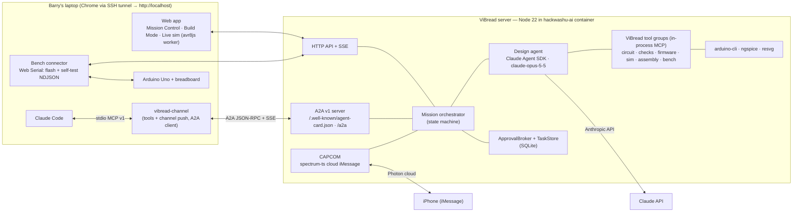

# ViBread — Build Plan (for review)

> HackWashU Fall Build Challenge, Sep 25–27 2026 · Main track + Photon bonus track.
> Hard deadline: **Sun Sep 27, 12:00 PM CT** (Devpost). Plan finalized Fri Sep 25 ≈ 23:00 CT → ~37 h wall clock.
> Evidence for every technology decision lives in [`research/`](research/) (8 reports, sources inline).

## 0. TL;DR

ViBread is **Mission Control for your breadboard**. A beginner describes what a circuit should do; ViBread's agent designs it
(netlist + Arduino sketch) from parts the user already owns, runs a **Go/No-Go poll** of independent checkers (electrical
rules + SPICE limits, compile + code↔circuit cross-check, firmware simulation tests, layout-vs-schematic), turns the design into
**LEGO-style numbered assembly steps** on laptop and phone, then verifies the **real build** by flashing a generated self-test
firmware that streams "telemetry" back over USB. When something is wrong it says *where* ("Houston, we have a problem: D2 reads
LOW even with the button released — its leg shares row 17 with the GND jumper"), proposes the fix, and re-runs the checks.
The same mission is reachable from iMessage (Photon Spectrum, "CAPCOM") and from other agents (A2A + a Claude Code bridge),
under Claude-Code-style permission modes.

**Stack in one line:** TypeScript on Node 22 · Claude Agent SDK (`claude-opus-5-5`) with ViBread tool groups as in-process MCP
servers · own JSON circuit IR · ngspice 45 · arduino-cli 1.5.1 · avr8js 0.21 · own layout/LVS/SVG + resvg PNG · Web Serial
(`webserial-flasher`) · `@a2a-js/sdk` 1.2 · MCP SDK 1.30 Claude Code Channel · `spectrum-ts` 12.10 · React + Vite · SQLite.

## 1. Problem, users, definition of success

- **Problem.** Going from "a lamp that turns on when it's dark" to a working breadboard needs four skills at once: circuit design,
  embedded code, reading wiring diagrams, and debugging hardware. In a CHI 2016 study of novices building an Arduino project,
  only 6 of 20 finished within the 45-minute session and circuit construction was the most common fatal failure (Booth et al., *Crossed Wires*;
  research/06 §2.7). AI tools today stop at "here is a diagram and code"; nobody watches the physical build.
- **Users.** Beginners and intermediate makers who already own an Arduino kit (brief p.3). Controller family: Arduino only.
  MVP board: **Uno R3 / Nano (ATmega328P)** — to be confirmed (§10 Q1).
- **Successful build (brief p.5, sharpened):**
  - **GO for build** = no ERC errors · electrical limits within spec · sketch compiles · all simulation tests pass · human GO.
  - **Mission success** = physical self-test matches the simulated expectation · user confirms the behavior.

## 2. Theme fit — "Fly Me to the Moon"

The rubric asks whether we address the prompt and whether the design supports the theme. Our interpretation is structural, not
decoration: **Apollo reached the moon because every step was simulated, every wire was checked against a checklist, a Go/No-Go
poll gated each phase, and when Apollo 13 failed, Mission Control debugged it from telemetry.** ViBread gives a first-time
maker the same discipline for their own moonshot.

| Apollo practice | ViBread feature |
|---|---|
| Mission brief | User describes the goal (web or iMessage) |
| Flight plan | Netlist + sketch + bill of materials drawn from the user's own parts |
| Simulators | Same compiled binary runs in an AVR emulator; electrical limits via SPICE |
| Go/No-Go poll | Checkers report GO / NO-GO: **EECOM** (electrical), **GUIDO** (firmware), **FIDO** (simulation), **FAO** (assembly). Human = Flight Director |
| Launch checklist | Numbered LEGO-style assembly steps ("T-minus 6 steps") |
| Telemetry | Self-test firmware streams pin/ADC/VCC readings; diffed against the simulated expectation |
| "Houston, we have a problem" | Closed-loop debugger localizes the fault and proposes the fix |
| CAPCOM (the one voice talking to the crew) | iMessage agent (Photon Spectrum) talking to the builder at the bench |

UI labels stay plain for beginners ("Electrical checks · EECOM"); the console names are flavor, not jargon.

**Hero demo circuit: the Moon-Phase Lamp.** Four LEDs show the lit fraction of the moon (8 phases), a button advances the day,
and a photoresistor divider turns the lamp on only when the room is dark. It exercises digital outputs, a pulled-up input with
debounce, an analog input with hysteresis, and a state machine; every connection is observable by the self-test. Revision demo
from Claude Code: "add a buzzer chime at full moon." Fallbacks if the kit differs: *Launch Control* (buttons + countdown LEDs +
buzzer) or *Lunar Distance Radar* (HC-SR04 + LED bar + buzzer).

## 3. Demo flow (what judges see) and 5-minute pitch

1. **Brief** (web or iMessage): "A night-light that shows the moon phase and turns on when it's dark. I have an Uno, four white
   LEDs, a button, a photoresistor, and a resistor pack." ViBread asks the one question it cannot infer (e.g., which resistor
   values are in the pack) — A2A `INPUT_REQUIRED` / iMessage reply.
2. **Flight plan + Go/No-Go**: schematic, sketch, BOM appear; the four checker lights turn GO with evidence (e.g., "LED current
   12.7 mA ≤ 20 mA", "7/7 simulation tests incl. button bounce and dark/bright hysteresis"). Human taps GO (web) or votes GO in an
   iMessage poll.
3. **Simulate**: live breadboard view driven by the actual compiled firmware; drag "room light", press the virtual button.
4. **Assemble**: phone shows LEGO-style steps (parts callout, highlighted holes, resistor bands + value text, LED long-leg cue).
5. **Telemetry**: a pre-built board with one deliberate fault is flashed from the browser; self-test runs; ViBread reports the
   fault with the rows highlighted, on screen and in iMessage. User fixes it → re-test → GO → iMessage celebration effect →
   app firmware flashed, lamp works.
6. **Agent interop**: in a terminal, Claude Code (through the ViBread bridge) asks for "a buzzer chime at full moon"; ViBread
   asks back "active or passive buzzer?" inside the Claude Code session; the revision re-runs every check; the delta step appears.

**Pitch skeleton (5:00):** 0:00 hook — Apollo's discipline vs. the *Crossed Wires* result (6/20 novices finish) · 0:30 what
ViBread is · 1:00–3:45 live demo (steps 1–6 compressed; backup video cued) · 3:45 how it works: one IR, independent checkers,
same binary simulated and flashed, layout-vs-schematic, telemetry diff, fault dictionary · 4:30 impact + close.

## 4. Scope ladder and cut lines

| Tier | Item | Track |
|---|---|---|
| MUST | **M1** Natural language → circuit IR + sketch (curated module library ∩ user inventory, ask-back questions) | Main |
| MUST | **M2** Go/No-Go checks: ERC + board rules, SPICE limits, compile, code↔circuit pin-mode check, simulation tests | Main |
| MUST | **M3** In-browser simulation of the compiled firmware with live breadboard view | Main |
| MUST | **M4** Deterministic breadboard layout + LVS + LEGO-style steps (desktop + phone) | Main |
| MUST | **M5** Physical verification: generated self-test firmware flashed from the browser; telemetry diffed vs expectation | Main |
| MUST | **M6** Debug loop: fault → attribution (design / code / wiring / component / unknown) → proposed fix → re-check | Main |
| MUST | **M7** Permission modes + one approval broker across channels | Main |
| SHOULD | **S1** Photon CAPCOM: brief, clarifying question, Go/No-Go poll, step images, self-test prompts, fault alerts, celebration | Photon |
| SHOULD | **S2** A2A agent + Claude Code bridge (MCP tools + Channel push) with ask-back | Main + Photon |
| SHOULD | **S3** Photo verification (Claude vision) as second opinion, incl. inbound iMessage photos | Main + Photon |
| COULD | **C1** Skill-level exposition (novice/intermediate/expert); variant-aware visuals | Main |
| COULD | **C2** Parts inventory from a photo of the kit; parts sourcing via Partuno | Main |
| COULD | **C3** Public Streamable-HTTP `/mcp` for non-Claude MCP clients; Wokwi cloud cross-check | Main |
| COULD | **C4** Fiducial (ArUco) photo rectification; KiCad schematic export | Main |
| WON'T | Non-AVR boards (Uno R4/ESP32/Pico), PCB layout, arbitrary-part simulation, A* on-board router, AR overlay, mains/high voltage | — |

The brief marks instruction adaptation to variants/skill levels "out of scope for MVP" (p.5) → C1. **Cut order if behind:**
C4 → C3 → C2 → C1 → S3 → S2's Channel push (keep its tools) → S1's photo intake (keep text/polls/images). MUST items are never
cut; M3 may degrade to "headless test results + static step view" if the live view slips.

## 5. Architecture

### 5.1 Components



- One Node 22 server process owns all state. The browser owns the USB device (the board is on the laptop, not in the container).
- The Claude Code bridge runs on the laptop (Claude Code spawns it) and talks to the server only through A2A.
- CAPCOM (Spectrum cloud iMessage) runs **server-side** in the same process; it needs only outbound internet.
- Runbook: Vite on `0.0.0.0:5173`, API/A2A on `0.0.0.0:8787`; on the laptop
  `ssh -L 5173:172.30.77.10:5173 -L 8787:172.30.77.10:8787 <golf>` and open `http://localhost:5173` in Chrome/Edge.

### 5.2 Circuit IR — the single source of truth (research/02)

Own versioned JSON IR (`vibread.circuit/0.1`), validated with zod, `additionalProperties: false` at the LLM boundary. Chosen over
KiCad/SPICE/Circuit JSON/Wokwi because each omits something we need (board aliases, pin electrical types, module variants,
evidence, breadboard hints). Field groups: `board` (profile `uno-r3-atmega328p-5v`: pin capabilities, limits, reserved pins) ·
`parts` (id, ref, `moduleKey`, variant, value + tolerance) · `pins` with KiCad-style electrical types · `nets` (members, kind:
power/ground/signal/analog) · `sketch` · `tests` (scenarios) · `provenance` (intent, assumptions). Every downstream artifact
(SPICE deck, layout, steps, self-test, expected signature) is **derived** from an IR revision and carries its hash.

**Module library** (curated data, not copied graphics): per module — pins + electrical types, limits, SPICE model id, sim device
model id, breadboard footprint, glyph id, self-test strategy, evidence URLs. MVP set (~10, finalized from the team's kit):
LED (by color), resistor, pushbutton (4-pin tactile), photoresistor, potentiometer, passive + active buzzer, (stretch) SG90
servo, HC-SR04. Adding a module = one data file + sim model + footprint (answers the whiteboard's "add new modules"). Parts the
library lacks can be added as a *generic module* from a user-supplied pinout; they are flagged **unverified** and can never get a
simulation GO.

### 5.3 Mission lifecycle and gates

`BRIEF → CLARIFY → DESIGN ⟲ → GO/NO-GO → SIMULATE → ASSEMBLE → VERIFY → (DEBUG ⟲) → LAUNCH → DONE`

- **DESIGN loop:** the agent proposes IR + sketch + scenarios through tools; deterministic checkers return structured findings;
  the agent repairs until all checkers are GO or 4 iterations elapse (then it reports what is blocking).
- **Revisions:** any change creates revision *n+1* and re-runs every checker. Approvals bind to a revision hash; a stale approval
  can never authorize a newer revision.
- **Go/No-Go poll** (deterministic, LLM only explains):

| Checker | Evidence | Source |
|---|---|---|
| EECOM (electrical) | Typed ERC (KiCad pin matrix) + Uno board rules + SPICE DC operating points per output-state vector | research/03 |
| GUIDO (firmware) | arduino-cli compile (`--json --warnings all`), flash/RAM budget, pin modes observed in sim vs IR roles | research/05, 04 |
| FIDO (simulation) | Agent-written scenario tests incl. edge cases, run headless on avr8js | research/04 |
| FAO (assembly) | Layout feasible on the user's breadboard; LVS derived nets == IR nets | research/07 |

### 5.4 Agent and tool layer (research/01) — "Agent → MCP" from the whiteboard

- **Harness: Claude Agent SDK `0.3.283` on Node 22** with `claude-opus-5-5`. Chosen because it natively provides what the brief
  asks for — Claude-Code permission modes, `canUseTool`, `PreToolUse` hooks, sessions/resume, streaming — plus in-process MCP
  servers. It spawns a bundled Claude Code binary and needs `ANTHROPIC_API_KEY`. **Fallback** (decided in spike P0-4 within
  45 min): manual Messages-API loop with `@anthropic-ai/sdk` 0.128 behind the same tool registry.
- **Tools are defined once** (zod schema + handler) in `packages/tools`, grouped into six in-process MCP servers the agent uses:

| MCP server (ours) | Tools (abridged) | Backing |
|---|---|---|
| `vibread-circuit` | `list_modules`, `get_inventory`, `propose_design`, `validate_ir`, `render_schematic` | IR + library, elkjs SVG |
| `vibread-checks` | `run_erc`, `run_spice_limits`, `explain_finding` | TS rules, ngspice CLI |
| `vibread-firmware` | `compile`, `pin_mode_check`, `generate_selftest` | arduino-cli, avr8js |
| `vibread-sim` | `run_scenarios`, `sim_step`, `sim_inspect` | avr8js + device models |
| `vibread-assembly` | `layout_board`, `lvs_check`, `build_steps`, `render_step_png` | own kernel, resvg |
| `vibread-bench` | `request_flash`, `run_selftest`, `diagnose`, `inspect_photo` | browser action requests, fault dictionary, Claude vision |

  Physical-world tools (`request_flash`, `run_selftest`) produce **browser action requests**; the browser executes them over Web
  Serial after approval and posts results back. The server never touches the laptop's USB.
- Other agents see **task-level** tools (A2A skills / bridge tools, §5.10), not the raw domain tools.

### 5.5 Electrical checks: ERC + SPICE (research/03)

- **ERC — BUILD in TypeScript.** No permissive headless ERC engine accepts our IR; KiCad's needs a `.kicad_sch`. Implement the
  KiCad pin-type conflict matrix semantics plus a versioned Uno rule table: `CUR-PIN-DESIGN` ≤ 20 mA (error), `CUR-PIN-ABS`
  40 mA, `CUR-VCC-GND` ≤ 200 mA total, `PWR-USB-FUSE` 500 mA path, `LED-RESISTOR` required + sized from color Vf range,
  `BTN-PULLUP` (internal 20–50 kΩ; no internal pull-down), `ADC-RANGE`, `ADC-SOURCE-Z` ≤ ~10 kΩ, `PWM-PINS` {3,5,6,9,10,11},
  `I2C-PINS` A4/A5, `SPI-PINS` 10–13, `SERIAL-USB` D0/D1 reserved, `MOTOR-POWER`/`MOTOR-FLYBACK`, `LEVEL-*`, `SHORT-GRAPH`.
  (MCU-internal rules like AVCC/decoupling don't apply to Uno-based builds — the Uno board already provides them.)
- **SPICE — USE ngspice (Ubuntu 26.04 apt: 45.2) CLI in batch mode** in a temp dir with timeout; the server owns the deck and the
  `.control` block (no `.include/.lib/.shell` from model output). For each distinct output-pin state vector the firmware reaches
  in simulation, run a DC operating point with team-authored models: GPIO driver as source + ≤45 Ω effective resistance
  (datasheet VOH/VOL bound), color-binned LED diodes, pull-ups at 20 k/50 k corners, LDR at "bright"/"dark" values. Outputs:
  per-pin, per-LED, and total 5 V currents → rules; divider voltages → the **expected ADC ranges** reused by both the simulator
  and the self-test (one electrical truth, three consumers).
- **Honest labeling** on every result: "nominal model check in ngspice under the Uno profile; not a physical wiring guarantee."

### 5.6 Firmware build, code checks, and simulation (research/04, 05)

- **Compile — USE arduino-cli 1.5.1 + `arduino:avr@1.8.8`**: `compile --fqbn arduino:avr:uno --json --warnings all
  --output-dir <job>` → ELF + HEX + structured diagnostics (file/line/column) + flash/RAM sizes. Unique job dir per compile
  (concurrent builds sharing an output dir were reproduced failing in research/05). Warm compile ≈ 0.3 s measured.
- **Simulation — BUILD on avr8js 0.21.1 (MIT).** avr8js provides the ATmega328P CPU + GPIO/timers/USART/ADC/SPI/TWI; the external
  world is ours: device models for LED, button (with deterministic bounce profiles), potentiometer, LDR divider (values from
  SPICE), passive/active buzzer; stretch: servo pulse decode, HC-SR04 echo timing. The same TypeScript runner runs headless in
  Node (tests) and in a browser Web Worker (live view). Virtual time only; bounded by a virtual deadline.
- **Scenario tests (agent-written, ViBread-owned JSON):** steps `set-digital`, `bounce`, `set-analog`/`sweep-analog`,
  `wait`, `expect-pin`, `expect-pwm`, `expect-serial`; each assertion reports timestamp + observed evidence. The agent must write
  nominal cases **and** edge cases (bounce shorter/longer than debounce, threshold hysteresis, rapid presses, power-on state) —
  the brief's "let the AI think about edge cases."
- **Code ↔ circuit cross-check:** after `setup()` and during scenarios, decode DDRx/PORTx per pin (OUTPUT / INPUT_PULLUP / INPUT)
  and compare with the IR role (LED net must be OUTPUT; button net must be INPUT_PULLUP or have an external resistor; ADC net
  must not be driven). Mismatch → GUIDO NO-GO with the exact pin.
- **Fidelity statement shown with every simulation:** "Instruction-level ATmega328P emulation of the exact binary that will be
  flashed, with protocol-level part models. Validates logic, timing, and pin configuration; does not prove current, voltage
  noise, brown-out, or breadboard contact quality — the physical self-test does."
- **Wokwi:** its official CLI MCP (experimental, cloud token) is the only existing MCU-simulation MCP worth using; optional
  cross-check (C3), never on the critical path.

### 5.7 Breadboard layout, LVS, and LEGO-style steps (research/07)

- **Board profile data:** 0.1" grid, A–E / F–J 5-hole groups split by the channel, rails as explicit segments (never inferred
  from stripe color), Uno as an off-board part reached by flexible jumpers from its headers.
- **MVP layout = deterministic net-to-row allocator** (≈ a day's work, no A* needed at this scale): 5 V and GND on the top
  rails via jumpers from the Uno; each branch (connected non-power subgraph) placed left-to-right with a spacer row; each
  signal net gets a 5-hole strip; 2-lead parts span strips at footprint-legal distances (LED adjacent rows, resistor 3–5 rows,
  LDR 1–3); the tactile button straddles the channel; Uno pins reach strips by jumpers; ground/5 V connections by short rail
  jumpers. Lexicographic tie-breaks → same input, same holes (a regenerated guide never moves parts on the user).
  The general A*/rip-up router from research/07 §2.4 is deferred.
- **LVS:** union-find over contact groups + occupied holes + jumpers → derived nets → compared with IR nets as hypergraphs;
  reports split nets, merged/shorted nets (critical if GND+5 V), floating/unmapped pins, duplicate occupancy. Also the engine
  behind fault diagnosis (§5.8).
- **Steps** follow Agrawala et al. (SIGGRAPH 2003) + LEGO conventions + CircuitStyle: inventory → orientation legend → rails →
  one part per step (polarity before insertion) → one jumper per step → checkpoint → power last. Each step: per-step parts
  callout ("1× 220 Ω — red-red-brown"), highlighted new items with ghost-lead animation, exact holes in text ("R1: E12 → E16"),
  color never the only cue (labels + patterns, WCAG 1.4.1), `prefers-reduced-motion` respected.
- **Rendering:** own React/SVG renderer (Wokwi Elements are MIT glyphs but include no breadboard; Fritzing art is CC-BY-SA —
  not used). Server-side PNG per step with `@resvg/resvg-js` 2.6.2 for iMessage and the A2A artifacts.

### 5.8 Physical verification and debugging (research/06)

- **Flashing — WRAP `webserial-flasher` 1.0.1 (MIT, STK500v1 over Web Serial)** with explicit profiles (Uno/Nano-new 115200,
  Nano-old 57600), DTR reset, signature check (`1E 95 0F`), retries. Requires Chrome/Edge on a secure origin — `http://localhost`
  through the SSH tunnel qualifies; the raw `172.30.77.10` URL does not. Fallback if the library fails the spike: our own
  STK500v1 uploader (sync, load address, program page, verify; ≈250 lines against Optiboot's documented command set).
- **Generated self-test firmware (primary oracle), deterministic template — never LLM-written:** boots with all pins as inputs,
  prints a `ready` banner with the design hash, runs only tests the design's safety metadata allows, streams NDJSON results, and
  restores safe state on exit. Tests: `rails.vcc` (VCC via internal bandgap, idle and under load) · `digital.stuck` (idle
  levels under pull-up) · `button.interactive` (release→press→release) · `analog.range` + `sensor.interactive` ("cover the
  light sensor") · `led.sequence` (each LED lit in turn; human reports which one lit — web buttons or an iMessage poll) ·
  `net.continuity` only across pairs guarded by a known series resistor. Unobservable cases report `unknown`, never a green check.
- **Expected signature** per test is computed from the IR revision (+ SPICE ranges); readings in the logic-threshold gap are
  marked indeterminate and never gate a verdict.
- **Fault dictionary diagnosis (board-test practice applied to breadboards):** generate single-fault mutants of the *layout* —
  lead moved ±1 row, jumper missing or on the wrong pin, button rotated 90°, part in the wrong strip, two jumpers swapped — predict
  each mutant's signature, rank mutants consistent with the telemetry, and highlight their holes on the step image. Ties are shown
  as ranked alternatives (e.g., "button rotated" vs "leg in GND row") and resolved by a photo or an interactive test.
- **Attribution rule:** sim tests fail → *code* · checks/LVS fail pre-build → *design* · telemetry ≠ expectation and a wiring
  mutant explains it → *wiring* · no mutant explains it → *component* (dead part/wrong value; ask for photo/swap) · otherwise
  *unknown*. The LLM explains the result and proposes the fix; it never invents the pin sequence.
- **Photo check (secondary):** HEIC → JPEG (`heic-convert`), then Claude vision gets the photo, the expected step image, and
  expected placements, answers structured per-part questions with `unknown` allowed. Photo evidence never overrides telemetry;
  conflicts trigger "reseat + close-up". Published evaluations show multimodal models make confident wiring mistakes
  (research/06 §2.8), so vision is advisory.

**Detectability (research/06 §6.7; D = detectable, C = conditional, H = human):**

| Fault | MCU self-test | Photo | Human prompt |
|---|---|---|---|
| Missing wire | D (on a tested path) | D/C | D |
| Wrong row | D/C (same-net row: undetectable, and harmless) | D/C | D |
| Short to GND | D/C (stuck-low, VCC sag) | C | D |
| Short between pins | D/C (guarded pairs) | C/D | D |
| Reversed LED | C | C/D | D (LED doesn't light) |
| Missing resistor | C | D/C | D |
| Wrong resistor value | C/D (divider ranges) | C (bands) | D (color code) |
| Dead component | C/D (behavior test) | N | D |

### 5.9 Permission model (brief p.5 "claude code permission control")

One `ApprovalBroker` (SQLite): request id, action class, exact action hash (revision + tool + input), expiry, one-shot decision,
decider identity. Adapters: web modal, iMessage poll/"GO r7-3f2a" grammar, Claude Code (tool round-trip or Channel permission
relay). First valid decision wins; stale or mismatched approvals are rejected.

| ViBread mode | Agent SDK | Software changes (design/code edits, compile, sim, tests) | Release a revision as build target | Physical (flash, self-test, rewire step) | BOM change (new part) |
|---|---|---|---|---|---|
| **Plan** | `plan` | propose only | ask | ask | ask |
| **Ask every time** (default for beginners) | `default` + `canUseTool` → broker | ask per mutating call | ask | ask | ask |
| **Review** | `default`, software tools allow-listed | automatic | ask once per revision (diff + checker evidence) | ask | ask |
| **Autopilot** (≈ bypass) | `bypassPermissions` | automatic | automatic when all checkers GO | **ask — never bypassable** | ask |

Physical actions are gated by a `PreToolUse` hook + broker because `bypassPermissions` skips `canUseTool` (research/01 §6.2).
This realizes the brief's intent: the agent changes software and re-runs simulation freely, the human reviews the simulation,
and nothing touches the real board without a human.

### 5.10 Agent interop: A2A + Claude Code (research/01)

- **A2A v1.0 server** (`@a2a-js/sdk` 1.2.1, Express on Node 22): agent card at `/.well-known/agent-card.json`, JSON-RPC at `/a2a`,
  streaming on. Skills: `design-circuit`, `validate-circuit`, `assembly-instructions`, `flash-and-self-test`, `verify-photo`,
  `debug-build`. Ask-back = `TASK_STATE_INPUT_REQUIRED` with a text question + JSON DataPart (request id, schema, action hash);
  continuation reuses `taskId`/`contextId`. Artifacts: `design-vN.netlist.json`, `firmware-vN.ino`, `validation-vN.json`,
  `assembly-step-K.svg/png`, `selftest-J.json`.
- **Claude Code bridge `vibread-channel`** — local stdio MCP server on **`@modelcontextprotocol/sdk` 1.30.1** (a probe of Claude
  Code 2.1.283 negotiated MCP `2025-11-25` over stdio, so a v2-only stdio server would be risky). Tools:
  `vibread_design_circuit`, `vibread_continue_task`, `vibread_get_task`, `vibread_get_artifacts`, `vibread_validate`,
  `vibread_build_instructions`. It declares `claude/channel`, streams the A2A task, and pushes ViBread questions, verification
  results, and bench fault alerts into the running session; Claude answers with `vibread_continue_task`. One continuation path
  per request (no double-resume). Custom channels need `claude --dangerously-load-development-channels server:vibread-channel`
  (research preview); without the flag the same server still works as plain MCP tools (Claude polls `vibread_get_task`).
- No third-party A2A↔MCP bridge qualified (Python/Go sidecars, v0.3-era, or unlicensed); we build the thin facade.

### 5.11 Photon CAPCOM (research/08)

- `spectrum-ts` **12.10.1** cloud iMessage provider inside the server; long-lived `app.messages` loop (poll votes are not
  delivered via webhooks); terminal provider for development and as the credential-free demo fallback.
- Moments: brief by text → clarifying question → **GO/NO-GO poll** → step PNGs → self-test prompts ("Which LED is on? 1/2/3/4/none"
  as a poll — the phone becomes a test instrument) → inbound photo → fault alert with highlighted image → celebration screen
  effect on mission success → app card deep-linking to Build Mode, edited in place as steps progress.
- **Teammates without group chats:** Free/Pro lines are shared-pool DMs (native groups need the $250/line Business tier). Each
  teammate DMs CAPCOM; mission membership links them, so an approval by one and a step image to another share one mission
  context — "context across time, channels, and teammates" without a group.
- Craft rules from Photon's guidance: text-only first message, inbound-first, 5-second debounce of message bursts, typing indicator
  while working, one reply per turn, users registered as project users before any outreach.

### 5.12 Persistence and cross-channel context

SQLite tables: `missions`, `members` (web session, iMessage handle, bridge id ↔ person), `revisions` (IR, sketch, scenarios,
checker results, layout, hashes), `messages` (channel, sender, direction, revision), `approvals`, `runs` (sim, self-test, photo),
`artifacts` (content-addressed). The Mission Control timeline shows every event with its channel icon; any channel can resume
a mission ("continue my moon lamp").

## 6. Stack, repo layout, standards

**Pinned dependencies (versions verified on npm/apt Sep 25):** `@anthropic-ai/claude-agent-sdk` 0.3.283 · `@anthropic-ai/sdk`
0.128.0 · `@a2a-js/sdk` 1.2.1 · `@modelcontextprotocol/sdk` 1.30.1 · `spectrum-ts` 12.10.1 · `avr8js` 0.21.1 ·
`webserial-flasher` 1.0.1 · `@resvg/resvg-js` 2.6.2 · `heic-convert` 2.1.0 · `elkjs` 0.12.0 · `better-sqlite3` 13.0.3 ·
`zod` 4 · React + Vite. System: `arduino-cli` 1.5.1 + `arduino:avr@1.8.8`, `ngspice` 45.2.

```
vibread/
  apps/server     Node 22: API+SSE, orchestrator, Agent SDK, A2A, CAPCOM, broker
  apps/web        React+Vite: Mission Control, Build Mode (phone), live sim worker, Web Serial bench
  apps/channel    Claude Code bridge (stdio MCP v1 + A2A client)
  packages/core   IR schema, board profile, module library, net utils, hashing
  packages/checks ERC rules, SPICE deck + ngspice runner
  packages/firmware  arduino-cli service, self-test generator
  packages/sim    avr8js harness, device models, scenario runner (Node + browser)
  packages/assembly  layout, LVS, steps, SVG renderer, PNG export
  packages/bench  expected signature, fault dictionary, diagnosis, NDJSON protocol
  packages/tools  tool registry → in-process MCP servers + A2A/bridge facades
  fixtures/       golden designs, faulted mutants, sample photos
```

| Subsystem | Industry standard | ViBread choice | Existing MCP verdict → decision |
|---|---|---|---|
| Agent tools | MCP | Agent SDK in-process MCP servers | — → BUILD 6 domain servers |
| Agent-to-agent | A2A v1.0 | `@a2a-js/sdk` | Bridges toy/usable → BUILD facade |
| Schematic/netlist | KiCad pin types, S-expr schematics | Own IR with KiCad pin semantics; elkjs SVG | KiCad MCPs usable but broad/unlicensed → BUILD |
| Parts data | Distributor APIs (DigiKey/Nexar) | Curated library + evidence URLs | Partuno good but needs keys → optional (C2) |
| Electrical sim | SPICE | ngspice CLI | ngspice/SPICE MCPs young, GPL, or native-heavy → BUILD |
| MCU sim | Instruction-level emulators; Wokwi CI scenarios | avr8js + own scenarios | Wokwi MCP usable (cloud) → optional (C3) |
| Firmware | arduino-cli / PlatformIO | arduino-cli | HardwareMCP good but local-USB-only → BUILD |
| Board test | In-circuit test, fault dictionaries, LVS | Self-test + mutation dictionary + LVS | Serial MCPs good but can't see browser USB → BUILD |
| Instructions | LEGO / Agrawala principles | Own step generator | None suitable → BUILD |
| Messaging | Spectrum | `spectrum-ts` | Photon MCP archived → USE SDK directly |

## 7. Execution plan and timeline (CT)

**How the work gets done:** contracts first (IR schema, tool registry interface, SSE event types, NDJSON protocol, golden
fixtures), then parallel implementation by package — AI subagents plus humans — with one integration owner merging and
running the golden end-to-end path at every checkpoint. Commits pushed to `origin/main` after every milestone.

| When | Phase | Exit criterion |
|---|---|---|
| Fri 23:00–23:45 | Plan review, decisions (§10), API key, Photon signup + promo, register team phones | Hardware list + keys + Photon project exist |
| Fri 23:45–Sat 02:30 | **P0 spikes + skeleton**: all 11 spikes (§8); repo scaffold; IR schema v1; module library v1; Moon-Phase-Lamp golden fixture written by hand | All spikes green or fallback chosen |
| **Sat before 10:00** | **Register team on Devpost** (formation deadline) | Done |
| Sat 08:30–13:00 | **P1 vertical slice**: brief → agent → IR+sketch → ERC → compile → layout → steps → headless sim tests, in the web UI | **Checkpoint A 13:00:** golden fixture + one agent-generated design go end-to-end |
| Sat 13:00–18:00 | **P2 verification loop**: SPICE limits, live sim view, self-test generator + expected signature, browser flash, diagnosis, permission modes | **Checkpoint B 18:00:** deliberate fault on the real board found + fixed through the UI |
| Sat 16:00–18:30 | Photon online office hours — bring S1 questions | — |
| Sat 18:00–23:00 | **P3 channels**: CAPCOM, A2A + Claude Code bridge, photo check, cross-channel timeline | **Checkpoint C 23:00:** full demo script runs once end-to-end |
| Sat 23:00–01:00 | **P4 polish**: step visuals, phone layout, theme UI, error states | Feature freeze 01:00 |
| Sun 08:00–10:30 | **P5**: bug bash, 3 timed rehearsals, backup demo video, screenshots | Video recorded |
| Sun 10:30–11:30 | Devpost write-up + README (dependency/license notices) → **submit by 11:30** | Submitted with 30-min buffer |
| Sun 16:30 | Finalist pitch (5 min) if selected | — |

Checkpoint rules: at A, if the agent path is flaky, the demo runs on golden fixtures while the agent keeps improving; at B, if
flashing fails, switch to the fallback uploader (budget 2 h) before touching SHOULD items; at C, anything not working is cut per §4.

## 8. Verification strategy

**P0 spikes (each a ≤ 30-line script; pass criterion):**

Spikes 1–5 and 9 run in the container tonight. Spikes 6–8, 10, 11 need Barry's laptop, phone, and board — tonight if he is
available, otherwise first thing Sat 08:30, before any P1 work depends on them.

1. arduino-cli compiles Blink for `arduino:avr:uno` → ELF + HEX, JSON diagnostics parsed.
2. avr8js runs that HEX in Node; PB5 toggles at 1 Hz virtual time.
3. ngspice: 5 V → 220 Ω → red LED DC op point → 13–15 mA parsed from output.
4. Agent SDK on Node 22: `query()` with one in-process tool on `claude-opus-5-5`; `canUseTool` fires; events stream. (Fail → manual loop.)
5. A2A: card served; client `sendMessage` → `INPUT_REQUIRED` → continuation → `COMPLETED` with an artifact.
6. Claude Code on the laptop loads `vibread-channel` with the dev flag, lists tools, receives one pushed event.
7. Spectrum: terminal echo; cloud iMessage DM round-trip to a registered phone; poll vote received; PNG delivered.
8. Chrome on the laptop (via `http://localhost` tunnel) flashes Blink with `webserial-flasher`; reads NDJSON from a test sketch.
9. resvg renders a 1200×800 step SVG with text to PNG.
10. Claude vision returns schema-valid JSON for one breadboard photo + expected layout.
11. HEIC → JPEG conversion of an iPhone photo.

**Acceptance per MUST item:**

| Item | Proof |
|---|---|
| M1 | 3 golden prompts (moon lamp, launch control, distance radar) → schema-valid IR + compiling sketch in ≤ 4 iterations |
| M2 | Rule tests: LED without resistor, floating button, output-output conflict, 5 V–GND short, PWM on non-PWM pin → exact rule IDs; SPICE LED current within 10% of hand calculation |
| M3 | Live view LED states match the headless scenario trace for the golden fixture |
| M4 | LVS clean on golden layouts; injected mutants (moved lead, missing jumper, merged strip) → exact LVS diagnostics; identical layout hash on rerun |
| M5 | Real board: correct build passes; three deliberate faults (button leg in GND row, LDR divider resistor missing, two LED jumpers swapped) each detected |
| M6 | For each deliberate fault the true mutant ranks top-2; fix shown; re-test passes after the fix |
| M7 | Scripted policy tests: Autopilot still requires approval to flash; stale-revision approval rejected |
| S1/S2 | Demo script steps 1–6 pass on the real phone and Claude Code |

## 9. Risks, pushback, mitigations

| Risk | Likelihood / impact | Mitigation |
|---|---|---|
| Board is Uno R4 / ESP32, not ATmega328P | Unknown / **critical** (avr8js, STK500, rules all AVR) | Confirm tonight (§10 Q1); if R4, borrow/buy an Uno R3/Nano clone for the demo rather than re-plan |
| Agent SDK issues (subprocess, latency, Node-only) | Medium / high | Spike P0-4; same tool registry drives a manual Messages-API loop |
| LLM designs invalid circuits | Medium / high | Curated library, schema-constrained tool input, deterministic checkers with repair loop, golden fixtures as demo floor |
| `webserial-flasher` edge cases (5 stars, new) | Medium / high | Spike P0-8; own STK500v1 fallback (2 h budget) |
| Photon provisioning / promo / phone registration | Medium / medium | Sign up tonight; terminal fallback; register judges' numbers live with the Photon CLI |
| Claude Code Channels need dev flag (research preview) | High / low | Demo on Barry's laptop; tools-only fallback |
| Vision misreads breadboards | High / low | Secondary evidence only; never gates; "reseat + close-up" loop |
| Venue network blocks the SSH tunnel | Low / high | Phone hotspot; `cloudflared` quick tunnel (https) as a second path; recorded video |
| Scope/time overrun | High / high | Checkpoints A/B/C, cut order §4, MUST-first sequencing |
| API spend | Low / low | Estimate ≈$0.40 per design run on Opus 5.5 (~50k input + 10k output tokens at $4/$20 per MTok); cap at $100 |
| Licensing | Low / medium | No copied code/art; no GPL/AGPL code in the repo; Agent SDK commercial terms, LGPL Arduino libraries used as libraries, all listed in README |

**Pushback on three claims in the brief (so they don't hide in the plan):**

1. *"Very accurate simulation; we fully rely on it; circuits as complicated as needed."* No tool — commercial or ours — simulates
   arbitrary circuits accurately; accuracy exists only for modeled parts, and Wokwi itself documents limited analog support. What
   we can truthfully claim: the exact binary that gets flashed runs in an instruction-level emulator, and electrical limits come
   from SPICE with labeled device models, **for the supported module set**. Anything outside it is *unverified* and never gets a
   simulation GO. That is why physical verification exists: simulation cannot see a loose wire or a dead LED.
2. *"Supported parts: any hardware they have."* MVP = curated library (~10 modules chosen from the team's kit) ∩ the user's
   inventory, plus generic modules flagged unverified.
3. *"Camera to Claude to see if we did anything wrong."* Vision is a second opinion; the MCU self-test is authoritative, matching
   the brief's own "main thing is tests ran through the microcontroller."

## 10. Decisions needed from the team

1. **Board and parts:** exact Arduino model(s) and a photo or list of the kit (LED colors, resistor values, buttons, sensors,
   breadboard size). This fixes the module library and the hero demo.
2. **Team:** members (≤ 4), who does hardware/demo board, pitch/video, Photon setup, testing.
3. **Anthropic API key** for the app (budget cap).
4. **Photon:** who signs up + redeems `HACKWITHPHOTON`; which iPhones to register.
5. **Claude Code** on a laptop for the interop demo (v2.1.80+, logged in).
6. **Theme + hero circuit:** approve Mission Control framing and the Moon-Phase Lamp (or pick a fallback).
7. **Judge access:** SSH-tunneled demo on our laptop only, or also a public `cloudflared` URL.
8. **Optional:** Wokwi CI token (C3), DigiKey/Mouser keys (C2).

## 11. Originality, licensing, submission

- Nothing is copied from existing projects. Dependencies are libraries/SDKs/CLIs used through public APIs and listed with
  licenses in the README. Application code, prompts, module data, and art are written this weekend; git history is the proof.
- Competitors (Cirkit Designer, Schematik, Tinkered, Flux, Wokwi, Tinkercad, Arduino AI Assistant, circuito.io) were studied only
  for positioning. **Differentiation:** they stop at design, simulation, or upload; ViBread closes the loop on the *physical*
  build — permissioned agent, checked design, step-by-step guidance where the user already is, MCU-proven assembly, and
  attribution of failures to design, code, or wiring (research/08 §4.4).
- Devpost package: title, short description, team, problem/solution, tech list, 2–3 min video + screenshots, GitHub link,
  tracks: Main + Photon.
