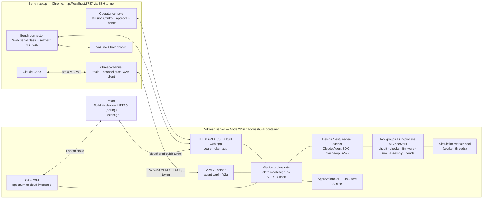

# ViBread — Build Plan (for review)

> HackWashU Fall Build Challenge, Sep 25–27 2026 · Main track + Photon bonus track.
> Hard deadline: **Sun Sep 27, 12:00 PM CT** (Devpost). Plan written Fri Sep 25, ≈23:30 CT → ~36 h of wall clock.
> Evidence for every technology decision lives in [`research/`](research/) (8 reports, sources inline).

## 0. TL;DR

ViBread is **Mission Control for your breadboard**. A beginner describes what a circuit should do; ViBread's agent designs it
(schematic + netlist + Arduino sketch) from parts the user already owns, runs a **Go/No-Go poll** of independent checkers
(electrical rules and current limits, compile + code↔circuit check, simulation tests written by a *separate* test agent,
layout-vs-schematic, and an independent reviewer agent), turns the design into **LEGO-style numbered assembly steps** on
laptop and phone, then verifies the **real build**: safe firmware first, staged power-up, then a generated self-test that
streams "telemetry" back over USB. When something is wrong it says *where* ("Houston, we have a problem: D2 reads LOW even
with the button released — its leg shares row 17 with the GND jumper"), proposes the fix, and re-runs the checks. The same
mission is reachable from iMessage (Photon Spectrum, "CAPCOM") and from other agents (A2A + a Claude Code bridge), under
Claude-Code-style permission modes where physical actions always need an authenticated human.

**Delivery strategy:** a fixture-driven **Golden Path v0** (no LLM in the loop) runs end-to-end on the real board by
**Sat 13:00**; the agent, channels, and richer analyses plug into that pipeline afterwards in strict priority order (§4).

**Stack:** TypeScript on Node 22 · Claude Agent SDK (`claude-opus-5-5`) with ViBread tool groups as in-process MCP servers ·
own JSON circuit IR · arduino-cli 1.5.1 · avr8js 0.21 · own layout/LVS/SVG + resvg PNG · Web Serial (`webserial-flasher`) ·
`spectrum-ts` 12.10 · `@a2a-js/sdk` 1.2 · MCP SDK 1.30 Claude Code bridge · ngspice 45 (cross-check) · React + Vite · SQLite.

## 1. Problem, users, definition of success

- **Problem.** Going from "a lamp that turns on when it's dark" to a working breadboard needs four skills at once: circuit
  design, embedded code, reading wiring diagrams, and debugging hardware. In a CHI 2016 study of novices building an Arduino
  project, only 6 of 20 finished within the 45-minute session and circuit construction was the most common fatal failure
  (Booth et al., *Crossed Wires*; research/06 §2.7).
- **What exists.** Commercial AI tools (Cirkit Designer, Schematik, Tinkered, Flux, Arduino AI Assistant) stop at design,
  simulation, or upload. Research systems proved the pieces we build on: Trigger-Action-Circuits (UIST 2017) generated circuits,
  firmware, and assembly instructions from behavior descriptions (6/6 novices finished vs 0/6 with the Arduino IDE);
  ElectroTutor (UIST 2018) attached tests to tutorial steps and cut backtracking from 18.8 to 0.2 instances; SchemaBoard
  (UIST 2020) linked schematic and breadboard views. They relied on fixed component databases, hand-authored tutorials, or
  custom instrumented hardware.
- **What ViBread adds:** LLM design from the user's own parts with ask-back · the same binary simulated and flashed ·
  auto-generated self-test firmware with fault attribution on an unmodified Uno · a permissioned agent that lives in
  iMessage and answers other agents.
- **Users.** Beginners and intermediate makers who already own an Arduino kit (brief p.3). Controller family: Arduino only.
- **Supported-circuit envelope (answers brief p.5 "how complicated"):** Uno R3 or Nano (ATmega328P) · 5 V logic, USB power ·
  one breadboard (30- or 63-row) · ≤ 12 parts and ≤ 10 signal nets · planned external load ≤ 400 mA (per pin ≤ 20 mA, MCU
  total ≤ 200 mA) · parts from the module library · no motors/relays/mains in the MVP.
- **Successful build (brief p.5, sharpened):**
  - **GO for build** = no ERC errors · electrical limits within spec · sketch compiles · the independent test suite passes with
    full coverage · reviewer agent votes GO (the brief's "overall agent saying yes") · human GO.
  - **Mission success** = staged power-up clean · self-test telemetry matches expectation · user confirms the behavior.

## 2. Theme fit — "Fly Me to the Moon"

The rubric asks whether we address the prompt and whether the design supports the theme. The interpretation is structural:
**Apollo reached the moon because every step was simulated, every wire was checked against a checklist, a Go/No-Go poll gated
each phase, and when Apollo 13 failed, Mission Control debugged it from telemetry.** ViBread gives a first-time maker the same
discipline for their own moonshot.

| Apollo practice | ViBread feature |
|---|---|
| Mission brief | User describes the goal (web or iMessage) |
| Flight plan | Schematic + sketch + bill of materials drawn from the user's own parts |
| Simulators | The compiled binary runs in an AVR emulator before anything is wired |
| Go/No-Go poll | Consoles report GO / NO-GO: **EECOM** electrical · **GUIDO** firmware · **FIDO** simulation · **FAO** assembly · **RETRO** independent reviewer agent. Human = Flight Director |
| Launch checklist | Numbered LEGO-style assembly steps ("T-minus 6 steps") with staged power-up |
| Telemetry | Self-test firmware streams pin/ADC/VCC readings, diffed against expectation |
| "Houston, we have a problem" | Closed-loop debugger localizes the fault and proposes the fix |
| CAPCOM (the one voice talking to the crew) | iMessage agent (Photon Spectrum) talking to the builder at the bench |

UI labels stay plain ("Electrical checks · EECOM"); console names are flavor, not jargon. Theme UI is built in P1/P2, not
left for the end, because two of the three rubric criteria (Impact-vs-prompt, UX-supports-theme) reward it.

**Hero demo circuit: the Moon-Phase Lamp** (pending the kit inventory, §7 gate). Four LEDs show the lit fraction of the moon
(8 phases), a button advances the day, and a photoresistor divider turns the lamp on only when the room is dark — with the
dark threshold **calibrated on the user's bench** by the self-test (§5.8). Fallbacks if the kit differs: *Launch Control*
(buttons + countdown LEDs + buzzer) or *Knob Night-Light* (potentiometer + PWM LED).

## 3. Demo, pitch, and judging logistics

**Latency budget** (measured at Checkpoint A, P50/P95): design run ≤ 60 s / 120 s · revision run ≤ 45 s / 90 s · flash
≤ 15 s · self-test ≤ 60 s including prompts. Anything slower is pre-computed for live demos.

| Format | Live | Recorded / pre-warmed |
|---|---|---|
| **Pitch (5 min, non-EE judges)** | (1) Brief on the phone loads a pre-warmed mission; GO poll voted on iMessage. (2) Real board with a deliberate fault: self-test → "Houston…" with rows highlighted → fix → GO → celebration effect → lamp works. | Full agent design run, simulation replay, Claude Code/A2A interop — in a 40-second video cut inside the pitch |
| **Table demo (2 min, Sun 12:00–16:00)** | Pre-flashed, powered kit with a deliberate fault: self-test → diagnosis → fix → GO; phone shows the steps; iMessage alert | Devpost video for everything else |
| **Photon clip (60 s)** | — | CAPCOM flow on the phone: brief → poll → step image → fault alert → photo → celebration |

**Pitch skeleton (5:00), story-first for judges who are not electronics people:** 0:00 hook — the *Crossed Wires* result (6/20)
and Apollo's discipline · 0:40 one user's journey · 1:10–3:30 live beats above · 3:30 40-second video (agent design, simulation,
Claude Code) · 4:10 why it's new (§1) · 4:40 impact + close. One technical slide, no jargon.

**Judging logistics:** one person stays at the table 12:00–16:00 with the kit powered and pre-flashed; spare board + cable on
the table; ask Photon on Discord (Saturday office hours) how and when they judge; rough backup video recorded at Checkpoint B,
refreshed at C.

## 4. Scope: Golden Path v0, tiers, and cut order

**Golden Path v0 — due Sat 13:00, fixture-driven, no LLM in the loop:** hand-written Moon-Phase-Lamp fixture (IR + sketch +
intent tests) → schematic SVG → ERC + analytic limits + compile → headless tests + simulation replay on the breadboard view →
layout + LVS → phone steps with staged power-up → safe firmware + self-test on the real board → one deliberate fault diagnosed
→ one CAPCOM DM with a GO/NO-GO poll. Every later feature plugs into this pipeline; if later work fails, this still demos.

| Tier | Item | Track |
|---|---|---|
| MUST | **M0** Golden Path v0 (above) | Main + Photon |
| MUST | **M1** Agent design: natural language → IR + sketch (module library ∩ user inventory, ask-back); independent test author; RETRO reviewer vote | Main |
| MUST | **M2** Checks: ERC + Uno rules, analytic electrical limits at worst-case corners, compile, code↔circuit pin-mode check, test coverage rules | Main |
| MUST | **M3** Schematic SVG + simulation replay on the breadboard view (the user "checks the simulation") | Main |
| MUST | **M4** Deterministic layout + LVS + phone LEGO steps with staged power-up | Main |
| MUST | **M5** Physical verification: safe firmware before wiring, rail-short detection at power-up, self-test telemetry diff, light-sensor calibration | Main |
| MUST | **M6** Debug loop: rule-table diagnosis → attribution (design / code / wiring / component / unknown) → fix → re-test | Main |
| MUST | **M7** Permission modes (Review default), web approval broker, human-only physical/BOM approvals, API auth | Main |
| MUST | **M8** Thin CAPCOM: brief by DM, status replies, GO/NO-GO poll (Photon's hard requirement is Spectrum integration) | Photon |
| SHOULD 1 | **S1** Full CAPCOM: step images, self-test prompts as polls, iMessage approvals (registered handle), inbound photo check, fault alerts, celebration | Photon |
| SHOULD 2 | **S2** Live interactive simulation (avr8js in a browser worker) | Main |
| SHOULD 3 | **S3** A2A server with ask-back + Claude Code bridge (tools + Channel push) | Main + Photon |
| SHOULD 4 | **S4** SPICE cross-check (ngspice) of the analytic limits | Main |
| SHOULD 5 | **S5** Mutant-based fault ranking (fault dictionary) on top of the rule table | Main |
| SHOULD 6 | **S6** Photo verification in the web app (same pipeline as S1's photo intake) | Main |
| COULD | Skill-level exposition; parts inventory from a kit photo; public `/mcp`; Wokwi cross-check; ArUco rectification; KiCad export | Main |
| WON'T | Uno R4/ESP32/Pico, PCB layout, arbitrary-part simulation, on-board A* router, AR overlay, mains/high voltage | — |

**Degradation rules.** Behind at Checkpoint A → the demo runs on the golden fixture while M1 continues. Behind at Checkpoint B →
M1 demos from pre-warmed (cached) agent runs; M6 stays rule-table. **Cut order** after that: COULD → S5 → S4 → S3's Channel push
(keep A2A + bridge tools; if needed keep only the A2A server) → S6 → S1's photo intake → S2 (replay remains). The brief marks
instruction adaptation to variants/skill levels "out of scope for MVP" (p.5), hence COULD.

## 5. Architecture

### 5.1 Components and network topology



- **Server** runs in the container on golf and serves the API, SSE, A2A, and the built web app from one port (`0.0.0.0:8787`).
- **Laptop** reaches it with `ssh -L 8787:172.30.77.10:8787 <golf>` → `http://localhost:8787` — a secure context, which Web
  Serial requires (the raw `172.30.77.10` URL is not). The Claude Code bridge also uses this tunnel.
- **Phone** reaches Build Mode through a `cloudflared` quick tunnel (HTTPS). Quick tunnels don't carry SSE, so phone views
  **poll** every 1–2 s; SSE and A2A streaming are used only over the SSH tunnel. Spike 12 verifies this on venue Wi-Fi.
  In iMessage, CAPCOM sends a plain URL only after the user's first reply (Photon deliverability guidance); app cards are optional.
- **Auth:** bearer token on the API and `/a2a`; mission links carry an unguessable token; the bench laptop holds an operator
  session. Physical approvals come only from that session or a registered iMessage handle (§5.9).
- The browser owns the USB device; the server never touches the laptop's serial port.

### 5.2 Circuit IR — the single source of truth (research/02)

Own versioned JSON IR (`vibread.circuit/0.1`), validated with zod, `additionalProperties: false` at the LLM boundary. Chosen over
KiCad/SPICE/Circuit JSON/Wokwi because each omits something we need (board aliases, pin electrical types, module variants,
evidence, breadboard hints). Field groups: `board` (profile `uno-r3-atmega328p-5v` or `nano-atmega328p-5v`: pin capabilities,
limits, reserved pins, on-board vs off-board placement) · `parts` (id, ref, `moduleKey`, variant, value + tolerance) · `pins`
with KiCad-style electrical types · `nets` (members, kind) · `sketch` · `tests` · `provenance` (intent clauses, assumptions).
Every artifact (schematic, layout, steps, self-test, expected signature) is **derived** from an IR revision and carries its hash.

**Module library** (curated data, facts + links, no copied graphics): pins + electrical types, limits, sim device model, footprint,
glyph, self-test strategy, evidence URLs. MVP set (~10, frozen from the team's kit tonight): LED by color, resistor, 4-pin tactile
button, photoresistor, potentiometer, passive + active buzzer; stretch: SG90 servo, HC-SR04. Adding a module = one data file +
sim model + footprint (the whiteboard's "add new modules"). Parts outside the library can be entered as a *generic module* from a
user-supplied pinout; they are flagged **unverified** and can never receive a simulation GO.

### 5.3 Mission lifecycle and gates

`BRIEF → CLARIFY → DESIGN ⟲ → GO/NO-GO → ASSEMBLE (staged) → VERIFY → (DEBUG ⟲) → LAUNCH → DONE`

- **DESIGN:** the design agent proposes IR + sketch via tools; deterministic checkers return findings; it repairs until every
  checker is GO or 4 iterations elapse, then reports what blocks. The **test author** (separate context, §5.6) writes the intent
  tests; **RETRO** reviews at the end.
- **Revisions:** any change creates revision *n+1* and re-runs every checker. Approvals bind to a revision hash.
- **VERIFY is orchestrator-driven**, not an LLM tool call: flashing, prompts that wait on a human, and telemetry collection are
  state-machine steps (no tool-call timeouts); the LLM receives the final telemetry + diagnosis to explain.
- **Go/No-Go poll** (deterministic evidence; LLMs explain and RETRO votes):

| Console | Evidence | Source |
|---|---|---|
| EECOM (electrical) | Typed ERC + Uno rules + analytic limits at worst-case corners (SPICE cross-check when S4 lands) | research/03 |
| GUIDO (firmware) | arduino-cli compile (`--json --warnings all`), flash/RAM budget, pin modes observed in simulation vs IR roles | research/05, 04 |
| FIDO (simulation) | Independent intent tests pass **and** coverage rules hold | research/04 |
| FAO (assembly) | Layout fits the user's breadboard; LVS derived nets == IR nets | research/07 |
| RETRO (review agent) | Independent agent compares brief, IR, sketch, and test results; votes GO/NO-GO with reasons | — |

### 5.4 Agent and tool layer (research/01) — "Agent → MCP" from the whiteboard

- **Harness: Claude Agent SDK `0.3.283` on Node 22**, model `claude-opus-5-5`. It natively provides what the brief asks for —
  Claude-Code permission modes, `canUseTool`, `PreToolUse` hooks, sessions/resume, streaming — and in-process MCP servers.
  **Fallback** (decided in spike P0-4 within 45 min): a manual Messages-API loop (`@anthropic-ai/sdk` 0.128) behind the same
  tool registry.
- **Hardening (mandatory, tested):** `tools: []` (no built-in Bash/Write/Edit/WebFetch) · `strictMcpConfig: true` ·
  `settingSources: []` · empty per-mission working directory · deny-by-default `PreToolUse` hook that allows only
  `mcp__vibread-*` tools · API keys only in the server environment · text from iMessage/A2A passed as quoted untrusted content.
- **Three agent roles, separate contexts:** *design agent* (IR + sketch), *test author* (sees brief + IR interface, never the
  sketch), *RETRO reviewer* (sees everything, can only vote and explain).
- **Tools are defined once** (zod schema + handler) in `packages/tools`, grouped into six in-process MCP servers:

| MCP server (ours) | Tools (abridged) | Backing |
|---|---|---|
| `vibread-circuit` | `list_modules`, `get_inventory`, `propose_design`, `validate_ir`, `render_schematic` | IR + library, elkjs SVG |
| `vibread-checks` | `run_erc`, `electrical_limits`, `spice_crosscheck` (S4), `explain_finding` | TS rules, ngspice |
| `vibread-firmware` | `compile`, `pin_mode_check`, `generate_selftest` | arduino-cli, avr8js |
| `vibread-sim` | `run_scenarios`, `coverage_report`, `sim_trace` | avr8js worker pool + device models |
| `vibread-assembly` | `layout_board`, `lvs_check`, `build_steps`, `render_step_png` | own kernel, resvg |
| `vibread-bench` | `diagnose`, `inspect_photo`, `explain_telemetry` | rule table / fault dictionary, Claude vision |

  Flashing and self-tests are orchestrator actions executed by the browser after approval, not agent tools.
- Other agents see **task-level** tools (A2A skills / bridge tools, §5.10), never the raw domain tools.

### 5.5 Electrical checks (research/03)

- **ERC — BUILD in TypeScript.** No permissive headless ERC engine accepts our IR. Pin-type conflict semantics follow KiCad's
  *documentation* (not its GPL source), plus a versioned Uno rule table: `CUR-PIN-DESIGN` ≤ 20 mA, `CUR-PIN-ABS` 40 mA,
  `CUR-VCC-GND` ≤ 200 mA, `PWR-USB-FUSE` 500 mA path, `LED-RESISTOR`, `BTN-PULLUP` (internal 20–50 kΩ; no internal pull-down),
  `ADC-RANGE`, `ADC-SOURCE-Z`, `PWM-PINS` {3,5,6,9,10,11}, `I2C-PINS` A4/A5, `SPI-PINS` 10–13, `SERIAL-USB` D0/D1, `SHORT-GRAPH`.
  (Board-internal rules like AVCC/decoupling are already satisfied by the Uno/Nano board.)
- **Analytic limits (MUST) at conservative corners:** maximum current uses near-zero driver resistance, minimum LED Vf, and
  the resistor's minimum value within tolerance; brightness/voltage-drop checks use the ~45 Ω effective driver bound and maximum
  Vf. Sums give per-pin, MCU-total, and 5 V-rail currents.
- **SPICE cross-check (S4):** ngspice 45.2 (Ubuntu apt) batch mode in a temp dir with timeout; server-owned deck and `.control`
  block (no `.include/.lib/.shell` from model output); DC operating points per output-state vector; results labeled "nominal
  model check, not a physical wiring guarantee."
- **Light sensors are never judged on absolute values** (a GL5528-class photoresistor spans ~8–20 kΩ at 10 lux and ≥ 1 MΩ
  dark). Checks use relative change; thresholds come from on-bench calibration (§5.8).

### 5.6 Firmware, tests, and simulation (research/04, 05)

- **Compile — arduino-cli 1.5.1 + `arduino:avr@1.8.8`**: `compile --fqbn <uno|nano> --json --warnings all --output-dir <job>`
  → ELF + HEX + structured diagnostics + flash/RAM sizes. Unique job dir per compile (shared output dirs were reproduced
  failing under concurrency in research/05). Warm compile ≈ 0.3 s measured.
- **Simulation — BUILD on avr8js 0.21.1 (MIT)**: ATmega328P CPU + GPIO/timers/USART/ADC come from avr8js; the outside world is
  ours — device models for LED, button with deterministic bounce, potentiometer, photoresistor divider (driven by relative
  light levels), passive/active buzzer; stretch: servo, HC-SR04. Headless runs execute in a `worker_threads` pool so the server
  loop never blocks; spike 2 measures virtual-seconds per wall-second.
- **Independent intent tests (answers "who tests the tester"):** the test author turns each intent clause into scenario steps
  (`set-digital`, `bounce`, `set-light`, `wait`, `expect-pin`, `expect-pwm`, `expect-serial`) and a plain-language line
  ("In the dark, pressing the button 3 times lights 3 LEDs"). **Coverage rules (deterministic):** every output net asserted,
  every input exercised, every intent clause mapped to ≥ 1 test, edge-case categories present (bounce, threshold hysteresis,
  rapid input, power-on state). The design agent can't edit this suite.
- **Code ↔ circuit check:** decode DDRx/PORTx per pin (OUTPUT / INPUT_PULLUP / INPUT) during simulation and compare with IR roles.
- **What the human sees at GO:** the plain-language test list with pass marks, a **simulation replay** (recorded trace animated
  on the breadboard view — MUST), and, when S2 lands, a live interactive simulator.
- **Fidelity statement shown with every simulation:** "Instruction-level ATmega328P emulation of the exact binary that will be
  flashed, with protocol-level part models. Validates logic, timing, and pin configuration; does not prove current, noise,
  brown-out, or contact quality — the physical self-test does."

### 5.7 Schematic, layout, LVS, and LEGO-style steps (research/02, 07)

- **Schematic (MUST, P1):** standard symbols from module glyph ids, laid out with elkjs (EPL-2.0 option), board on the left,
  power top/bottom, net labels; SVG in the web app and PNG for iMessage.
- **Board profiles:** 0.1" grid, A–E / F–J 5-hole groups split by the channel, rails as explicit segments. **Uno** = off-board
  part reached by flexible jumpers from its headers; **Nano** = on-board anchor straddling the channel at the left end, occupying
  its rows. The profile is frozen at tonight's hardware gate.
- **MVP layout = deterministic net-to-row allocator** (no router needed at this size): 5 V/GND on the top rails; each branch
  placed left-to-right with a spacer row; each signal net gets a 5-hole strip; 2-lead parts span strips at footprint-legal
  distances; the tactile button straddles the channel; board pins reach strips by jumpers; lexicographic tie-breaks make the
  same input produce the same holes.
- **LVS:** union-find over contact groups + occupied holes + jumpers → derived nets compared with IR nets; reports split nets,
  merged nets (critical if GND+5 V), floating pins, duplicate occupancy. Same engine powers diagnosis (§5.8).
- **Steps** (Agrawala et al. SIGGRAPH 2003, LEGO conventions, CircuitStyle): inventory → orientation legend → **USB unplugged**
  → rails → **power-up checkpoint 1 (rails only)** → one part per step (polarity before insertion) → one jumper per step →
  a checkpoint test after each functional subsection (ElectroTutor-style) → final power-up. Each step: per-step parts callout
  ("1× 220 Ω — red-red-brown"), highlighted new items with a ghost-lead animation, exact holes in text ("R1: E12 → E16"),
  color never the only cue (WCAG 1.4.1), reduced-motion respected. Own React/SVG renderer (Wokwi Elements are MIT glyphs but
  have no breadboard; Fritzing art is CC-BY-SA — not used); `@resvg/resvg-js` PNG export per step.

### 5.8 Physical verification and debugging (research/06)

**Safety sequence (answers the brief's "short circuit check" for the dangerous case):**
1. **Step 0 — before any wiring:** connect the bare board; flash ViBread's safe firmware (all pins inputs, banner with design
   hash). Whatever sketch was on the board before can no longer drive pins into the new circuit.
2. **Power-up checkpoint 1 (rails only):** plug USB; the board must enumerate, print its banner, and report normal VCC
   (internal bandgap). No banner, repeated resets, or USB dropping off → **"likely rail short — unplug now"** with the rail
   jumpers highlighted and a rail checklist (optional photo check).
3. **Subsection checkpoints** as parts are added; full self-test at the end.

- **Flashing — WRAP `webserial-flasher` 1.0.1 (MIT, STK500v1 over Web Serial)** with Uno/Nano-new 115200 and Nano-old 57600
  profiles, DTR reset, signature check `1E 95 0F`, retries. Chrome/Edge only. Fallback: own STK500v1 uploader written from
  Atmel's AVR061 protocol note (≈250 lines, 2 h budget).
- **Self-test firmware** is generated from a deterministic template — never LLM-written. It runs only tests the design's safety
  metadata allows and streams NDJSON: `rails.vcc` (idle + under load) · `digital.stuck` (idle levels under pull-up) ·
  `button.interactive` (release → press → release) · `light.relative` (ambient, then "cover the sensor"; pass on relative change;
  records both readings) · `pot.sweep` · `led.sequence` (each LED lit in turn; the human reports which one — web buttons or a
  poll) · `net.continuity` only across pairs guarded by a series resistor. Unobservable cases report `unknown`.
- **Light-sensor calibration:** the recorded ambient/covered readings set the app firmware's dark threshold (midpoint with a
  hysteresis band), compiled in before the final flash — the lamp works under the actual room's lighting.
- **Expected signature** per test comes from the IR revision; readings inside the logic-threshold gap and floating inputs
  (median + variance across samples) are marked indeterminate and never gate a verdict.
- **Diagnosis (MUST = rule table):** each failing signature maps to candidate causes with their holes highlighted, e.g.
  button pin stuck LOW → {leg in a GND row, button rotated 90°, jumper to GND}; LED sequence mismatch → {jumpers swapped, LED
  reversed, LED missing}; light reading pinned at a rail → {divider resistor missing, sensor missing, wrong row}; no banner /
  USB drop → {rail short}. **S5 adds a fault dictionary:** single-fault mutants of the layout (lead moved ±1 row, missing part,
  missing/misrouted jumper, rotated button, swapped jumpers, reversed polarity, wrong resistor value), each with a predicted
  signature, ranked against the telemetry.
- **Attribution:** tests fail in simulation → *code* · checks/LVS fail pre-build → *design* · telemetry ≠ expectation and a wiring
  cause explains it → *wiring* · nothing explains it → *component* (ask for a swap or photo) · else *unknown*. The LLM explains
  and proposes the fix; it never chooses pin sequences.
- **Photo check (secondary):** HEIC → JPEG with Photon's `heif2jpeg` (MIT); Claude vision receives the photo, the expected step
  image, and expected placements, and answers per-part questions with `unknown` allowed. It never overrides telemetry; conflicts
  trigger "reseat + close-up." Published evaluations show multimodal models make confident wiring mistakes (research/06 §2.8).

| Fault | MCU self-test | Photo | Human prompt |
|---|---|---|---|
| Rail short (5 V–GND) | D (no banner / USB drop at checkpoint 1) | C | D (rail checklist) |
| Missing wire | D (on a tested path) | D/C | D |
| Wrong row | D/C (same-net row: undetectable and harmless) | D/C | D |
| Short to GND | D/C (stuck-low, VCC sag) | C | D |
| Short between pins | D/C (guarded pairs) | C/D | D |
| Reversed LED | C | C/D | D (LED doesn't light) |
| Missing resistor | C | D/C | D |
| Wrong resistor value | C | C (bands) | D (color code) |
| Dead component | C/D (behavior test) | N | D |

(D = detectable, C = conditional, N = not detectable; research/06 §6.7.)

### 5.9 Permission model (brief p.5 "claude code permission control")

| ViBread mode | Agent SDK | Software changes (design/code edits, compile, sim, tests) | Release a revision as build target | Physical (flash, self-test, rewire step) | BOM change (new part) |
|---|---|---|---|---|---|
| Plan | `plan` | propose only | ask | ask | ask |
| Ask every time | `default` + `canUseTool` → broker | ask per proposed revision | ask | ask | ask |
| **Review (default)** | `default`, ViBread software tools allow-listed | automatic | ask once per revision (plain-language tests + diff + console evidence) | ask | ask |
| Autopilot | `bypassPermissions` (built-ins removed, deny-by-default hook) | automatic | automatic when all consoles incl. RETRO are GO | ask — human only | ask — human only |

- **One `ApprovalBroker`** (SQLite): request id, action class, exact action hash (revision + action + input), expiry, one-shot
  decision, **decider identity and kind (human/agent)**. First valid decision wins; stale or mismatched approvals are rejected.
- **Who may decide:** physical and BOM actions — only an authenticated human: the bench laptop's operator session or an
  iMessage handle registered to the mission. Software-release approvals may also come from a human through MCP elicitation in
  Claude Code. **A2A clients and bridge tool calls can request actions but never approve them.** Claude Code's Channel
  permission relay is not used (it relays Claude Code's own tool prompts, not ViBread's).
- MUST ships the web adapter; iMessage approvals arrive with S1.
- This realizes the brief's intent: the agent changes software and re-runs simulation freely, the human reviews the simulation,
  and nothing touches the real board without a human. The narrowing of "bypass all permissions" is listed in §9 for sign-off.

### 5.10 Agent interop: A2A + Claude Code (research/01)

- **A2A v1.0 server** (`@a2a-js/sdk` 1.2.1, Express on Node 22, bearer token): agent card at `/.well-known/agent-card.json`,
  JSON-RPC at `/a2a`, streaming on. Skills: `design-circuit`, `validate-circuit`, `assembly-instructions`, `debug-build`,
  `verify-photo`. Ask-back = `TASK_STATE_INPUT_REQUIRED` with a text question + JSON DataPart (request id, schema); continuation
  reuses `taskId`/`contextId`. Physical steps appear to A2A clients as *requests awaiting a human at the bench*, never as
  approvable prompts. Artifacts: `design-vN.netlist.json`, `firmware-vN.ino`, `validation-vN.json`, `schematic-vN.svg`,
  `assembly-step-K.png`, `selftest-J.json`.
- **Claude Code bridge `vibread-channel`:** local stdio MCP server on `@modelcontextprotocol/sdk` 1.30.1 (a probe of Claude
  Code 2.1.283 negotiated MCP `2025-11-25` over stdio). Tools: `vibread_design_circuit`, `vibread_continue_task`,
  `vibread_get_task`, `vibread_get_artifacts`, `vibread_validate`, `vibread_build_instructions`. It declares `claude/channel`
  and pushes ViBread questions, check results, and bench outcomes into the running session; Claude answers through
  `vibread_continue_task` (one continuation path per request). Custom channels need
  `claude --dangerously-load-development-channels server:vibread-channel` and a personal Pro/Max or Console login (Team and
  Enterprise orgs block channels unless an admin enables them); without channels the same server works as plain tools
  (Claude polls `vibread_get_task`).
- No third-party A2A↔MCP bridge qualified (Python/Go sidecars, v0.3-era, or unlicensed); we build the thin facade.

### 5.11 Photon CAPCOM (research/08)

- `spectrum-ts` **12.10.1** cloud iMessage provider inside the server; long-lived `app.messages` loop (poll votes aren't
  delivered via webhooks); the terminal provider for development and **all late-night testing** (throttled real sends protect
  the shared line from Apple's burst/off-hours filtering).
- **M8 thin slice (P1):** brief by DM → status replies → GO/NO-GO poll. **S1:** step PNGs, self-test prompts as polls ("Which
  LED is on? 1/2/3/4/none" — the phone becomes a test instrument), iMessage approvals from the registered handle, inbound photo
  check, fault alert with highlighted image, celebration screen effect on mission success.
- **Onboarding script:** confirm `HACKWITHPHOTON` applied (Pro: up to 100 users) → register each person as a project user →
  they text first → CAPCOM replies text-only → links only after their reply. Polls need iOS 26: every poll has a text fallback
  ("reply 1–4", "GO", "NO-GO"). Judges' numbers only with consent, registered on the spot with the Photon CLI.
- **Teammates without group chats:** Free/Pro lines are shared-pool DMs (native groups need the Business tier). Each teammate
  DMs CAPCOM; mission membership links them, so one person's approval and another's step image share one mission context.
- Craft rules: inbound-first, 5-second debounce of bursts, typing indicator while working, one reply per turn.

### 5.12 Persistence and cross-channel context

SQLite: `missions`, `members` (operator session, iMessage handle, bridge client ↔ person, human/agent kind), `revisions` (IR,
sketch, tests, console results, layout, hashes), `messages` (channel, sender, direction, revision), `approvals`, `runs` (sim,
self-test, photo, calibration), `artifacts` (content-addressed). The Mission Control timeline shows every event with its channel
icon; any channel can resume a mission ("continue my moon lamp").

## 6. Stack, repo layout, standards

**Pinned dependencies (verified on npm/apt Sep 25):** `@anthropic-ai/claude-agent-sdk` 0.3.283 · `@anthropic-ai/sdk` 0.128.0 ·
`@a2a-js/sdk` 1.2.1 · `@modelcontextprotocol/sdk` 1.30.1 · `spectrum-ts` 12.10.1 · `heif2jpeg` 0.1.6 · `avr8js` 0.21.1 ·
`webserial-flasher` 1.0.1 · `@resvg/resvg-js` 2.6.2 · `elkjs` 0.12.0 · `better-sqlite3` 13.0.3 · `zod` 4 · React + Vite.
System: `arduino-cli` 1.5.1 + `arduino:avr@1.8.8`, `ngspice` 45.2, `cloudflared`.

```
vibread/
  apps/server        Node 22: API+SSE+static web, orchestrator, agents, A2A, CAPCOM, broker
  apps/web           React+Vite: operator console, Build Mode (phone), sim replay/live worker, Web Serial bench
  apps/channel       Claude Code bridge (stdio MCP v1 + A2A client)
  packages/core      IR schema, board profiles, module library, net utils, hashing
  packages/checks    ERC rules, analytic limits, SPICE cross-check
  packages/firmware  arduino-cli service, self-test generator, calibration injection
  packages/sim       avr8js harness, device models, scenario runner, coverage (Node workers + browser)
  packages/assembly  schematic + breadboard SVG, layout, LVS, steps, PNG export
  packages/bench     expected signatures, rule-table diagnosis, fault dictionary, NDJSON protocol
  packages/tools     tool registry → in-process MCP servers + A2A/bridge facades
  fixtures/          golden designs, faulted variants, sample photos
```

| Subsystem | Industry standard | ViBread choice | Existing MCP verdict → decision |
|---|---|---|---|
| Agent tools | MCP | Agent SDK in-process MCP servers | — → BUILD 6 domain servers |
| Agent-to-agent | A2A v1.0 | `@a2a-js/sdk` | Bridges toy/usable → BUILD facade |
| Schematic/netlist | KiCad pin types, S-expr schematics | Own IR with KiCad pin semantics; elkjs SVG | KiCad MCPs usable but broad/unlicensed → BUILD |
| Parts data | Distributor APIs (DigiKey/Nexar) | Curated library + evidence URLs | Partuno good but needs keys → COULD |
| Electrical | ERC + SPICE | TS rules + analytic limits; ngspice cross-check | SPICE MCPs young, GPL, or native-heavy → BUILD |
| MCU sim | Instruction-level emulators; Wokwi CI scenarios | avr8js + own scenarios | Wokwi MCP usable (cloud token) → COULD |
| Firmware | arduino-cli / PlatformIO | arduino-cli | HardwareMCP good but local-USB-only → BUILD |
| Board test | In-circuit test, fault dictionaries, LVS | Safe firmware + self-test + rule table (+ fault dictionary) + LVS | Serial MCPs good but can't see browser USB → BUILD |
| Instructions | LEGO / Agrawala principles | Own step generator | None suitable → BUILD |
| Messaging | Spectrum | `spectrum-ts` | Photon MCP archived → USE SDK directly |

## 7. Execution plan and timeline (CT)

**Owners.** Headcount is open (§10 Q2); roles to fill:

| Role | Owns |
|---|---|
| Integrator (Barry + the lead coding agent) | Contracts, Golden Path, merges, checkpoints, pushes to `origin/main` |
| Hardware lead | Kit inventory, demo boards, deliberate faults, hardware spikes, table demo |
| Channels lead | Photon account/onboarding, CAPCOM testing, judge phones, Claude Code demo laptop |
| Pitch/UX lead | Theme UI review, novice test, video, Devpost |
| AI subagents (one per package) | `core`, `checks`, `firmware`, `sim`, `assembly`, `bench`, `tools`, `web`, `server`, `channel` — contract-first, golden tests shared |

AI subagents keep building overnight against the frozen contracts and fixtures; humans integrate and test hardware in the
morning.

| When | Phase | Exit criterion |
|---|---|---|
| **Fri 23:30–00:30** | **Hardware gate + decisions:** kit photo/inventory (board, USB-serial chip, breadboard, parts), register team on Devpost, API key, Photon signup + promo + register phones, spike 8 if Barry is at the board | Board profile, module list, hero circuit frozen. **Not a 328P → re-scope within the hour.** Spare 328P board + cable sourced |
| Sat 00:30–03:00 | **P0:** container spikes 1–5, 9; repo scaffold; contracts (IR schema, tool registry, event/poll API, NDJSON protocol); golden fixture; module library | Contracts committed; spikes green or fallback chosen |
| Sat 00:30–08:30 | Overnight AI build of packages against contracts + golden tests | Each package passes its golden tests |
| Sat 08:30–09:30 | Hardware spikes 6–8, 10–12 at the venue (laptop, phone, board, venue Wi-Fi) | All green or fallback chosen |
| Sat 08:30–13:00 | **P1 = Golden Path v0** + thin CAPCOM (M8) + schematic + step visuals/theme basics; agent design path in parallel | **Checkpoint A 13:00:** Golden Path v0 runs on the real board; agent P50/P95 measured |
| Sat 13:00–18:00 | **P2:** agent design integrated (M1) with test author + RETRO; permission modes + web broker; 3 deliberate faults diagnosed; calibration; staged power-up | **Checkpoint B 18:00:** an agent-generated design gets GO and a deliberate fault is diagnosed + fixed through the UI; rough backup video recorded |
| Sat 16:00–18:30 | Photon online office hours — S1 questions, ask how/when Photon judges | — |
| Sat 18:00–23:00 | **P3:** SHOULDs in order S1 → S2 → S3 → S4 → S5 → S6; **novice test** (non-EE person follows phone steps 10 min, fix top 3 issues) | **Checkpoint C 23:00:** full demo script runs; video refreshed |
| Sat 23:00–01:00 | **P4:** polish, error states; iMessage testing via terminal provider only | Feature freeze 01:00 |
| Sun 08:00–10:30 | **P5:** bug bash; rehearse pitch (5 min) and table demo (2 min) ×3; final video + Photon clip; screenshots | Videos done |
| Sun 10:30–11:30 | Devpost write-up + README (dependency/license notices) → **submit by 11:30** | Submitted with 30-min buffer |
| Sun 12:00–16:00 | Table judging: staffed, kit powered and pre-flashed | — |
| Sun 16:30 | Finalist pitch (5 min) if selected | — |

## 8. Verification strategy

**P0 spikes (each ≤ 30 lines; pass criterion).** Spikes 1–5 and 9 run in the container tonight; 6–8 and 10–12 need Barry's
laptop, phone, board, and the venue network (spike 8 tonight if possible, otherwise first thing Saturday).

1. arduino-cli compiles Blink for Uno/Nano → ELF + HEX; JSON diagnostics parsed.
2. avr8js runs that HEX in a worker thread; PB5 toggles at 1 Hz virtual time; virtual-s per wall-s recorded.
3. ngspice: 5 V → 220 Ω → red LED DC operating point → 13–15 mA parsed.
4. Agent SDK on Node 22: `query()` with one in-process tool on `claude-opus-5-5`, `tools: []`; `canUseTool` fires; a Bash
   request is impossible. (Fail → manual loop.)
5. A2A: card served with token; `sendMessage` → `INPUT_REQUIRED` → continuation → `COMPLETED` with an artifact.
6. Claude Code on the laptop loads `vibread-channel` with the dev flag (account type confirmed), lists tools, receives one push.
7. Spectrum: terminal echo; cloud iMessage DM round-trip with a registered phone; poll vote + text fallback; PNG delivered.
8. Chrome via `http://localhost:8787` flashes Blink with `webserial-flasher`, then reads NDJSON from a test sketch.
9. resvg renders a 1200×800 step SVG with text to PNG.
10. Claude vision returns schema-valid JSON for one breadboard photo + expected layout.
11. `heif2jpeg` converts an iPhone HEIC photo.
12. Demo phone on venue Wi-Fi opens Build Mode through the quick tunnel; a step change appears within 2 s.

**Acceptance per MUST item:**

| Item | Proof |
|---|---|
| M0 | Golden Path v0 end-to-end on the real board by 13:00, including one diagnosed fault and one CAPCOM poll |
| M1 | 3 golden prompts (moon lamp, launch control, knob night-light) → schema-valid IR + compiling sketch + schematic in ≤ 4 iterations; P50/P95 within budget; test suite written without sketch access; RETRO vote recorded |
| M2 | Rule tests: LED without resistor, floating button, output-output conflict, 5 V–GND short, PWM on non-PWM pin → exact rule IDs; worst-case LED current matches hand calculation; coverage rules reject a suite missing an output assertion |
| M3 | Schematic renders for all golden designs; replay LED states match the headless trace |
| M4 | LVS clean on golden layouts; injected mutants (moved lead, missing jumper, merged strip) → exact diagnostics; identical layout hash on rerun; steps include both power-up checkpoints |
| M5 | Safe firmware flashed before wiring; the rail-short path is exercised safely by pulling the USB cable during checkpoint 1 (same observable as a short-induced drop) and reports "likely rail short" — the rails are never shorted on purpose; correct build passes; faults detected: button leg in a GND row, photoresistor divider resistor missing, two LED jumpers swapped; calibration sets a working threshold in the demo room |
| M6 | Rule-table diagnosis lists the true cause in the top 2 for each fault; the fix is shown; re-test passes |
| M7 | Review is the default; Autopilot still needs a human to flash; an A2A/bridge approval attempt is rejected; stale approval rejected; agent cannot call Bash/Write |
| M8 | Brief by DM → status → GO/NO-GO poll (and text fallback) on a registered phone |
| UX | Non-EE tester completes the golden circuit's phone steps; top 3 issues fixed |

## 9. Risks, pushback, mitigations

| Risk | Likelihood / impact | Mitigation |
|---|---|---|
| Board is not an ATmega328P (Uno R4/ESP32) | Unknown / **critical** | Hardware gate tonight; source a 328P Uno/Nano clone; re-scope within the hour otherwise |
| Scope/time overrun | High / high | Golden Path v0 first; checkpoints A/B/C; degradation rules and cut order (§4); overnight AI build |
| Agent SDK issues (subprocess, latency) | Medium / high | Spike P0-4; same tool registry drives a manual Messages-API loop |
| Agent designs weak or tests self-serving | Medium / high | Curated library, schema-constrained tools, deterministic checkers, independent test author + coverage rules, RETRO vote, golden fixtures as demo floor |
| `webserial-flasher` edge cases (new, 5 stars) | Medium / high | Spike 8 tonight; own STK500v1 fallback (2 h) |
| Phone/network path at the venue | Medium / high | Quick tunnel + polling; spike 12; phone hotspot; recorded video |
| Photon provisioning / onboarding friction | Medium / medium | Sign up tonight; onboarding script; text fallbacks; terminal fallback |
| Light-sensor behavior in the judging room | Medium / medium | Relative checks + on-bench calibration; rehearse in the room |
| Channels blocked or dev-flag friction | Medium / low | Personal account; start Claude Code before the pitch; interop shown on video; tools-only fallback |
| Vision misreads breadboards | High / low | Secondary evidence; never gates |
| API spend | Low / low | Estimate ≈$0.40 per design run (~50k input + 10k output tokens at $4/$20 per MTok); cap at $100 |
| Licensing | Low / medium | No copied code/art; no GPL/AGPL code in the repo; notices in README (Agent SDK commercial terms, elkjs EPL-2.0, LGPL Arduino libraries used as libraries) |

**Pushback on four points in the brief (for team sign-off):**

1. *"Very accurate simulation; we fully rely on it; circuits as complicated as needed."* No tool simulates arbitrary circuits
   accurately; accuracy exists only for modeled parts (Wokwi itself documents limited analog support). We claim: the exact binary
   that gets flashed runs in an instruction-level emulator, and electrical limits are computed at worst-case corners, **for the
   supported module set and envelope (§1)**. Anything outside is *unverified*. Physical verification exists because simulation
   cannot see a loose wire or a dead LED.
2. *"Supported parts: any hardware they have."* MVP = curated library (~10 modules from the team's kit) ∩ the user's inventory,
   plus generic modules flagged unverified.
3. *"Camera to Claude to see if we did anything wrong."* Vision is a second opinion; the MCU self-test is authoritative, matching
   the brief's own "main thing is tests ran through the microcontroller."
4. *"Bypass all permissions."* Autopilot bypasses software approvals only; flashing, self-tests, rewiring, and new parts always
   need a human at the bench. A real board can be damaged; an unattended agent should not energize it.

## 10. Decisions needed from the team

1. **Board and parts (tonight):** exact board(s) + USB-serial chip, breadboard size, and a photo/list of the kit; is there a spare?
2. **Team:** members (≤ 4) and who takes each role in §7.
3. **Anthropic API key** for the app (budget cap).
4. **Photon:** who signs up + redeems `HACKWITHPHOTON`; which iPhones (iOS 26 for polls) to register.
5. **Claude Code:** which laptop/account runs the interop demo (personal Pro/Max or Console; not a Team/Enterprise org with
   channels disabled).
6. **Theme + hero circuit:** approve Mission Control framing and the Moon-Phase Lamp, or pick a fallback.
7. **Network during judging:** server stays in the golf container (default) and golf stays up all weekend; confirm the laptop can
   SSH in from the venue.
8. **Latency tolerance:** confirm the §3 budget and the live/recorded split.
9. **Optional:** Wokwi CI token, DigiKey/Mouser keys (COULD items).

## 11. Originality, licensing, submission

- **New this weekend:** all research in `research/` was produced Sep 25 after the prompt release (see git timestamps); no code
  existed before this weekend. Dependencies are libraries/SDKs/CLIs used through public APIs and listed with licenses in the
  README. Application code, prompts, module data, and art are written this weekend. Protocol-level components (KiCad-style pin
  matrix, STK500 fallback) are written from documentation, not from GPL sources.
- **Positioning for the Creativity rubric:** ViBread builds on Trigger-Action-Circuits and ElectroTutor (cited in the pitch) and
  goes beyond commercial tools that stop at design, simulation, or upload: LLM design from the user's own parts, one binary
  simulated and flashed, auto-generated self-test firmware with fault attribution on an unmodified Uno, and a permissioned agent
  that lives in iMessage and answers other agents.
- **Devpost package:** title, short description, team, problem/solution, tech list, 2–3 min video + 60 s Photon clip,
  screenshots, GitHub link, tracks: Main + Photon.
