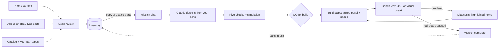

# ViBread redesign plan — v3 (implemented)

Status: **implemented** (Sat Sep 26, 2026). This document records the v3 UI and inventory design; later integration replaced
MUI X Chat with assistant-ui, removed design permission modes and generic approval prompts, and added the pi/pi-ai runtime,
debug logs, elkjs schematic verification and explicit scan retry states.

## 1. Summary

1. **Works like Claude desktop.** Missions are listed in a sidebar like Claude's sessions. Each mission is one chat:
   Claude's replies, grouped tool and timeline rows, answerable questions and a side panel for results (schematic, parts,
   build steps, code, tests, simulation). One **next-step button** in the header walks you through the whole mission:
   GO for build → build → test on the bench → done.
2. **Inventory = your parts, mostly by camera.** Photograph your parts → Claude identifies them → ViBread turns that into
   standard catalog entries → you confirm. Typing ("3 red LEDs, 5x 220 ohm") works too, without a Claude key.
3. **A catalog of part types you can extend.** Each part type is an object with fields (LED → colour, size;
   resistor → resistance). About 35 common starter-kit parts are built in, and you can make your own type in a minute:
   from scratch, by copying one, or straight from an unknown part in a scan.
4. **Build on the laptop or the phone.** After GO for build the steps appear in the side panel and on your phone. The
   phone (paired once by QR) also scans parts and photo-checks steps.
5. **Mission-control palette**: space cadet, cool gray, anti-flash white and red; light and dark themes follow the system.

**Stays the same**: five checks, human GO for build (web button or iMessage `GO`), build steps, bench self-test, simulation,
recorded-run labels, iMessage, Claude Code connection, phone pairing and its security. Claude edits designs directly; physical
bench actions still wait for a click. **Effort**: this plan is now a shipped design record; use the Build status in [PLAN.md](../PLAN.md)
for current proof and remaining hardware/account checks.

## 2. How it all fits together



- **Inventory** belongs to you and is shared by all missions. A **mission** keeps its own copy of the parts it may use,
  so editing the inventory later doesn't change old missions.
- **One mission = one chat + one side panel + one next-step button.** Everything that happens (design versions, checks,
  GO, build progress, photo checks, bench runs) appears in the chat in time order; details open in the panel.

| Mission state | Next-step button (header) | What it opens |
|---|---|---|
| Claude designing / checks running | *Claude is working… · Stop* | — |
| Checks finished | **GO for build** | today's GO dialog (same rules) |
| Building | **Build steps · 12/33** | Build steps view + phone QR |
| All steps done | **Test on the bench** | Bench view |
| Virtual board passed | **Test with your Arduino** | Bench view (as today: practice doesn't count) |
| Real board passed | **Does it work?** | confirm card in the chat |
| Done | **Done ✓** | mission summary |

## 3. Screens

### 3.1 Shell and new mission

```
┌─────────────────┬──────────────────────────────────────────────────────────────────┐
│ ViBread       « │                Good afternoon. What are we building?              │
│ [+ New mission] │     ┌───────────────────────────────────────────────────────────┐ │
│ ▤ Inventory  23 │     │ A lamp that fills like the moon when I press a button…    │ │
│─────────────────│     │ [Parts: all inventory (23)]                         (↑) │ │
│ Today           │     └───────────────────────────────────────────────────────────┘ │
│ ● Moon lamp     │       Night light · Traffic light · Reaction game · Doorbell      │
│ ▲ Night light   │       Inventory empty? [Scan your parts]                          │
│ Earlier         │                                                                   │
│ ✓ Launch control│                                                                   │
│ ⚙ Settings      │                                                                   │
└─────────────────┴──────────────────────────────────────────────────────────────────┘
```

- Enter creates the mission with your inventory attached; the text becomes the first message. Cmd/Ctrl+N = new mission.
- The **Parts** chip shows how many parts Claude may use and opens the inventory (choosing a subset per mission: SHOULD).
- Mission dots: ● designing (BRIEF/CLARIFY/DESIGN) · ◐ ready for GO (GONOGO) · ▲ building (ASSEMBLE) · ◆ testing
  (VERIFY/DEBUG) · ★ launched (LAUNCH) · ✓ done (DONE).

### 3.2 Mission chat and side panel

```
┌────────┬──────────────────────────────────────────────┬───────────────────────────────┐
│sidebar │ Moon lamp  ●●●●○  [Build steps · 12/33]    ⋯ │ Build steps ▾   r2 ▾   ⤓   ✕ │
│        │──────────────────────────────────────────────│───────────────────────────────│
│        │                   ┌────────────────────────┐ │ Step 12 of 33 · USB unplugged │
│        │                   │ A lamp that fills …    │ │  (step picture)               │
│        │                   └────────────────────────┘ │ Put LED4 in e24 (+) and e25   │
│        │ I'll use 4 of your yellow LEDs and 220 Ω …   │ Parts: 1× yellow LED          │
│        │ ▸ Design r2 · uses 9 of your 23 parts   ✓    │ [I did this]  [◀ ▶]           │
│        │ ▸ Five checks                      all GO    │ Phone: [QR]                   │
│        │ ▸ GO for build · by you                      │                               │
│        │ ▸ Steps 1–11 done (phone)                    │                               │
│        │ ▸ Photo check step 11 · LED3 correct         │                               │
│        │ ┌──────────────────────────────────────────┐ │                               │
│        │ │ Reply…                                             (↑) │                               │
│        │ └──────────────────────────────────────────┘ │                               │
└────────┴──────────────────────────────────────────────┴───────────────────────────────┘
```

- **Panel views** (switcher + design-version picker): **Parts** (new: what the design uses vs what you have) ·
  Schematic · Build steps · Code · Tests · Try it · Replay · Checks (findings of all five) · Telemetry · Diagnosis ·
  Photo checks. The panel opens by itself on the first design (Schematic), after GO (Build steps) and after a bench
  problem (Diagnosis).
- **Where the rows come from**: check, GO, build, photo-check and bench rows are timeline events merged into the assistant-ui
  thread in time order. That is also what makes the example missions (which have no chat history) show their story.
- **Other homes**: answerable questions → cards in the thread; agent working / Claude not connected → header chip; recorded run
  → banner + chips (as today); bench, rename, delete, phone link → ⋯ menu; Settings → dialog (`/settings` still works);
  `/login`, `/consent`, phone pages → outside the shell.
- *Inspiration, not a copy*: Claude's Chat tab opens artifacts in a window to the right; ViBread keeps the send and stop
  controls in the conversation [1][3].

### 3.3 Inventory page

```
 Inventory · 23 parts     [📷 Scan parts]  [Type parts]  [+ Add part]  [+ New part type]
 Search…     All · Ready · Needs a look · In use · Not usable in designs
 LIGHTS     Red LED · 5 mm              6   ready                       used in: Moon lamp
            Yellow LED · 5 mm           4   ready
 RESISTORS  220 Ω                       10  ready
            10 kΩ                       5   needs a look (10 kΩ or 1 kΩ?)
 SWITCHES   Push button                 2   ready
            Tilt switch                 1   basic (your pins)
 SENSORS    Thermistor (NTC)            1   modelled as light sensor
 MOTORS     SG90 servo                  1   list only — can't design with it yet
 BOARD      Arduino Uno R3              1   board for new missions
```

Each row: quantity stepper, status, **used in** (links to missions), ⋯ (edit fields, change type, delete). Statuses:
**ready** · **needs a look** (unsure reading, fix before use) · **modelled as …** / **basic** (usable with limits, see
§5.2) · **list only**.

### 3.4 New part type (the "object" editor)

```
 New part type                                              Start from: [blank ▾ / copy LED / scan crop]
 Name        [IR obstacle sensor        ]  Category [Sensors ▾]   Picture [from scan ✓]
 Fields      Name       Kind            Values                   Different value = different part
             [Range  ]  [choice ▾]      [short, long]            [✓]              [+ add field]
 Treat as    ○ Works like a built-in part  [light sensor ▾]   (only parts with the same pins are offered)
             ● My pins   [3-pin module: VCC · GND · OUT ▾]    OUT is a [digital output ▾]
             ○ Just keep it in my list
 Also called [IR sensor, obstacle module]                                      [Cancel]  [Save]
```

## 4. Build and test after GO (assembly)

1. **GO for build** → the panel switches to **Build steps**, the header button becomes **Build steps · 0/33**, and the
   chat says "Build started — scan the QR to follow on your phone".
2. **Step 1 "Gather your parts"** (the existing inventory step): the design's parts list checked against your inventory
   ("need 4 · have 6 ✓", "need 1 · missing" → *Ask Claude to redesign without it*). SHOULD: your own part photos from
   the scan next to each part.
3. **Every step** (today's content): picture (focused or whole board), exact holes, parts for this step, USB plugged or
   unplugged, **I did this** (now on the laptop too, not only the phone), **Check with camera** on the phone (advisory
   photo check against the step picture).
4. **Laptop and phone stay in sync** (both poll every 1–2 s). The chat gets one row per group of steps and one per photo
   check.
5. **After the last step** → **Test on the bench** → Bench view inside the shell (← back to chat), same 7 bench steps,
   USB or virtual board. The result comes back as a chat row; a problem opens **Diagnosis** in the panel (highlighted
   holes + fix), and *Fix and retest* returns to the bench.
6. **Real board passed** → **Does it work?** card → Done. SHOULD: "Keep it built (parts marked in use)" or "Taking it
   apart (parts back in the inventory)".

## 5. Inventory system

### 5.1 Part types and fields (the standardized database)

- A **part type** is an object with **fields**. Examples: LED → colour (choice), size (choice); Resistor → resistance
  (number, Ω), bands (4 or 5); Knob → resistance (number, Ω).
- Each field says whether it **changes the electronics** (LED colour, resistance — the checks and simulation use these)
  or not (size, package, brand).
- Each type also has: name, category, also-called names (used for typing and scanning), a short "how to recognise it in
  a photo", its **support level** (§5.2) and how it maps into a design.
- An **inventory item** = part type + field values + quantity + photo + status. Same type + same identity values (e.g.
  `resistor 220 Ω`) = one item; quantities add up.
- Built-in types live in code (versioned); your own types are stored per user.

### 5.2 Default catalog (≈35 types)

| Support level | What ViBread can do with it | Built-in part types |
|---|---|---|
| **Full** | design, checks, simulation, breadboard steps, bench self-test | LED (colour: red, yellow, green, blue, white; size 3/5/10 mm) · resistor (E24/E96) · push button (4-pin) · light sensor (LDR) · knob (rotary, 3-pin) · buzzer (active / passive) |
| **Modelled as** | uses a Full part's simulation and checks, labelled "modelled as …"; the bench calibrates the real part | trimmer potentiometer (inline pins) → knob · NTC thermistor, force sensor (FSR), flex sensor → light sensor · piezo disc → passive buzzer |
| **Basic** | uses its pins; basic on/off or analog simulation; always marked unverified; no bench self-test; pins pre-filled | tilt switch · reed switch · slide switch · PIR motion module · sound module (digital out) · IR obstacle module · soil-moisture module (analog out) |
| **List only** | kept in your inventory; Claude is told you own it but doesn't design with it | RGB LED · capacitors · diodes · transistors · 7-segment display · LCD 16×2 · 74HC595 · DHT11 · HC-SR04 · IR receiver + remote · keypad · joystick · servo · DC and stepper motors · relay module · battery holders |
| **Board and supplies** | used by the mission and the build steps | Arduino (Uno R3 / Nano) · breadboard (400 / 830) · jumper wires (M-M, M-F, F-F) · USB cable |

Motors, servos, relays and mains stay out of designs (PLAN scope; the design prompt already refuses them).

### 5.3 Your own part types

- **Start from**: blank · a copy of a built-in type ("Copy LED" → change fields) · an unknown part in a scan (name,
  description and photo pre-filled).
- **Fields**: add or remove; kinds: choice list, number + unit, yes/no, text; tick *different value = different part*
  for identity fields like colour.
- **New values for built-in fields**: fields that don't change the electronics (size, package) take new values right
  away. A new LED colour needs its forward voltage; if you don't know it, checks use the widest safe range
  (1.8–3.4 V) and say "assumed" (SHOULD — needs a core change).
- **Treat as**:
  - *Works like a built-in part* → **modelled as** (offered only when pins and shape match, e.g. a 2-lead sensor →
    light sensor);
  - *My pins* → **basic** (templates: "2-pin switch", "3-pin module VCC/GND/OUT", "2-lead part", or list pins with
    their type);
  - *Just keep it in my list* → **list only**.
- Renaming or editing a type never breaks existing items. SHOULD: export/import types as a file to share with the team.

### 5.4 From inventory to a mission

- When a mission starts, ViBread copies your usable items into it. This happens in the mission service, so web,
  iMessage, Claude Code (MCP) and A2A missions all get it.

| Support level | Goes into the mission as |
|---|---|
| Full | the library part with its values (e.g. `led` red) |
| Modelled as | the base library part, labelled with your type's name ("Thermistor (modelled as light sensor)") |
| Basic | a generic part with its role, description and your pins |
| List only | a text line for Claude: "also owns 1 SG90 servo — ViBread can't design with it" |
| Board / breadboard | mission settings (SHOULD) |

- Contract change (Step 0): a mission part gains an optional `label` and `pinout`, which Claude copies into the design.
- When Claude wants a part you don't have (its *add part* request), the chat says it is not in your inventory; add it in
  Inventory before asking Claude to design with it.
- The **Parts** view shows, per design version, need vs have; inventory rows show **used in**.

### 5.5 Merge rules

- Review rows show **have 10 → will be 19** with an **Add / Replace** switch; Replace is the default when the part is
  already in the inventory, so scanning the same kit twice doesn't double the counts (the design agent never uses more
  than the listed count).
- Editing a part so it matches another item merges them.

### 5.6 Camera scan

- **Session**: the laptop creates a scan and shows a QR code; photos arrive from the phone (or an upload); the laptop
  shows *Waiting for photos… → Reading… → review*. Scans still running at a server restart are marked failed.
- **Identify**: Claude Sonnet 5 with a fixed output format, effort low/medium. It gets the catalog (built-in and your
  own types: names, also-called names, how they look), so it recognises your types too. It reports only what it sees:
  type or "unknown", lens colour, band colours, printed code, pin count, count, confidence. Photos use the
  high-resolution tier (long edge ≤ 2576 px); crops are cut from exactly that image [5].
- **Normalize** (our code, tested): resistor bands decoded both ways and kept only if they're a standard value; **ready**
  only if exactly one value remains, it's 4-band with a gold/silver end and Claude was confident — otherwise **needs a
  look** with the candidates. Printed values on tape win. Knob codes ("103" = 10 kΩ) and text ("4k7") → values.
- **Review**: crop + matched type + editable fields + count ("may be off" [5]) + Add/Replace. An unknown part → *pick a
  type*, *create a new type from it*, or remove.
- **Tips before capture**: white paper, one kind per group, ≤ 10 per group, spaced apart, good light, each pile once.
- **No Claude key**: the Scan button says so and opens Type parts. Scans are rate-limited (≈1–3 ¢ per photo).

### 5.7 Storage and API

- Tables: `part_types` (your types), `inventory_items`, `inventory_scans`.
- Routes: `GET /api/catalog` (built-in + your types) · `POST/PATCH/DELETE /api/catalog/types[/:id]` ·
  `GET /api/inventory` · `POST /api/inventory/items` (batch add/replace) · `PATCH/DELETE /api/inventory/items/:id` ·
  `POST /api/inventory/parse` (typed text → preview, no AI) · scans: `POST /scans`, `POST /scans/:id/photos`,
  `POST /scans/:id/analyze`, `GET /scans/:id`, `GET /scans/:id/crops/:n`, `POST /scans/:id/accept`.
- New read-only MCP tool `vibread_get_inventory` for Claude Code.

## 6. Phone and camera

- **One phone app.** Open the QR once (Settings → Phones, the Scan dialog, or the Build steps view) → the phone is
  paired → *Add to Home Screen*. Its home (`/b`, today's build picker) gets three buttons:
  1. **Continue building** — steps, *I did this*;
  2. **Scan parts** — photos go to a scan you review on the laptop or the phone;
  3. **Check this step** — photo check, inside a build.
- **Camera**: the button opens the phone's own camera app (file input with `capture=environment`). This works over the
  laptop's plain http Wi-Fi address and is already used by Build Mode today. A live viewfinder inside the page would
  need HTTPS, so we don't use one.
- **Photos**: uploaded to the laptop (iPhone HEIC converted), kept in ViBread's data folder, sent to Claude only for
  the scan or the photo check.
- **Sync**: the scan id is in the QR code; phone and laptop both poll every 1–2 s.
- **Requirements**: the phone on the same Wi-Fi as the laptop, or the laptop on the phone's hotspot (venue Wi-Fi often
  blocks devices from reaching each other); allow the firewall prompt once on the laptop.
- **Security (unchanged)**: a paired phone can only use Build Mode, scanning and photo checks; Settings → Phones →
  *Unpair all*.
- **Without a phone**: drag photos onto the laptop; laptop webcam in the desktop app (SHOULD).
- **Not on the phone**: the design chat, GO for build, bench/USB, Settings.
- SHOULD: text a parts photo to CAPCOM (iMessage) → it arrives as a scan to review.

## 7. Theme

- **Fonts** (bundled, offline, open licenses): Inter (interface and headings), Lora (Claude's replies), JetBrains Mono
  (code, telemetry). **No Anthropic logos, spark/asterisk or names**; About says "Not affiliated with Anthropic".
- **Tokens** (WCAG contrast measured: text ≥ 4.5:1, UI parts ≥ 3:1):

| Token | Light | Dark |
|---|---|---|
| main / sidebar / cards | `#EDF2F4` / `#E2E8EC` / `#FFFFFF` | `#1F2133` / `#25273A` / `#2B2D42` |
| text / secondary text | `#2B2D42` / `#5C677D` | `#EDF2F4` / `#A9B3C4` |
| primary / links | `#2B2D42` / `#2B2D42` | `#EDF2F4` / `#EDF2F4` |
| accent / error | `#D80032` | `#D80032` / `#FF6B7D` |
| success / info / warning | `#1F7A4D` / `#2B2D42` / `#9A4A06` | `#5FD39A` / `#A9B3C4` / `#FBBF24` |
| input borders / dividers | `#6B7890` / `#D5DCE3` | `#8D99AE` / `#3A3D56` |

- MUI uses `contrastThreshold: 4.5`, a System/Light/Dark switch, radius 8/12/18 (inputs/cards/chat box), borders instead of
  shadows, and no uppercase buttons. Breadboard and schematic canvases stay dark frames.

## 8. Implementation record

This table is the original slice plan, retained to show how the shipped UI was divided. S1–S8 are implemented; current proof and
remaining hardware/account checks are in [PLAN.md](../PLAN.md).

- **Step 0 — contracts (integrator, 30 min)**: part-type schema + catalog skeleton, inventory/scan types, mission part
  `label`/`pinout`, next-step states, routes, component props. Shared files (`api/hooks.ts`, `api/client.ts`,
  `packages/core/src/api.ts`) stay integrator-owned.
- **Step 0.5 — scan reality check (20 min, needs a Claude credential)**: 3 real photos of the team's kit through the scan
  format + normalizer.

| Slice | Owns | Work | Est. |
|---|---|---|---|
| S1 Shell + theme | `theme.ts`, `main.tsx`, `shell/*`, `components/*`, Settings dialog | theme, fonts, sidebar, settings dialog, replace hard-coded colours | 2 h |
| S2 Chat | new-mission page, `pages/MissionPage.tsx`, `chat/*`, chat box | empty state, chat box, messages, timeline rows (design, checks, GO, build, photo check, bench), grouped tool rows and question cards | 2.5 h |
| S3 Panel + header | `workspace/*` | panel views incl. Parts, Build steps (laptop *I did this*, QR), Checks, Diagnosis; next-step button; GO dialog; done card | 2.5 h |
| S4 Inventory UI | `inventory/*`, phone scan page | inventory page, Parts chip, type/add/edit, scan dialog + review | 2.5 h |
| S5 Inventory server | server routes/tables, vision scan, normalizer, phone scope, mission-service copy, MCP tool | as in §5.4–5.7 | 2.5 h |
| S6 Restyle | `bench/*`, `build/*` | new theme; phone home with Scan and Check; no logic changes | 1.5 h |
| S7 Catalog + part types | `packages/core/src/catalog.ts`, part-type editor + API | the ≈35 built-in types (fields, also-called names, photo hints, pins), editor, mapping rules, typed-parser names, tests | 2.5 h |
| S8 Desktop (SHOULD) | `apps/desktop` | camera permission for our window, macOS camera text | 0.5 h |

- **Original timeline (historical):** +0:30 contracts · slices until +5:30 · gate at +3:30 · QA/audit until +7:00 · then demo
  recording. It is retained as context, not a remaining schedule.
- **Original cut list:** S1–S7 were MUST. Laptop webcam, per-mission part subsets, board/breadboard from inventory, part photos
  in steps, new LED colours with forward voltage, parts in use after a build, export/import part types, iMessage photo scan,
  photo attachments in chat, sidebar search and a resizable panel were SHOULD or COULD; not all remain in scope. Merging
  duplicates across photos, barcodes, online part databases and draggable panes remain cut.

## 9. Done when (measurable)

1. New mission → chat opens with the brief as the first message and the inventory as parts.
2. Each example mission shows its rows (design → checks → release) and a Parts view with need vs have.
3. The next-step button walks an example mission: GO → steps (*I did this* on the laptop) → virtual bench → "Test with
   your Arduino"; a real-board pass → *Does it work?* → Done.
4. Typed "2 tilt switches, 1 thermistor, 3 red LEDs" → the right types and support levels.
5. A custom type from the "3-pin module" template takes ≤ 1 min, shows in the inventory and is placed by the build steps
   when a design uses it.
6. Kit photo: ≥ 80 % of groups get the right type; every resistor is either correct or "needs a look".
7. Phone: pair → home → Scan parts → review on the laptop in ≤ 60 s; Check this step still works.
8. No key: Scan explains itself, Type parts works; iMessage/MCP missions get the inventory.
9. Contrast test passes; no hard-coded colours outside the theme except the drawing canvases.
10. `npm test` + `npm run typecheck` green; one clean audit round.

## 10. Risks

| Risk | Plan |
|---|---|
| Demo recording and timing | Medium | Keep the current cached missions and use the desktop release; the original timing plan above is historical |
| Resistor bands from photos are unreliable | Medium | strict "ready" rule; mandatory review; printed labels preferred |
| "Modelled as" parts simulate with the base part's curve (e.g. thermistor as light sensor) | Medium | labelled everywhere; the bench calibration uses the real readings |
| Basic (generic) parts are intentionally limited | Medium | they stay marked unverified and do not get the full bench self-test |
| Live Claude credential unavailable | Medium | connect through Settings → Claude with pi-ai OAuth or a per-user Anthropic API key; the server fallback remains available |
| Regressions in bench or Build Mode | Medium | existing tests, issue-driven QA and the Diagnostics logs |

## 11. Decisions recorded

1. **Chat:** assistant-ui with MUI styling is shipped; grouped tool rows, answerable question cards and stop/resume replace
   the earlier MUI X Chat and generic approval-mode design.
2. **Claude credentials:** Settings → Claude offers pi-ai Anthropic OAuth (paste code, `code#state` or redirect address) and
   a per-user Anthropic API key checked before saving. Credentials are stored in the server database.
3. **Theme:** light/dark follows the system setting, using the space-cadet, cool-gray, anti-flash-white and red palette.
4. **Scanning:** phone camera and upload are shipped; failures persist with a reason and **Retry**; typed parts remain the
   no-key fallback.
5. **Catalog:** built-in types, typed parsing and the part-types editor are shipped; unsupported parts remain labeled basic or
   list-only.
6. **Safety:** GO for build is human-only; physical flash, self-test and rewiring requests still wait for a bench click.

## Sources

[1] Claude Code Docs, *Desktop application* — https://code.claude.com/docs/en/desktop ·
[2] *Choose a permission mode* — https://code.claude.com/docs/en/permission-modes ·
[3] Claude Help Center, *What are artifacts and how do I use them?* — https://support.claude.com/en/articles/9487310 ·
[4] Anthropic brand-guidelines skill (palette reference) — https://github.com/anthropics/skills/blob/main/skills/brand-guidelines/SKILL.md ·
[5] Claude API Docs, *Vision* (resolution tiers, counting and coordinate limits) — https://platform.claude.com/docs/en/build-with-claude/vision
